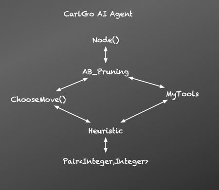

# Abstract

The AI agent has two main methods of coming up with a good move. When processing time and RAM space is sufficient, it utilizes a Alpha Beta Pruning Search Tree algorithm to search the seed amount that it will have after few rounds of moves for all current legal moves; while running time and RAM space is limited or board states are numerous to be processed, it will filter and compare the pre-defined heuristics, evaluate the board state at a level and sum up all heuristic 
factors to find the best move. A search tree algorithm is more accurate than Heuristic method because it inspects all cases in the following “n” rounds instead of narrowing itself down to one certain state. Since the given constrains give enough space and running time for the AI agent to go for at least a depth of 6 rounds for alpha pruning search, and this Has game has a maximum of 32 pits for one side to be counted for each turn, it will use Alpha Beta Pruning mainly.

<!-- truncate -->

# Game Intro

Hus is a two-player competitive game that is part of the mancala family of board games, which generally involve placing seeds in pits and capturing opponents’ seeds. In Hus, each player controls 32 pits arranged in a 2x16 grid. Each player begins the game with 24 seeds arranged in a pre-specified pattern. A turn proceeds as follows. The player selects one of the pits they control that contains more than 1 seed, and scoops all the seeds in that pit. The player then begins sowing the scooped seeds, moving counter-clockwise from the scooped pit, placing one seed in each pit until running out of seeds. Note that players only ever place seeds in their own pits. At the end of sowing, 3 things can happen depending on the contents of the pit in which the last seed was placed (which we will called the end pit):

If the end pit was previously empty, then the player’s turn is over.

If the end pit was previously occupied, and it is in the player’s “inner” row of pits, and the opponent’s inner pit directly opposite is occupied, then a capture takes place. The player scoops the seeds from their opponent’s inner and outer pits directly opposite the ending pit, and begins a round of sowing using these stolen seeds (placing the first seed in the first pit counter-clockwise from the end pit).

If the end pit was occupied but the conditions for capture are not met, then the player scoops the seeds from the end pit, and begins a round of sowing. This is called relay sowing.

The player’s turn continues until a round of sowing ends in a pit that was previously empty (i.e., option 1 hap- pens). Note that neither player may capture on the first turn, and if a situation arises where a player would have captured, relay sowing is performed instead. A player wins when it is their opponent’s turn to play, but their opponent has no more valid moves (so all their pits contain either 0 or 1 seeds). A draw is declared if nei- ther player has won after 5000 turns. More details can be found here: https://mancala.wikia.com/wiki/Hus.

We will hold a competition between all the programs submitted by students in the class, with every submitted program playing one match against every other program. Each match will consist of 2 Hus games, giving both programs the opportunity to play first. 

# Technical Approach and Motivation for Technical Approach

## Constrains

1. Turn Timeouts: 2 seconds per move (30 seconds for first move including loading and setup time)
2. Memory Usage: No more than 500 MB of RAM. Code submission less than 10 MB
3. Multi-threading: Allowed to use multiple threads, but confined to single processor, so no parallel
4. File I/O: Read allowed. Write Not Allowed: not possible to do learning from game to game.
5. Infinite Moves: 200 moves constrain, if it goes above 200, restart game.

## Alpha-Beta Pruning Tree Search (AB_Pruning.java)

### Motivation
Find the best way win as much in the tournament after few tryouts with playing versus friends. Alpha-Beta utilizes the given space and running time the best compare to Minimax search, and searches for all possibilities of moves, also fits Hus game which has small board, and small domain of pits (32). Also, HusBoard class provides the agent with all rules and utilities, the agent can try by doing HusBoard.move(). 

As shown below, Alpha-beta Pruning is based on MINIMAX tree search which finds the best move (in this case, a HusMove object) among all legal moves we have (parsed by .getLegalMoves() function of HusBoard clas) by calling MaxNode(), and check for the opponent's reaction in the next round by calling MinNode and pass in the current board state. MinNode then calls MaxNode of its children and so on recursively.

- In the reality, MINIMAX tree search reach timeout for a depth of 4-5 rounds (to be safe 4 rounds). So the agent will instead use Alpha-beta Pruning Algorithm which is defined as “Alpha–beta pruning is a search algorithm that seeks to decrease the number of nodes that are evaluated by the minimax algorithm in its search tree.” on Wikipedia, to optimize the space and running time.  As the graph below shows, when the left branch of the top tier MaxNode() returns a value of 10, now our alpha lower limit is 5, it is not necessary to go into more other nodes of the same layer because left branch MinNode() will not choose anything that is bigger than 5, and MaxNode is not going to choose this MinNode() with a return value of 5 which is less than 10. Same thing goes with MinNode(), if a left branch returns a value x, and the right MaxNode() branch detects a value y>x, the right MaxNode() can stop exploring. 
- Above that, to go as deep as possible for Alpha Pruning Algorithm, a check for the amount of legal moves of the current board state is useful. If the current board state has 1-3 possible moves only, it is possible to go deeper for the lower branch since the overall amount of recursive calls is relatively small because of this upper branch of the following nodes has small state  amount.
- Test Results comparison (Below) for Minimax Search and Improved AB_Pruning Search of CarlGo. As we can see, Alpha-beta Pruning tree search generally uses less time than Minimax Search. The max depth limit after 500 games of experience try-outs, is at least 6, sometimes it can be 20, but for CarlGo’s algorithm it is limited to be dynamically setting between 6~8.

## Another Approach: Heuristic Filter (Heuristic.java)
### Motivation
Inspired by Machine Learning, Connectionism, and Hill Climbing. Trying to come up with an agent that will work without naively trying out all possible moves and do Minimax search recursively on those moves. This is not the best approach for Hus game because doing recursive minimax search for a small board and small domain of possible moves is efficient. However in case such as driving a car in the desert or playing a real time strategy game, it is not that easy to try out all possible moves for current states and do minimax because that will take too much time and space. In this approach, the agent imitates how a human will think when he plays the game, and that human’s stream of thinking is important to eliminates unnecessary recursions calls. 
First the agent takes all factors that will take into consideration when we evaluate and analyze the each board state (without deepening into MINIMAX tree)
1. Try to Gain Maximum Seeds: Since the game rules say that if you land on an inner pit that has seeds, you can take all of opponent’s seeds in the direct opposite pits (both inner and outer) of that pit. Also, you win when all the pits of the opponents have only one seed left, which says that the more seeds you have, the better you are in game. This is a very general thoughts that every passing student will have in their project.
2. Search for opponent’s inner pits that are exposed, binding the inner and outer pit with the inner pit index. Return the ordered indexes of bindings by summing seed numbers and order the indexes. We will use this method in MyTools to do the work. “int[] findMaximumPit()” with running time: O(n)
After finding opponent’s exposed pits. We will search for potential captures with our current pits. We will do this by trying to capture ordered exposed pits of the opponent with our pits one by one. This is implemented by “my_pits_to_capture ()” with running time: O(Exponential)
3. * (Critical Hit!) I noted that when running the above methods sometimes it returns an array with duplicates. This is because a fact of a Critical Hit, which I define it as a click that can capture multiple opponent pits. For example in this case if upper player plays pit 20, which has 4 seeds, He will get to sowing again and again and capture opponent  pits 23 22 20 26 consecutively. Which is a BIG A for us. So, these duplicates exist because they are pit indexes suggested to click for multiple captures. (Left Graphs)
4. Protecting your seeds: Finds the exposed inner pits and order them by the amount of seeds the inner pit and its outer partner has in total. 
5.  Other factors: Legal moves for current state, degree of freedom (amount of legal moves) after this round.

The agent will sum each heuristic listed above as an ArrayList of a data structure called Pair<pitIndex, heuristic> which saves for each move’s pit index and its related heuristic value (in Heuristic.java, moveByHeuristic() function). 

Then the agent takes ArrayLists of multiple heuristic and map it to a hash table. When a pit index exists in the table, the heuristic gets cumulated. In the future, the agent can even learn how the opponent plays, and assumes the opponent’s heuristic scheme, and arrange ‘weights’ to each of the heuristic to change play style to defeat the opponent.

# Future Implementation
A combined Alpha-beta Pruning and this Method based on Heuristic will be useful when dealing with a case that rules are given, but no mechanism of creating another board state is provided like Hus.class, or it is not possible to just naively tryout outcomes. The agent can only try to figure out a good ‘formal system’ and ‘axioms’ of the game playing. In that case, a Alpha-beta Pruning algorithm can be run on heuristic basis. Which for MaxNode(), it does not recursively tries for all legal moves because that might be infinitely long, in stead it recursively searches deeper only for moves with high heuristic values. For MinNode(), it finds its self a set of moves with high heuristic values, and recursively search deeper for this reduced set. While the depth of search gets higher, the probability of reaching that state gets smaller, and overall the agent can map both probability and heuristic to a 2D map like this statistic example graph of joint probability in R.

Then the agent can apply Hill Climb and find the best move with highest heuristic and probability as the below graph (IEEE )

