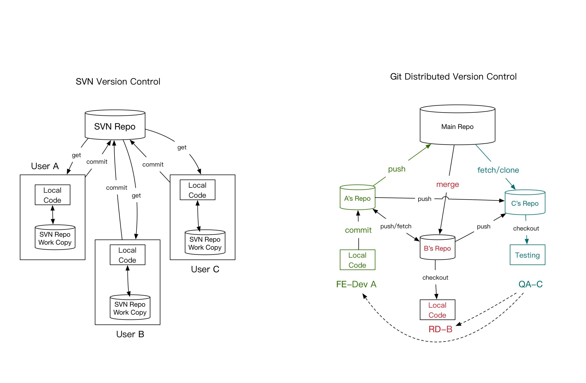

# Introduction for Noobs
During a software development, a team usually have different roles, each role is responsible at a certain stage of the development period. Summarizing them into a flowchart, it will show as follow:


Git vs SVN such as Perforce:



# Reset Porblems


<!--truncate-->

# When you are using multiple accounts

The Issue exists when you have multiple github accounts and you want to use different ones in different local repos.

1. Generate new keys by running:

	```
	ssh-keygen -t rsa -C "your@email.com"
	//name it something new
	```
2. Copy the pub key and save it to your github account ( the new account you want to add **_github won't accept the same key for both account, this is 1-1 mapping; so you need to generate a new key and bind it with new account_**):

	```
	pbcopy < ~/.ssh/id_rsa_personal.pub
	// go to github and add the key
	```
3. Touch a config file and make a route in ~/.ssh: 

	```
	#Default GitHub
	Host github.com
  		HostName github.com
  		User git
  		IdentityFile ~/.ssh/id_rsa

	#Personal GitHub
	Host github-gazcn007
  		HostName github.com
  		User git
  		IdentityFile ~/.ssh/id_rsa_personal
	```
4. Check saved keys by `ssh-add -l`:
	- if your newly created key is not there do `ssh-add ~/.ssh/id_rsa_personal `
	- * might be a good idea to delete all cached keys as well by `ssh-add -D`
5. Go to the repo where you need the new account's creditials and do:
	
	```
	ssh -T github@github-gazcn007 // to check connectivity
	
	git remote remove origin // remove original repo
	git remote add git@github-newAccount: newAccount/SomeRepo.git
	```
