# Overview
Metanautix now has Personal Quest online where individual users can download and do analytics on desktop. I have been working on a new systematic way to learn music theory and do musical analysis with mathematical matrix and vectors, and Quest is a critical tool in query on large dataset such as a pool of thousands of song scores. In this article, I will talk about my methodology in detail. 

An overview for my system will be:

<!--truncate-->
By the end of the day, I should have a musical-sense-making table before I do any sophisticated analysis, hence here I will mention my design of musical SQL table:

It is simple. MusicXML can be parsed as a tree (well, xml html json do work as trees having attributes), measure will be our rows, each column will be node attributes which gives pitch information, rhythmic information and other information like fingering. To utilize functions such as “fuzzy_join”, we save each element in VARCHAR (string).

Over years, I have found there are plenty of math involved in music, and it is simply to use mathematical numbers to represent music. Instead of having to memorize certain notes involved in a type of chord on all keys, we can easily represent the interval build-up by a vector. For example, [1,3,5] will be the one for a major chord, we can simply do [1,3,5] x [note x] = [note x, 2nd note from x, 3rd note from x], applying [C] (C major), we get [C,E,G] since permutation of C major is {C,D,E,F,G,A,B}. When we have a minor chord but more complicated say minor 7th with bass note D, then we have  [1,b3,5,b7] x  [D] =[D,F,A,C] since permutation of D major is {D,E,#F,G,A,B,#C}, “b” flat cancels out with “#” sharp. (by permutation of a major is all the notes involved in that key, C major will be all white keys on the piano, D major will be all white keys except sharp C and sharp F that are black keys). To visualize this also, we can image a polar coordinate system where each note is 30° apart from each other, each 30° represents a half step difference in notes. Since musical notes are repeating with different octave.
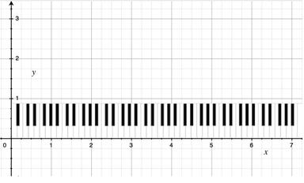

Memorizing notes to play at each measure is hard and tedious, and to me it is not efficient way to learn or analyze music pieces (Prelude in E minor below is an example). Just like ancient astrology where people use patterns of the sky to predict weather, multiple note pattern in music can be represented as a chord in stead. Each chord has its own build-up, in this case it will be a polar vector where only the intervals matters, different chords with the same quality is just a rotation process. Hence to check the chord quality, we can simply write a python filter function   that takes in the notes, gets the bass note and cancels out repeated notes to get the chord. The following picture shows the expected output of this function over a music score. 

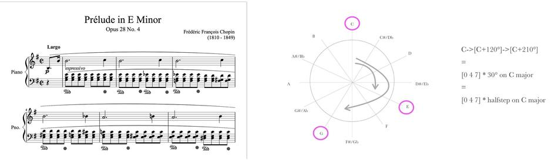
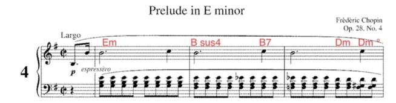

After this, we will do a process of what-is-so-called Roman Numeral Analysis, which “involves the use of Roman numerals to represent chords. In this context, Roman numerals (I, II, III, IV, ...) typically denote scale degrees (first, second, third, fourth, …)” [3] To do this, we need to know which key we are on and what is the status of the chord in this certain key. F major will be the IV on C major but V for Bb major. If you have ever been to the music school, this Roman Numeral Analysis is extremely crucial and it is a mandatory training process for all students because to all musician that is the basic construct of any composition, and the main body of every composition. Drawing an analogy, keys and scales in music are like colors in fine arts/graphics; of course, color matters, but just like what Toli Loris does for graphics processing, to render out the color we can better locate the structure[4]. In music once we have the structured progression in Roman numeral order, we can simply “re-color” to any key we want by locating key to I and find the corresponding based on scale degrees. For example, I-vi-IV-V on C major is C-Am-F-G, on F major is F-Dm-Bb-C etc. This can be done by parsing out the key signature information,  and do a string/interval conversion function that linearly checks all chord and notes to bring notes letter down to Roman Numeral Notation for chords and Arabic numerals for single notes depending on each individuals’ relationship to the root of the scale. 
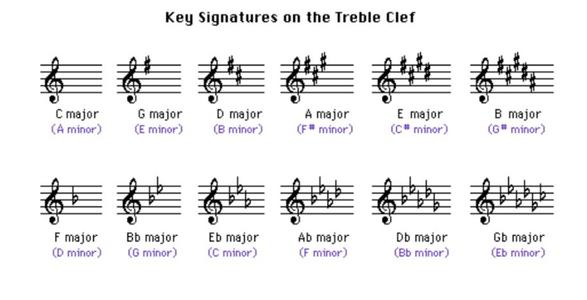

Meanwhile, an important attribute we need to parse out from the tree as well is the Rhythmic information, this can be done by appending the note’s “duration” attribute when we are getting the pitch information from the python elementTree of musicXML.

# Sample Code
Above are basic ideas for parsing out the musicXML file, now I will list some sample codes for each step.
 
MusicXML looks something like below left graph. It is a uniformed format being used for almost all score-writing software. Python eTree interprets musicxml as a tree, and hence we can save node information by writing something like:
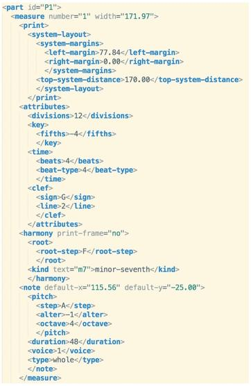
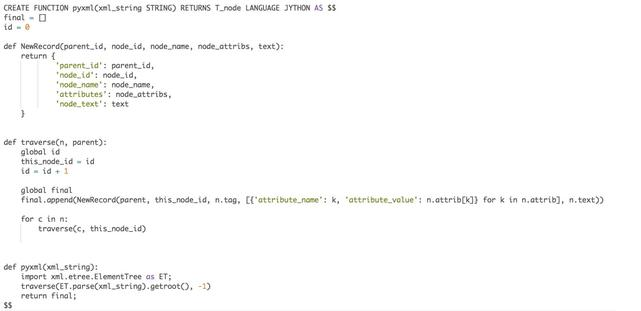
Meanwhile, an important attribute we need to parse out from the tree as well is the Rhythmic information, this can be done by appending the note’s “duration” attribute when we are getting the pitch information from the python elementTree of musicXML.

Sample Code:
Above are basic ideas for parsing out the musicXML file, now I will list some sample codes for each step. 
MusicXML looks something like below left graph. It is a uniformed format being used for almost all score-writing software. Python eTree interprets musicxml as a tree, and hence we can save node information by writing something like:

after parsing node information, we stop at parts where nodes overlays (more than 2 notes ringing at the same time), and put all overlaying nodes into the chordChecker (Right now we are just dealing with easy harmonies, later there will be an essay about set classes and Forte Numberings):
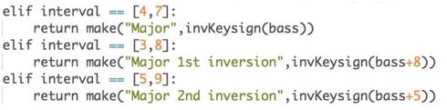

This generates and return a VARCHAR (string). If the note is less than two notes ringing at the same time, then it will be just counted as single notes, and will be concatenated to the string. By end of this turn, when we call the python function on Quest to convert a xml file into a table and save locally, we should have a table like following:

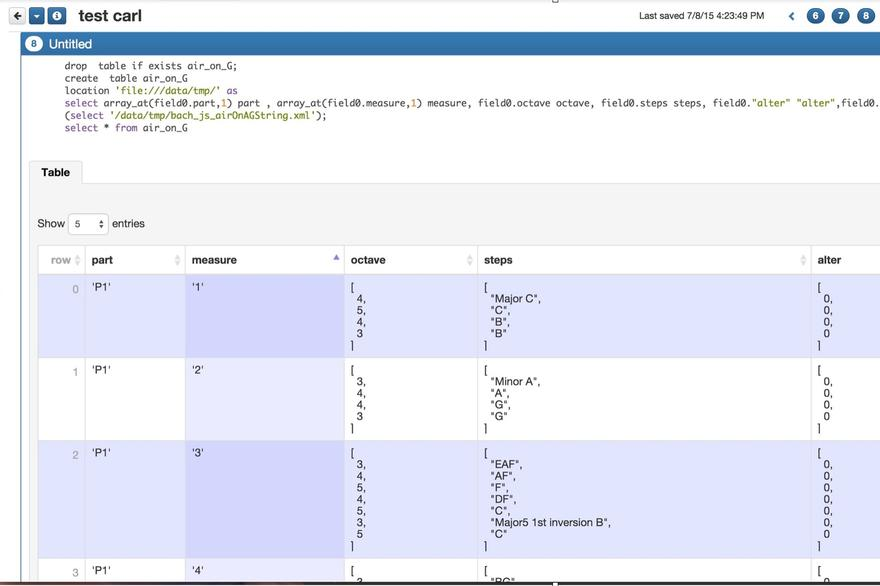

Next, we apply the algorithms that takes in a note and a key, figures out the interval between them, and return the Roman numeral notation for chords and Arabic notation for single notes

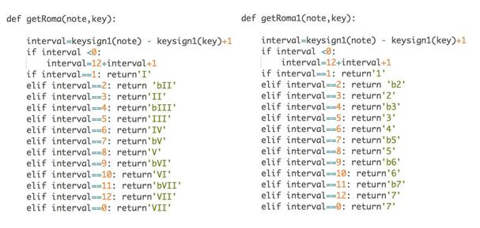

After this second filtering, we will get SQL table such as following:

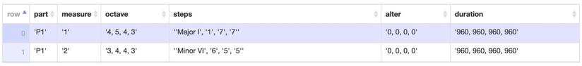

# Harmony

It is necessary for me to re-mention my musical philosophy again, people are trying to visualize music nowadays in many ways. Different professions view music in different dimension too: sound recording engineers dig into sound waves, digital technicians dig into sound timbre, not only that, even for musicians, Jazz musicians and Classical musicians think music in totally different way. I am highly influenced by the modular way thinking of Jazz musicians where songs flows with certain harmony structures. My design of the polar coordinate system, in which each polar disk representing a certain chord quality by drawing the pattern or a certain note by a drawing dots, overall all can be connected with metric dependent on the rhythm, is influenced a lot by Jazz “lead sheets”.  

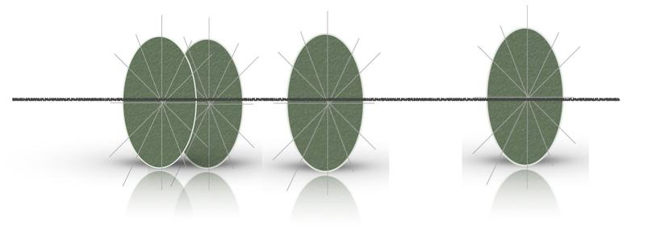

Comparing to traditional frequency/time analysis, I think the advantage of thinking in this way brings more to the theory itself than the sound analysis, like the one on the right[5]. Musicians focus on composition mechanism. Why would a composer ever needs to care about sophisticated physics school analysis on frequency, amplitude and time domain?

More interestingly, just like Alan Turing’s code breaking device, when we rotate the whole devices formed by the polar vectors to a new key, it automatically changes the color, but with the same content. This in another way can inspire the composer to see more in art when he or she is stuck “infinitely looping” in meditation.

# Rhythm

As we have mentioned, we are parsing out an attributes “duration” and “beats”(time signature) from the musicXML while we get the harmony information. Rhythm is a huge part in texture analysis of a music piece too.

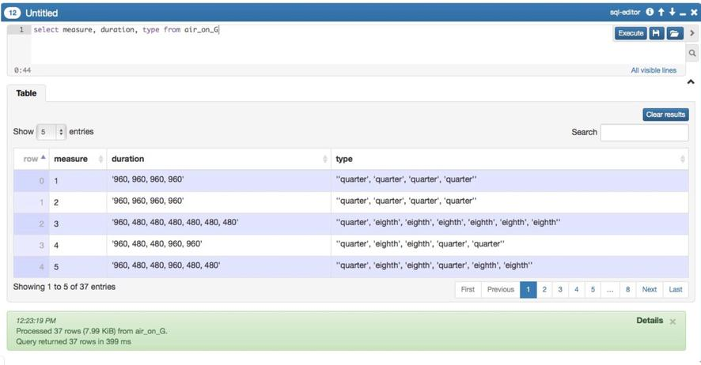

After parsing the beats into a SQL table, we can easily do analysis such as finding the probability of a beat pattern in a song, and compare that to another song. 

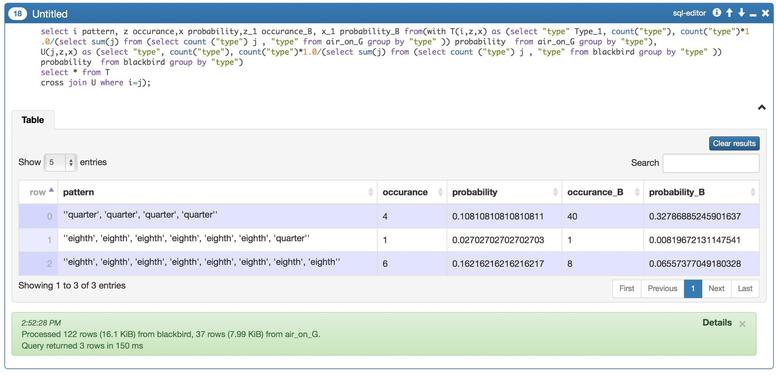

# Reduction
With harmony and rhythm information, it can also do harmonic reduction just like the concept of video games such as Rock Band and Guitar Hero [5]. This can be achieve by grouping notes into vector based on the rhythmic meter we set. In general, for 4/4 beat,  it can set a harmonic checker on beat 1,2,3,4 to get four harmonic progressions with in a measure; or it can be more precise and get 8 times of analysis, which means parse the prime set twice at each beat, and send to analyzer to get harmonic progressions at those two time stamp.

# Reference
- "Mathematics and Music." Mathematics and Music. James Stewart, n.d. Web. 10 July 2015. [1] 
- Diaz-Jerez, Gustav. "ALGORITHMIC MUSIC: USING MATHEMATICAL MODELS IN MUSIC COMPOSITION.”[2]
- "Roman Numeral Analysis." Wikipedia. Wikimedia Foundation, n.d. Web. 13 July 2015. [3]
- Lawrence D. Cutler, Apostolos Lerios, Kathryn Leonard, Ghassan Sarkis, Sreenivasa Viswanadha, James Adler, David Kryze, Patrick Nguyen, Theodore Vassilakis. "Big Data Techniques Applied to Media and Computer Graphics Applications.". Metanautix. Web.[4]
- Williamson, Daniel. “Dimension of Music." OpenStax CNX. N.p., n.d. Web. 13 July 2015.[5]
- Nicole Biamonte, "Musical Representation in the Video Games Guitar Hero and Rock Band", Scarecrow Press, 2010

<a href="https://github.com/gazcn007/musical_analysis.git"> Source Code </a>