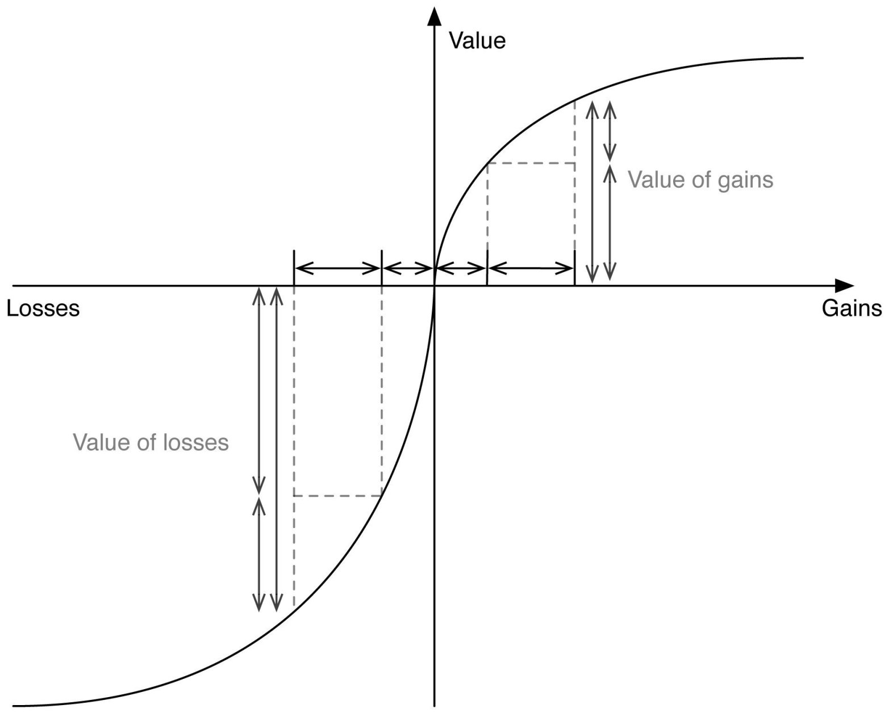

Equations:
EV(expected value)=P(outcome 1)+(1-P)(outcome 2)
EU(expected utility)=P(√(outcome 1))+(1-P)(√(outcome 2))

<!--truncate-->

factors to find the best move. A search tree algorithm is more accurate than Heuristic method because it inspects all cases in the following “n” rounds instead of narrowing itself down to one certain state. Since the given constrains give enough space and running time for the AI agent to go for at least a depth of 6 rounds for alpha pruning search, and this Has game has a maximum of 32 pits for one side to be counted for each turn, it will use Alpha Beta Pruning mainly.
For the following examples, assume a statistical value of a life at $5M.

1) In 1974, the United States passed the “safe drinking water act”.

Assume the following when considering this policy. Throughout one’s lifetime, there exists a 10% chance of becoming very ill from contaminated water, which will lead to $1M in treatment expenses to fix.
An alternative, is to spend 100K to reduce this probability to 2%. What is the EV of each scenario? Which has the higher EV? What is the EU of each scenario? Which has the higher EU?

In this question we have two scenarios. The first scenario has a 10% probability of getting sick which will lower our SVL (statistical value of a life) measure by $1M. This also means we have a 90% probability of not getting sick and retaining $5M. Therefore:
EV = .9(5M)+.1(4M) = $4.9M
EU = .9(√5M) + .1(√4M) = 2.21M
The second scenario will have the same set up but will use different values.
EV = .98(4.9M)+.02(3.9M) = $4.88M
EU = .98(√4.9M) + .02(√3.9M) = 2.22M
So the expected value is greater with no treatment, but the expected utility is larger with treatment.

2) In 1980, the United States passed CERCLA (Comprehensive Environmental Response, Compensation and Liability Act) more commonly known as “Superfund”.

Assume the following when considering this policy. Throughout one’s lifetime, there exists a 25% chance of getting radiation poisoning, which will lead to $500,000 in treatment expenses to fix.
An alternative, is to spend $1M to reduce this probability to 0%. What is the EV of each scenario? Which has the higher EV? What is the EU of each scenario? Which has the higher EU?

In this question we again have two scenarios, the easy scenario is where we spend $1M to reduce the probability to 0%. In this outcome the EV is $4M and the EU is 2M. The other scenario’s outcomes can be calculated using:
EV = .75(5M)+.25(4.5M) = $4.875M
EU = .75(√5M) + .25(√4.5M) = 2.20M
The results show us that both the EV and EU are higher in the situation where no clean up is performed. This should make sense because the cost of treatment is smaller than the clean up cost AND the probably of having to pay the treatment cost is less than 1.

3) In 1990, the United States passed the “Oil Pollution Act”.

Assume the following when considering this policy. Tourism revenues in the gulf region are expected to be $10M. There is a 3% chance of an oil spill which will reduce the tourism revenue to $1M.
The gulf states can band together to prevent oil transport in the area, but this will reduce tourism by $1M. What is the EV of each scenario? Which has the higher EV? What is the EU of each scenario? Which has the higher EU?

In this question we have two scenarios with one having a certain outcome. If the states ban transport altogether they will have an income of $9M and an expected utility of 3M. We can calculate EV and EU if they decide not to ban oil transport:
EV = .97(10M)+..03(9M) = $9.97M
EU = .97(√10M) + .03(√9M) = 3.15M
They should decide not to ban oil transportation because both EU and EV are higher in that scenario.
