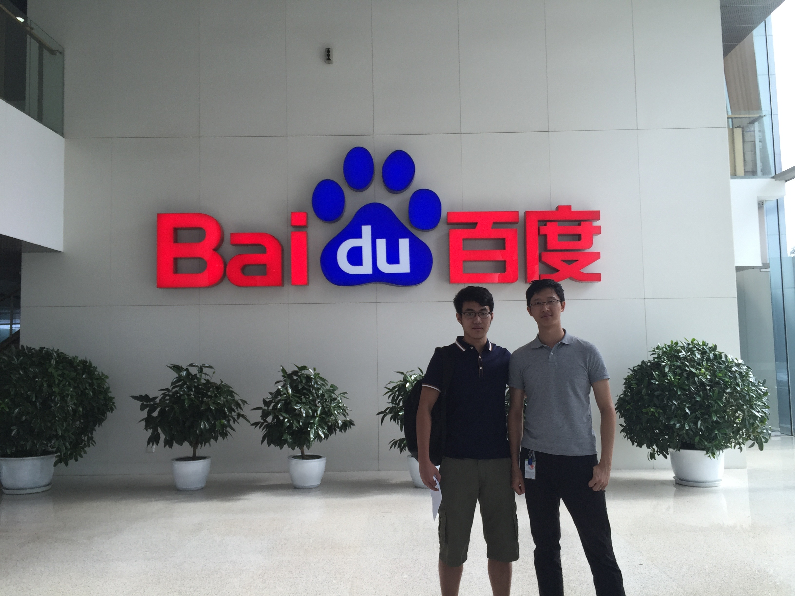
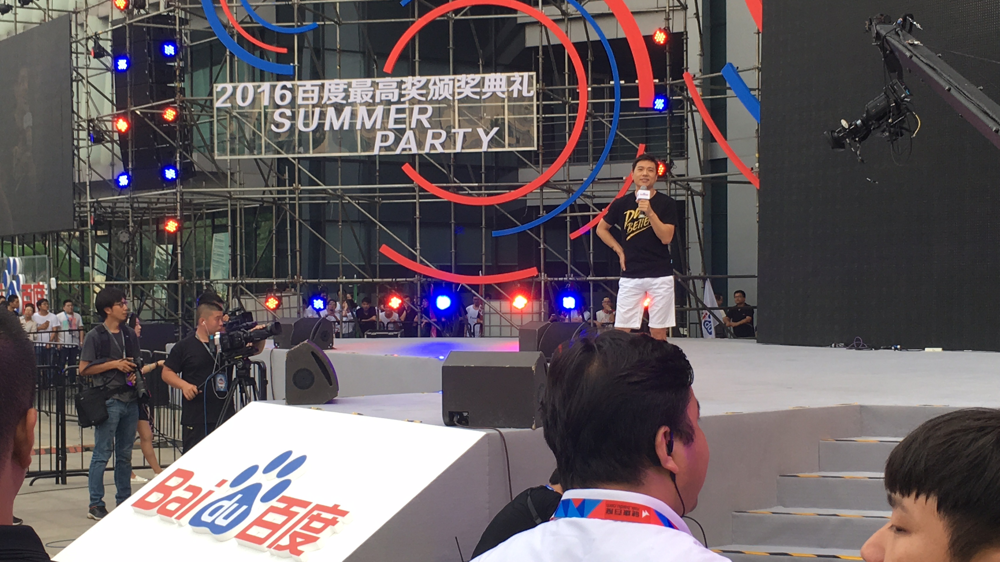
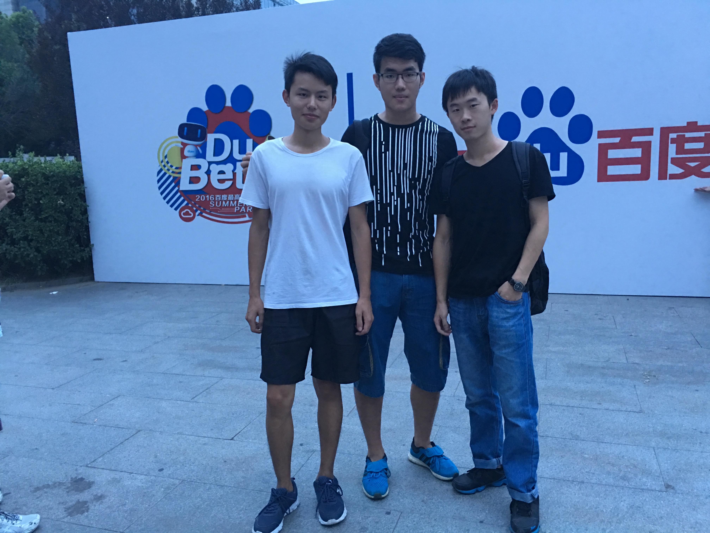
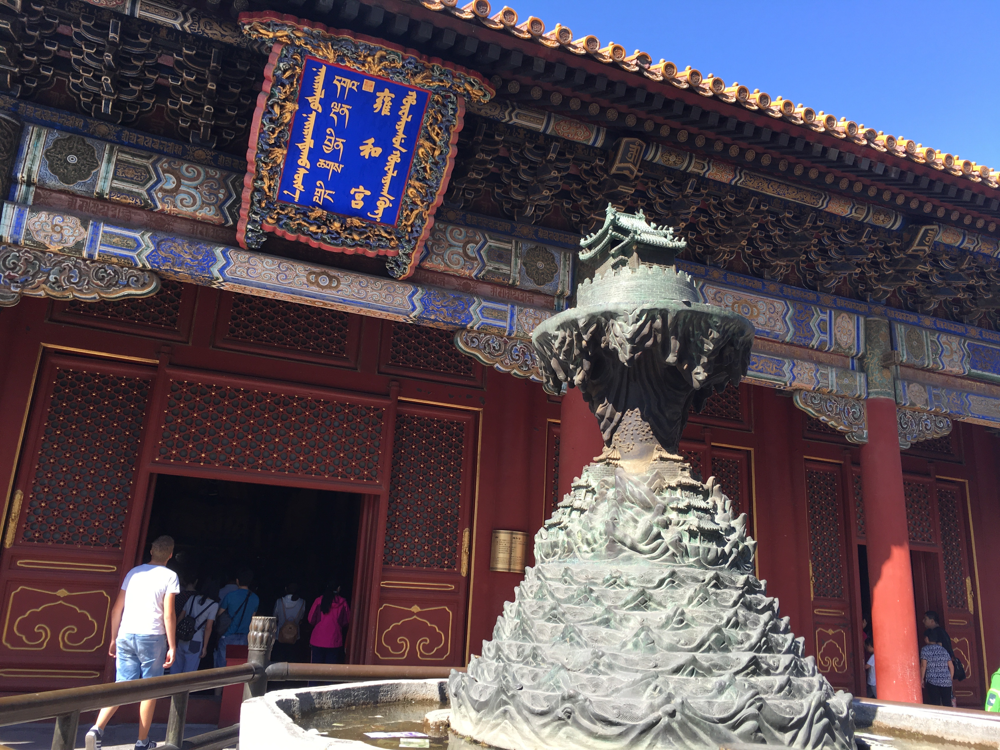
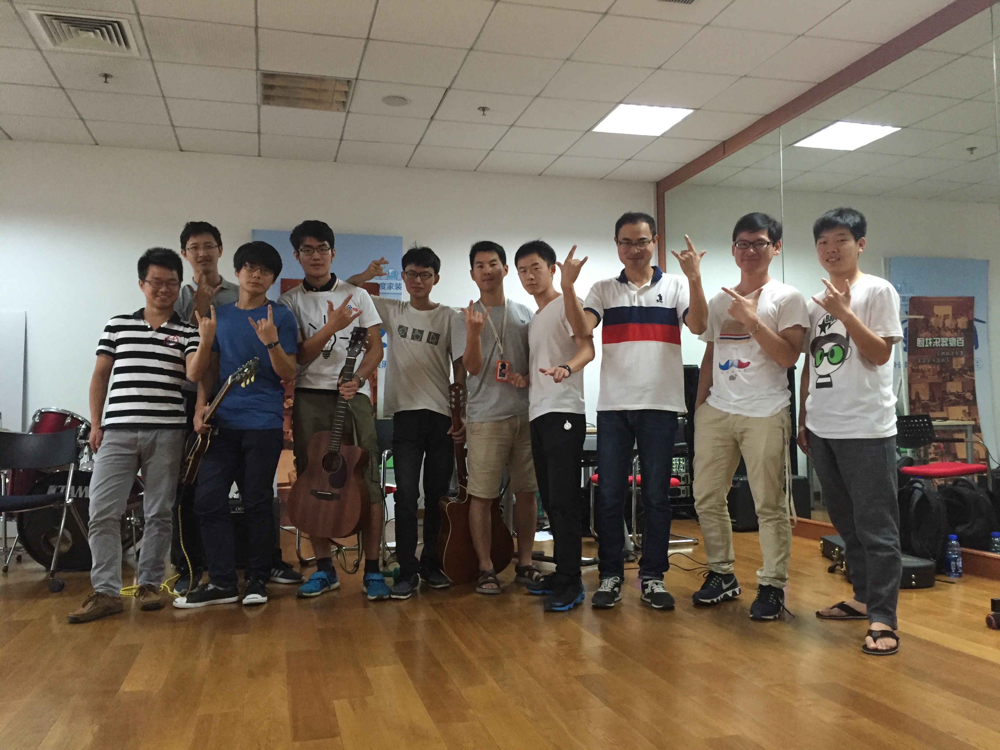

# Introduction 
I have almost done my summer internship at Baidu.inc. As a Chinese person, it has been a dream to work for Baidu, since it is not only the Chinese Google, it is also the Chinese Reddit (Baidu Tieba) and Quara (Baidu Zhidao), and Baidu has Andrew Ng who is a rockstar in Artificial Intelligence working as a Chief Scientist. I did get a few decent offers from tech firms in Canada, but eventually I decided to work in Beijing just to experience the Internet world and see how it is going in China.

# Memories
## Me and My Tech Lead
My tech lead is an admirable person in terms of personalities and technologies. He used to work for Atlanssian™, the producer of Jira and SourceTree. He has great sense of Agile Development.

## Robin Li
CEO of Baidu speaks at summer party

<!--truncate-->

## Hacker Friends
Two of my best friends at Baidu, both of them are crazy hackers and videogame producers.

## Nice Weather
The summer was also clean out of pollution which I worried the most for working in Beijing. 

## Music Concert
At the last day of Baidu, I hosted a concert in the Headquarter building. There were 50+ people attended the concert including Senior architects and Directors of Baidu.

