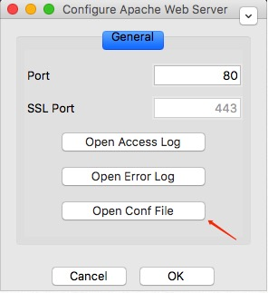
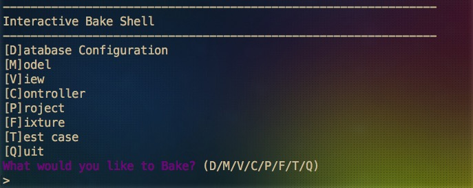
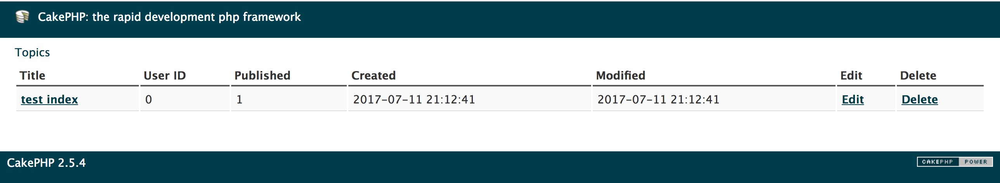
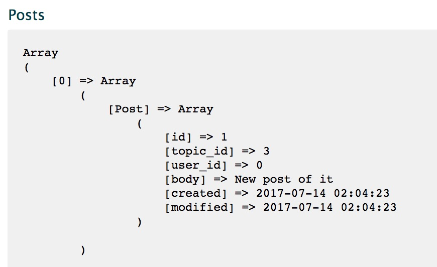
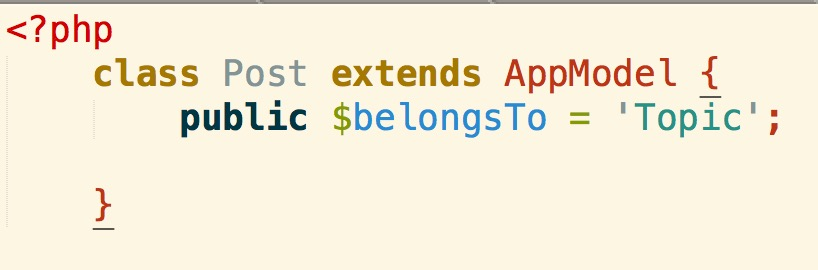
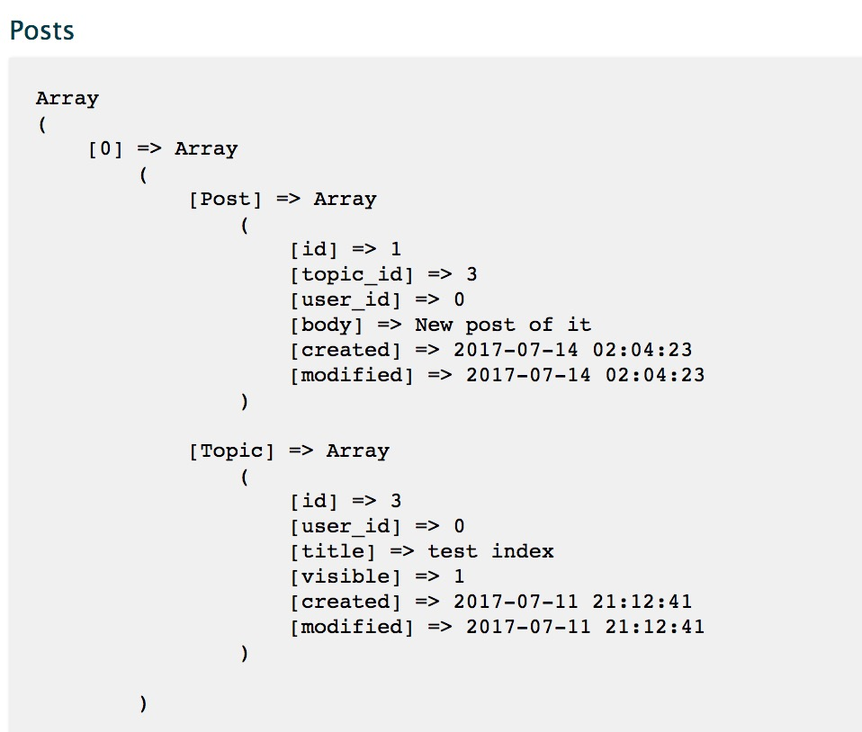

I have been playing around with PHP a lot with a Baidu open-source project -> http://task.redefime.com/app/list recently. The project used mainly CakePHP as the back-end, which is an elegant solution for MySQL+PHP stack. I am writing this blog for documentation and reference purposes for my future. I am getting more and more like the character in Nolan's movie 'Memento' as I need to keep writing things down to keep me not running around the circles and trapped by the same set of pitfalls.

# Environment Set Up

1. Get XAMPPP
2. Set up Virtual Host : `<virtualhost>` tag is used when you have multiple projects and you want to host them on different domain names so it doesn't get messed up:
	1. Open Config File:
		
	2. set up directorys and VirutalHost mapping (`DocumentRoot` is your project root, `ServerName` is going to be the domain name you want to host the `DocumentRoot` Files in):

	```php
	<VirtualHost *:80>
	DocumentRoot "/Applications/XAMPP/xamppfiles/htdocs/tree-outliner"
	ServerName test-outliner.com
	</VirtualHost>

	<VirtualHost *:80>
		DocumentRoot "/Users/Carl/Development/Learn/cakephpforum.com/app"
		ServerName cakephpforum.com
	</VirtualHost>
	```

<!--truncate-->

	3. set up hosts file on OS:

	```c
	// the way how it works is that when you start apache in XAMPP,
	// it will host files configured in httpd.conf on Localhost/127.0.0.1
	// when you open a site on browser, it goes to /etc/hosts file first
	// if no domain is found in the hosts file, it will go to DNS server and ask for the site IP
	// but if you map it in the /etc/hosts file, it will directly be redirected to the XAMPP hosted project

	//on mac you can open the file by entering the line in terminal : 
	vi /etc/hosts

	//and after the file is opened, append the following line: 
	127.0.0.1 	test-outliner.com
	127.0.0.1 	cakephpforum.com
	```

   !!!! -> If you have "access forbidden" problem, you need to give all DocumentRoot referred directories RW rights by doing `chmod -R 777 $directories`

3. Set up Cake Console : Download and unzip CakePHP, and add path in .bash_profile : `export PATH="/Users/Carl/Development/Learn/cakephpforum.com/app/Console:$PATH"` (in my case, /Users/Carl/Development/Learn/cakephpforum.com/app is the folder I unzipped my CakePHP.zip to, Console is a directory of CakePHP)
4. Copy paste `database.php.default` and rename it to `database.php` in the /app/Config folder, change host to `127.0.0.1` if using Mac OS, set database to the database you want to use on mysql (to access mysql panel, after starting up mysql in XAMPP, go to localhost/phpmyadmin

# Bake a Cake
## Cake Console
Essentially CakePHP wraps up lower level connections to MySQL, once you have the database set up on `localhost/phpmyadmin`, and everything is configured in `database.php`, you can run `cake bake` in the terminal under the current project directory to "bake a cake":



It will generate file automatically based on your shell configuration input, and you can begin coding with a MVC pattern set up.

## MVC in CakePHP

The whole flow of CakePHP can be view from this chart:


### View
The basic idea is, when the user access an URL on the domain. It retrieves the `.ctp` file from the `View` folder according to the URL routing. For example, if they are accessing `http://cakephpforum.com/topics`, then `View/Topics/index.ctp` is retrieved and rendered to the browser ( Capitalization will be handled automatically by CakePHP, so `Topics` and `topics` will both work ). 

In our case, lets say we have a table of topics on this view:

```php
<h1> Topics </h1>
<table>
<tr>
	<th>Title</th>
	<th>User ID</th>
	<th>Published</th>
	<th>Created</th>
	<th>Modified</th>
	<th>Edit</th>
	<th>Delete</th>
</tr>

<?php foreach($topic as $topic) : ?>
<tr>
	<td><?php echo $this->HTML->link($topic['Topic']['title'], array('controller'=> 'topics', 'action'=>'view', $topic['Topic']['id'])) ?></td>
	<td><?php echo $topic['Topic']['user_id']; ?></td>
	<td><?php echo $topic['Topic']['visible']; ?></td>
	<td><?php echo $topic['Topic']['created']; ?></td>
	<td><?php echo $topic['Topic']['modified']; ?></td>
	<td><?php echo $this->HTML->link('Edit', array('controller'=>'topics', 'action'=>'edit', $topic['Topic']['id'])) ?></td>
	<td><?php echo $this->Form->postLink('Delete', array('controller'=>'topics', 'action'=>'delete',$topic['Topic']['id']), array('confirm'=>'Are you sure you want to delete this topic?')) ?></td>
</tr>	
<?php endforeach; ?>
<?php unset($topic); ?>
</table>

```


### Controller
Controller is triggered by the user interaction on the view:

```php
<td><?php echo $this->HTML->link('Edit', array('controller'=>'topics', 'action'=>'edit', $topic['Topic']['id'])) ?></td>
```

In the easiest example above, this creates a link called Edit, and whenever the user clicks on it, it goes to topics controller and trigger function 'edit' with a parameter `$topic['Topic']['id']`.

Lets say we have the code for `edit`:

```php
public function edit($id){
			// query the data
			$data = $this->Topic->findById($id);

			if($this->request->is(array('post','put'))){
				$this->Topic->id = $id;
				if($this->Topic->save($this->request->data)){
					$this->Session->setFlash('The Topic has been editted!');
					$this->redirect('index');
				}
			}
			$this->request->data = $data;
		}
```

The controller can access Model by `$this->Topic`, and do any kind of query and data access from MySQL. After the data gets saved in our case, the controller used `$this->redirect('index');` to redirect back to the index view of Topics.

### Model
Model mirrors the image of SQL database as similiar concept of Schema in Mongoose. Association of foreign keys have to be done manually in Model. For example, without having association defined, if you directly print data of Post Model, it will give you the following: 



With the association defined by setting `$belongsTo` variable in the Model:



The same data query will return you Topic information that this Post belongs to as well:



