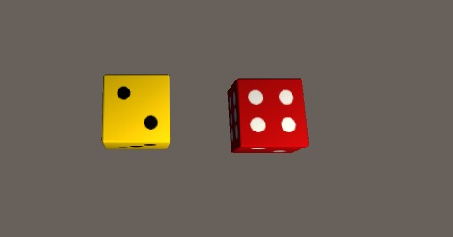
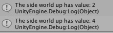
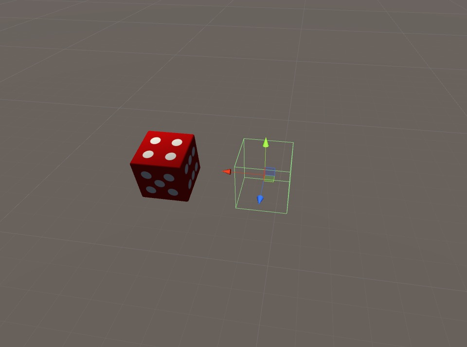
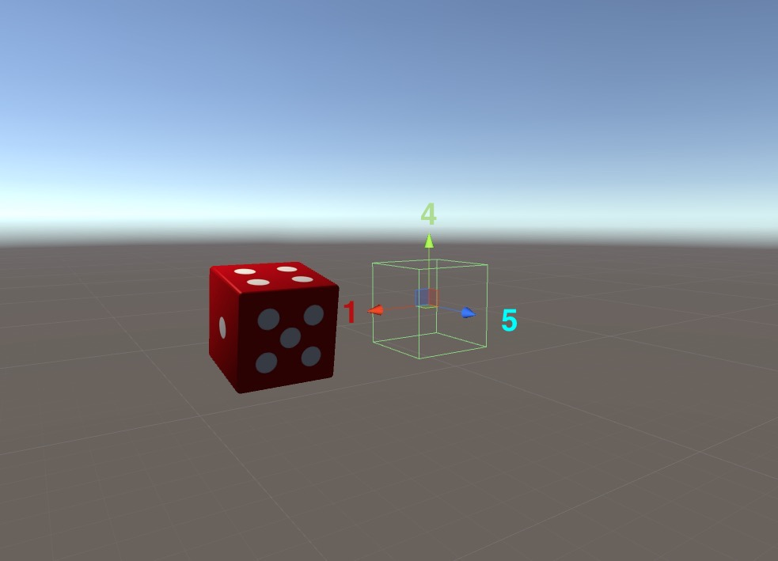
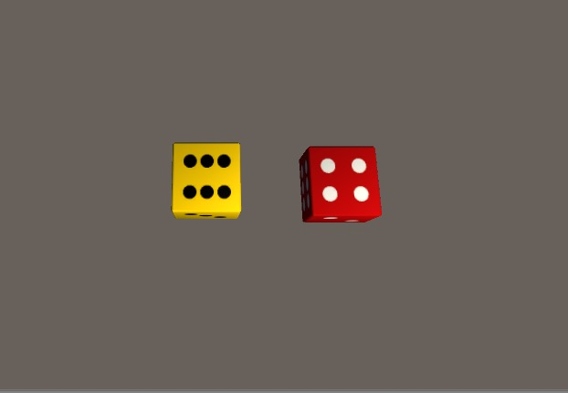
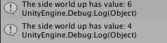

# Problem Description

During our development of Settlers of Catan, we met a subfunction level problem of synchronizing a dice and read the dice result based on the face exposing up. 

For example, given two dices in the following positions. You need to detect the facial values of the dices.


The number is printed in console.


<!--truncate-->

# Some Solutions

There are generally 3 ways of tackling down the dicing problem as I brainstormed and researched:
- 1. Make each dot a prefab and detect the collision between the dot and surface
- 2. Use Raycast from top to the dice to detect which surface is hitting up
- 3. Psedo-Rotation: generate a number first, then have an animation effect of dice rolling. Eventually displays the face that has the same number value as the number generated.

# Easy Approach

The above methods seem to be more real-world focused as if the dice is really there.

However, in unity, each prefab has meta-values such as trasnformation and colliders. After some time of thinking, I came up with a quick solution to the problem, which is to use the rotation of the dice to detect its value.

1. In Unity, the dice without any material is actually a cube


2. We assign a referencial value to the rotation its self. For example, a vector of (0,0,0) will be 4 facing up, (-90, 0, 0) will be 1 facing up.

	
	```c
void Awake() {

		// Pre-defined direction and face values
		// This is based on D6's material, @todo number will need to be reassigned if change material
		if (directions.Count == 0) {
			directions.Add(Vector3.up);
			faceValues.Add(5);
			directions.Add(Vector3.down);
			faceValues.Add(2); 
			directions.Add(Vector3.left);
			faceValues.Add(3);
			directions.Add(Vector3.right);
			faceValues.Add(4); 
			directions.Add(Vector3.forward);
			faceValues.Add (1); 
			directions.Add(Vector3.back);
			faceValues.Add(6); 
		}
	}
	```

3. Get Numbers

	```c
public int getNumber(Vector3 referenceVectorUp, float epsilonDeg) {
		// use reference of object transformation
		Vector3 referenceObjectSpace = transform.InverseTransformDirection(referenceVectorUp);

		// Use delta to find the most possible face that is facing up
		float min = float.MaxValue;
		int mostSimilarDirectionIndex = -1;
		for (int i=0; i < directions.Count; ++i) {
			// compare angles
			float a = Vector3.Angle(referenceObjectSpace, directions[i]);
			if (a <= epsilonDeg && a < min) {
				min = a;
				mostSimilarDirectionIndex = i;
			}
		}

		// return -1 for corner cases
		return (mostSimilarDirectionIndex >= 0) ? faceValues[mostSimilarDirectionIndex] : -1; 
	}
```

4. Test it, roll the dice:



5. Print Results to Console

	```c
	public void showNumber() {
		string name = transform.name;
		//prints number that is facing up to the console
		Debug.Log("The "+name+" has value: " + getNumber(Vector3.up, 30f));
	}```
	


# Synchronization over the Network

At the very end, we need to synchronize the dice move moment across the network with Photon.

```c
[PunRPC]
	void RollDice(int number, int number1, int number2){
		diceRoller = Instantiate(diceRollerPrefab , new Vector3(-1.0f,0,-5.7f),Quaternion.identity);
		GameObject[] lists = GameObject.FindGameObjectsWithTag ("Dice");
		foreach(GameObject go in lists ) {
			DiePhysics physics = go.GetComponent<DiePhysics> ();
			Debug.Log ("vector is " + number + " " + number1 + " " + number2);
			physics.init (new Vector3 ((float)number+1, (float)number1+1, (float)number2+1));
		}
		StartCoroutine (ShowDiceResult ());
	}

	IEnumerator ShowDiceResult(){
		yield return new WaitForSeconds (3.0f);
		GameObject[] lists = GameObject.FindGameObjectsWithTag ("Dice");
		foreach(GameObject go in lists ) {
			FaceDetection faceDetection = go.GetComponent<FaceDetection> ();
			faceDetection.showNumber ();
		}
	}
	```