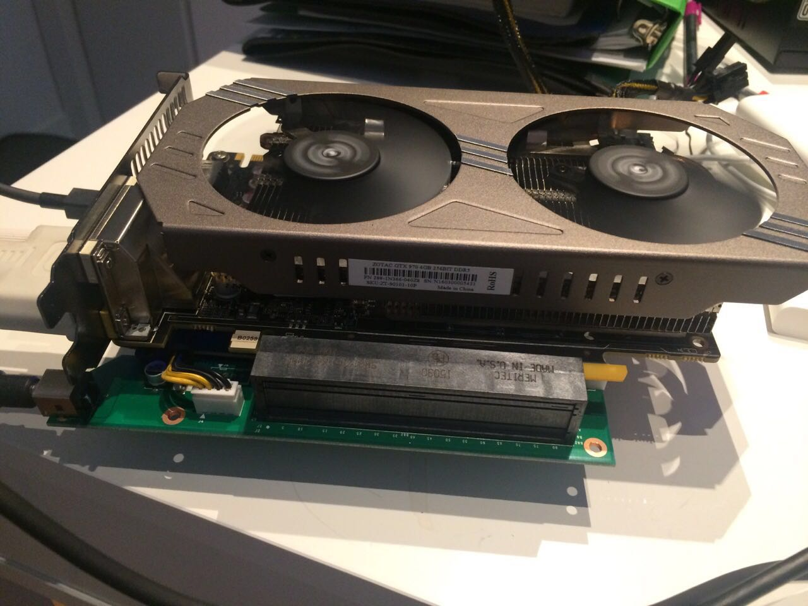

I was looking for a new desktop set up recently, and I explored a bunch of 

# E-GPU 

E-GPU just stands for External GPU. I was browsering online a week ago and found this

- 

So i was like maybe i should give it a try with my new macbook.

To fit into the Akitio box, you actually need an extra mini videocard.
I just took out the motherboard of akitio (PCIE to Thunderbolt) and plugged my video card in :

<!--truncate-->

You will also need a PSU for the videocard:

However, ***_NOTE_***!

2012 Macbook Pro doesn't really support EGPU set up. How E-GPU works is that it utilizes a mirroring technology of Intel Iris video-card (which is supported by macbook 2013 and newer models), it mirrors the computed images from E-GPU to the monitor. 2012 doesn't have an Iris videocard hence this technology is not supported.

So this is a failed experiment !

# Origin

I digged a good Origin computer from a guy who used to work for Ubisoft for 1400$. It came in unboxed:

# More to come?

I will explore more stuff in the market :)