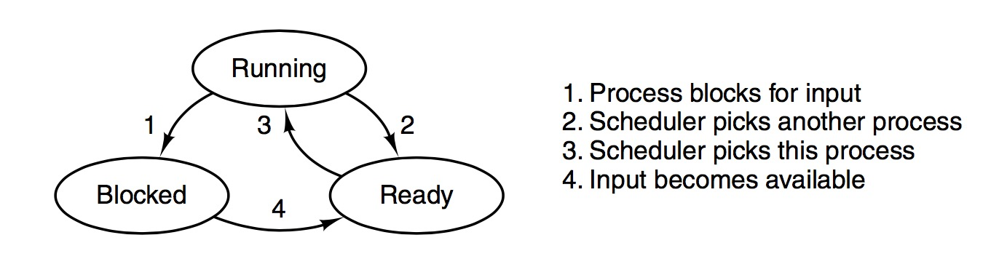
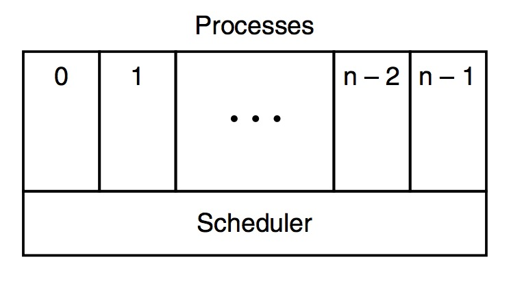
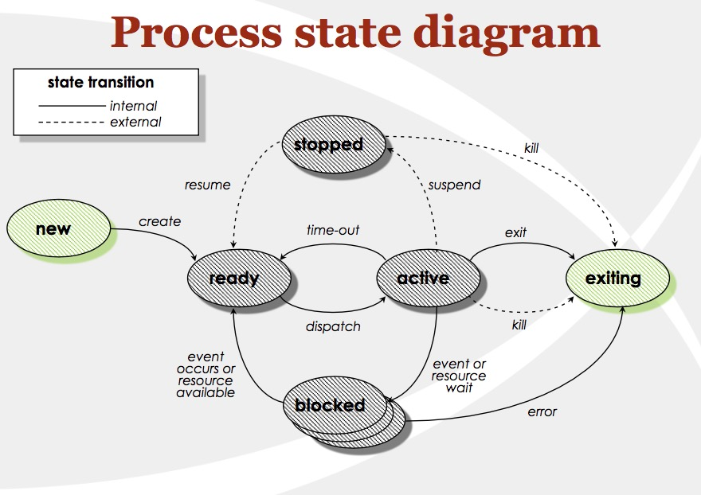
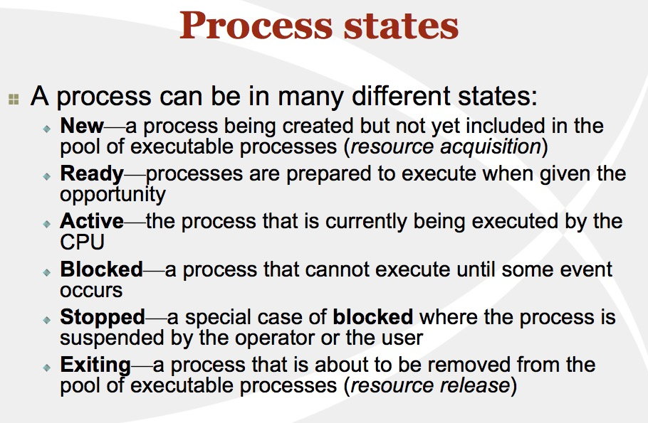
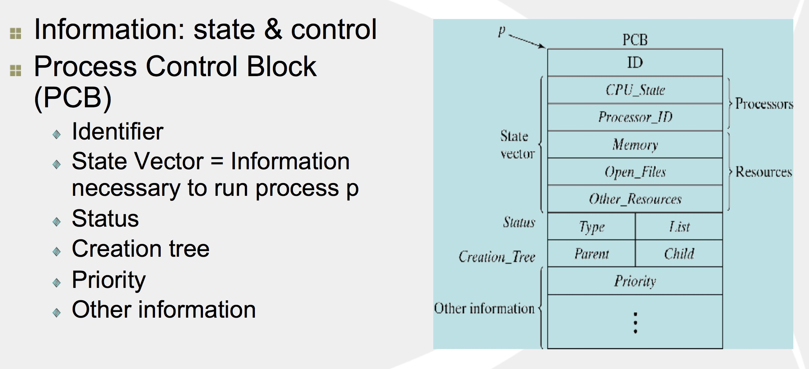
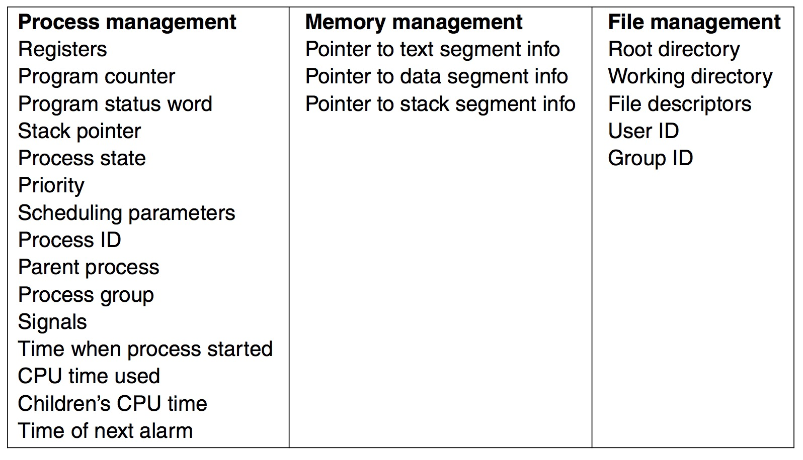
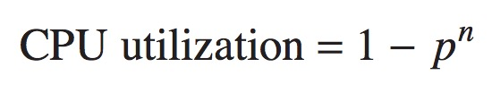
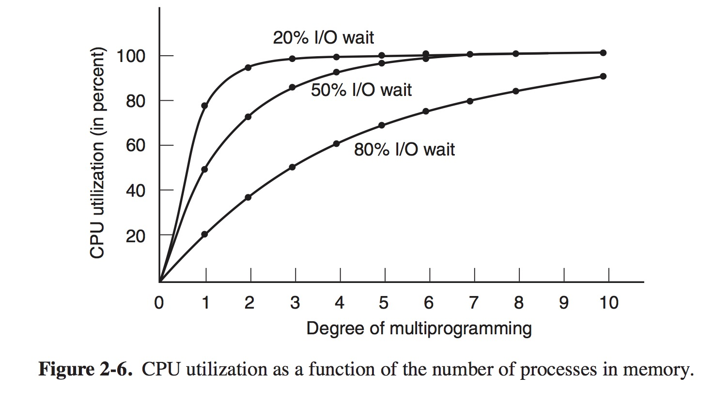

#Process
- This note-blog basically covers readings of chapter 2
- waitpid(pid_t pid, int *status, int options)

## Processes-2.1
- Pseudoparallelism: only one process is running at a certain instance, in a course of 1 second, cpu works on several of them, giving the illusion of parallelism.
- Multiprocessor Systems : two or more CPUs sharing the same physical memory. Keeping track of multiple/parallel activities is hard for people to do. => OS designers evolved a conceptual model (sequential processes)
<!--truncate-->
### The Process Model-2.1.1
- The conceptual model is organized into a number of sequential processes/ or just processes for short. A process is just an instance of an executing program (including the current values of the program counter, registers, variables), and each process has its own virtual CPU. Real CPU switches back and forth. -> multiprogramming.

### Process Creation-2.1.2 
- Four principal events cause processes to be created:
	1. System initialization.
	2. Execution of a process-creation system call by a running process.
	3. A user request to create a new process.
	4. Initiation of a batch job.
- Processes that stay in the background to handle some activity such as email, Web pages, news, printing, and so on are called _daemons_. (in UNIX，ps can be used to checkout background processes, windows->task manager)
- Processes can create processes：Creating new processes is particularly useful when the work to be done can easily be formulated in terms of several related, but otherwise independent interacting processes. ->a new process is created by having an existing process execute a process creation system call. 
- In UNIX (including almost all POSIX-based systems, including Linux, FreeBSD, OS X), there is only one system call to create a new process: _fork()_. Usually, the child process then executes _execve_ or a similar system call to change its memory image and run a new program. 0, get id, 1. fork off, 2. execve
- `In Windows, in contrast, a single Win32 function call, CreateProcess, handles both process creation and loading the correct program into the new process. This call has 10 parameters, which include the program to be executed, the com- mand-line parameters to feed that program, various security attributes, bits that control whether open files are inherited, priority information, a specification of the window to be created for the process (if any), and a pointer to a structure in which information about the newly created process is returned to the caller. In addition to CreateProcess, Win32 has about 100 other functions for managing and synchro- nizing processes and related topics.`
- Two ways of creating a new process
	Windows (building from stratch):
	> `1. load code and data into memory`
	> `2. create (empty) a dynamic memory workspace (heap)`
	> `3. create and initialize the process control block`
	> `4. make process known to process scheduler(dispatcher)`

	UNIX (clone an existing one):
	> `1. stop current process and save its state` 
	> `2. make a copy of code, data, heap and process control block`
	> `3. make process known to process scheduler (dispatcher)`

- 
Also it important to note that in UNIX, there are only two ways to start a process that is not in the Init(which is the initalization process tree): exec() and fork(). When you don't want another copy of the same program, you want to run a different program, exec() system call is used. It replaces the current running program with an entirely new one. This means that when you call exec, the operating system stops your process, loads up the new program, and starts that one in its place. A process never returns from an exec() call (unless there’s an error).

	
### Process Termination-2.1.3
- A process will terminate due to one of the following conditions:
	- 1 Normal exit (voluntary)
	- 2 Error exit (voluntary)
	- 3 Fatal error (involuntary)
	- 4 Killed by another process (involuntary)
- A process executes a system call to tell the operating system that it is finished: in UNIX, it is exit() / in Windows, it is ExitProcess()

### Process Hierarchies-2.1.4 
- Each process only have one parent.
- In UNIx, a process and all of its children and further decendants together form a process group; which means when a user sends a signal from the keyboard, the  signal is delivered to all members of the process group currently associated with the keyboard.
- In UNIX, after computer is booted, a special process called init, is present in the boot image. *Windows* have no concept of hierarchy.

### Process States-2.1.5 
- Although each process is a independent entity with its own *program counter* and internal state. -> interation is always needed.
- Fig.2.2, there are three states a process may be in:
	- Running ( Actually using the CPU at that instant)
	- Ready ( runnable; temporarily stopped to let another process run)
	- Blocked ( unable to run until some external event happens) 

 Transition 1 occurs when the OS discovers that a process can't continue right now. *Block has two types 
 1. Logically not possible to continue (i.e. some input is missing) 2. OS decided to take its resources to another process

 Transitions 2 and 3 are caused by process scheduler (process doesn't know about them even). Transition 2 occurs when the scheduler decides the running process has run long enough, and it's time for other process to use the CPU. Transition 3 occurs when all other processes have had their fair share, and it's time to let first process to use the CPU agian. 

Transition 4 is for Transition 1's response, when an I/O is ready for the process that has been waiting. 

Normally there are 3 types of schedulers are available in operating systems.
1. Long term scheduler: long term scheduler selects the processes which are in the disk(input queue)and load them in to the main memory.
2. Mid term scheduler: The medium term scheduler selects the jobs which are waiting for the I/O devices and remove them from the contest for the cpu and place them in the appropriate device queue
3. Short term scheduler: The short term scheduler selects the processes in the main memory which are waiting for cpu and allocate them to the cpu for execution.
*. Scheduler is also program written in Code. The lowest level of the OS is the scheduler, with a variety of processes on top of it.

- *Another state of suspension can be used to add into the three-state diagram. Suspending State means to move a process out of RAM and put that into HD, so more processes can have space in RAM to run*

Support material, another Process State Diagram:

### Implementation of Processes-2.1.6 

- To implement the process model, the OS maintains a table (an array of structures), called the process table/process control blocks, which one entry per process. => This entry contains important information about the process’ state, including its program counter, stack pointer, memory allocation, the status of its open files, its accounting and scheduling infor- mation, and everything else about the process that must be saved when the process is switched from running to ready or blocked state so that it can be restarted later as if it had never been stopped.
- The book is not accurate, PC and SP in the table is the value that is saved and later pushed into the PC and SP. CPU only has one PC and SP

- Associated with each I/O class is a location (typically at a fixed lo- cation near the bottom of memory) called the *interrupt vector*. It contains the address of the interrupt service procedure.
- A process may be interrupted thousands of times during its execution, but the key idea is that after each interrupt the interrupted process returns to precisely the same state it was in before the interrupt occurred.

### Modeling Multiprogramming-2.1.7
- CPU Utilization formula:

- This Formula can be used to decide whether to add components like RAM. i.e. each program takes 2 GB RAM, the program has 80% I/O wait, CPU utilization is hence 1-0.8^3. IF we add another 8GB of RAM to computer, we can run 4 more of the same program, which can raise our CPU usage from 49% to 1-0.8^7=79%.