# Introduction

When I joined Business Process and Information Technology Department of Baidu.inc, I was assigned to a team which was responsible for a development of the Internet giant's ERP system. During my service at the company, I was amazed by the amount of efficiency improvement owning to process management software. Meanwhile, there exists such a similarity between Redux, which is a functional programming based framework suggested by Facebook, and ERP process management. 
# Redux and Functional Programming
## What is Redux?
Redux is a Javascript library that is based on concept of Flux, which provides a great framework to maintain state management (it plays a crucial role combining with React.js which renders JSX based on state-change). Following diagram illustrates a simple paradigm. 
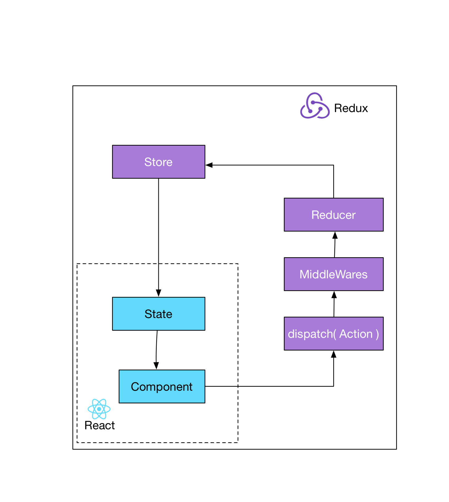
<!--truncate-->
Redux framework is a simple flow that has only three simple roles - _action_, _reducer_, and _store_. Comparing to the traditional MVC framework, Redux implements the beautiful Functional Programming --- each role only takes care of one responsibility at a time, exactly like functions: All _Action_ does is to prepare data needed for the state mutation; _Reducer_ only takes in data and mutate the state according to the function defined and data it receives. _Store_ is a tree data structure that stores data and functions in cache. To pass the data from Redux to React, all we need to do is to use mapStateToProps function to map data from _Store_ to props of React components.
 
## REDUX+REACT vs MVC
Let us take a chatting app as an example:

The server sends user a JSON file including new messages to display, the total number of new messages for notification, and also information of the senders. In MVC framework, the controller will bind data to its corresponding models, and each model maintains data for one or few views (the actual HTML/CSS layer). This will cause some bugs that are hard to track down, just like the following illustration shows:
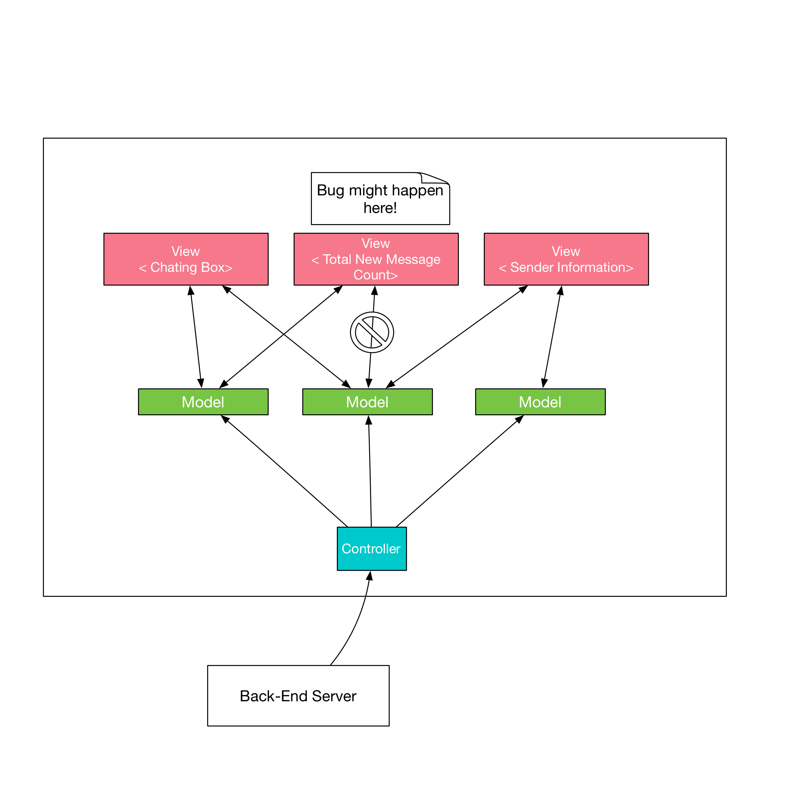
In a MVC case, each model binds more than one view, and it gets messy when there are a lot of data flows going on. Imagine in the chatting application, a view is binded with a model that parses total number of new messages from the file recieved from the back-end server. However, by the same time, another model also binds with the same view, but that model counts number of new messages based on the entries of message strings it receives instead. This will cause an elusive bug to programmers.

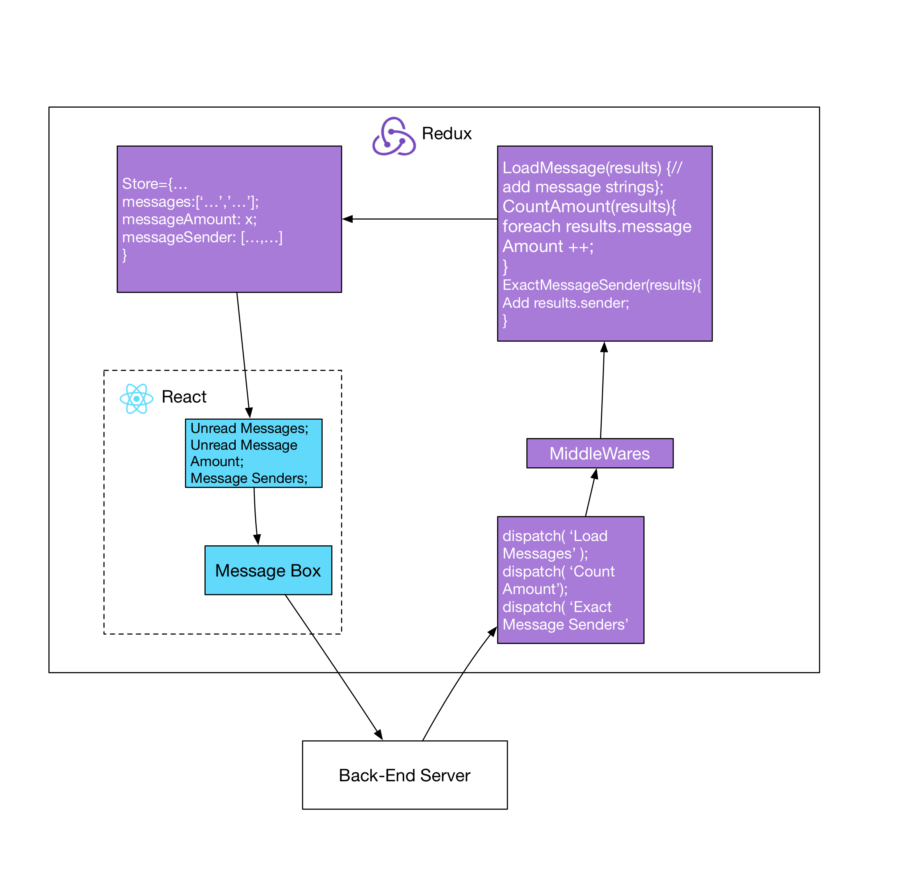
In a React+Redux case, the tangled relationship of MVC is reduced to a circular flow. Each actor is essentially a function which takes in an input and prepares output for the next stage. The illustration below shows explicitly how each stage processes the input data, and mutates the data for the next stage. In this case:
- _Actions_ are functions that extract raw data and process the data for _Reducers_.
	-> ExtractMessageSender() extracts sender names
	-> CountAmount() calculates the amount of message entries in the file received
	-> loadMessage() parse the actual messages in strings
- _Reducers_ takes data processed in _Actions_, and update the current _state_ with the data.
	->  messageSender is a string array of senders' names
	->  messageAmount is the amount of new messages to notify the user
	->  Messages is the actual messages
- Then the new _state_ will cause its corresponding view components to re-render (This is handled in React.js)
	
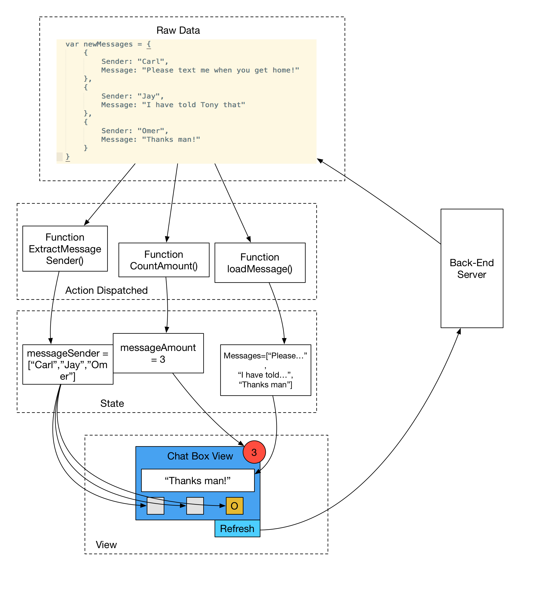

# ERP and Proces Management
I believe in the concept of Functional Programming and process flow of data process can be extended to coorperation management. _Though, I have to admit that since my expereince has been in software and Internet industries, the ERP system I am referring to in the context of this blog is more like EAI (Enterprise Application Integration) comparing to ERP systems built by the professional -- SAP._
## What is ERP
ERP, in general, stands for _Enterprise Resource Planning_. Its first goal is to provide a management platform for the enterprise to increase the resource usage. A good analogy is a multiprogramming system in terms of Operating System. 
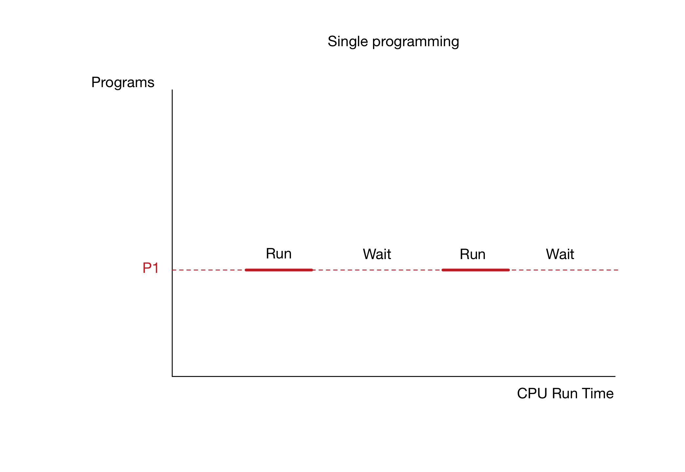
In a single programming system, CPU usage is extremely low, since the CPU runs fast but it takes time for the registers to fetch data from RAM and Hard Disk. However, with a better scheduling, a multi-programming system can utilize the waiting time of CPU running a program to run another program which is loaded and ready to compute (illustrated below).
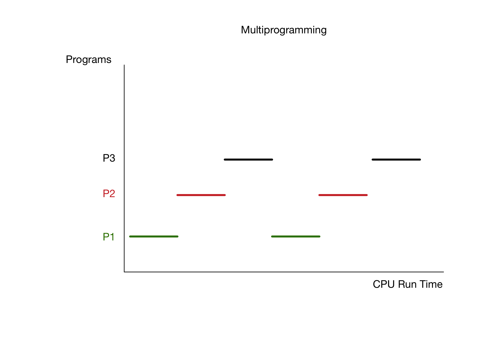
An ERP software provides enterprise a chance  to utilize resources just like how multi-programming system works. In a simple case of a reimbursement claim, the traditional senario would be an employee spending work time running up-and-down stairs of the office to get confirmation and approval from different departments.
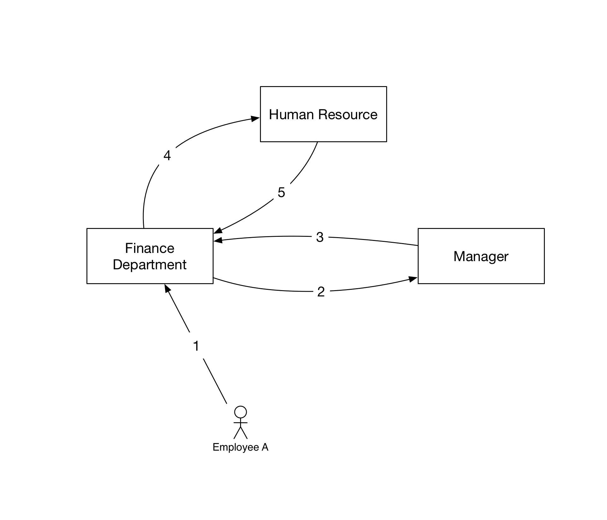
However, if there exists such a software which assigns each role to a specific responsibility, provides information sharing / data analysis, and formats the process into a well-formed flow, the cooperation will be highly organized.
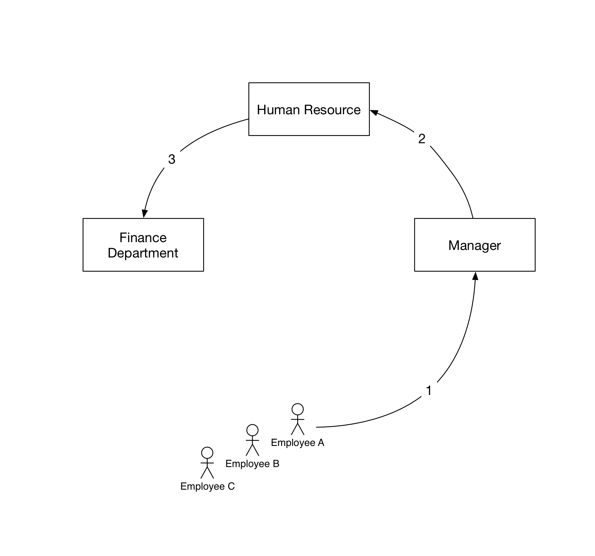

## Baidu ERP and Procurement Platform
I was lucky to be selected among a competitive talent pool to join the department at Baidu that takes responsibility for ERP service. I collabrated with an amazing team and we developed a procurement platform project which is an utility on Baidu ERP system. I will like to share you with a show-case, and introduce you to some of our designs. 
Inspired by Functional Programming and Redux flow, to achieve high productivity, we believe the most important characteristics are _simplicity_, _transparency_, and _reliability_ in an ERP system. Here are some of our approaches for Baidu Procurement Platform:
### Simplicity
By _simplicity_, I mean in a coorperation, each employee should know its basic responsibility, without having to worry about many unnecessary works.
> It is the great multiplication of the productions of all the different arts, in consequence of the division of labour, which occasions, in a well-governed society, that universal opulence which extends itself to the lowest ranks of the people. -- Adam Smith

This is essenially specialization from the classic economics. For the Baidu Procurement Platform development, I was responsible for providing the HR department an interface to change employee settings. Here is my design that is simple enough for HR department to focus on their responsibility.
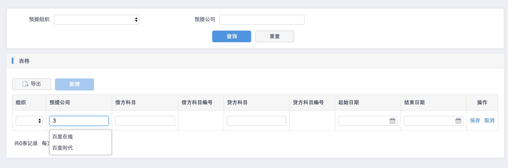
### Transparency
_Transparency_ refers to information quality. A good system should provide enough information for every role player to make decisions. For instance, when an manager is editing claim forms, a good system should provide him enough information that he needs automatically (I developed a table system and employed visualization tool Baidu Echart 2.0 for this page).
***My development of Financial Department Confirmation Page of ERP System***
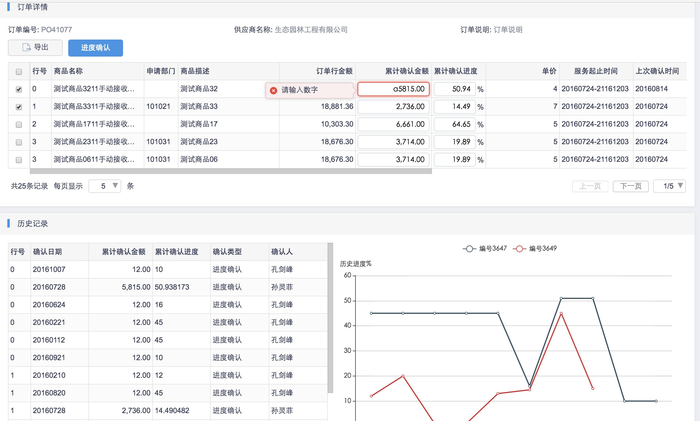
***My development ofHead of Department Confirmation Page of ERP System***
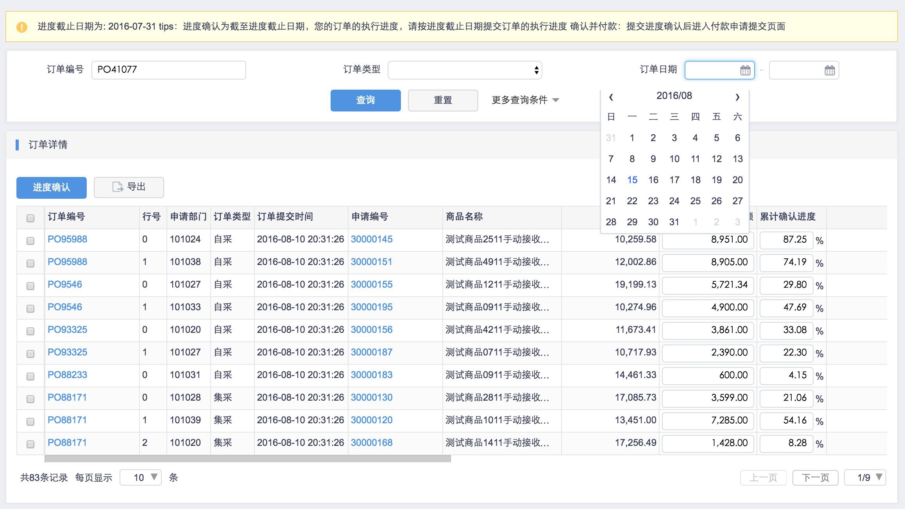

### Reliability
_Reliability_ is established through a long-term training. Team play is totally different game than being a productive individual. How long has the Mythical Man-Month been bothering project manangers? I sometimes even think the Object-Oriented Programming way of thinking is caused by the mistrustful individual programmers. A great ERP system should assure each employee that by being the 'solid function' as he/she focusing on certain job can overcome the Man-Month Myth. We designed the ERP software to provide with a real time data-analysis system where they can visualize their contribution. 
***My development of Personal Progress Confirmation Page of ERP System***
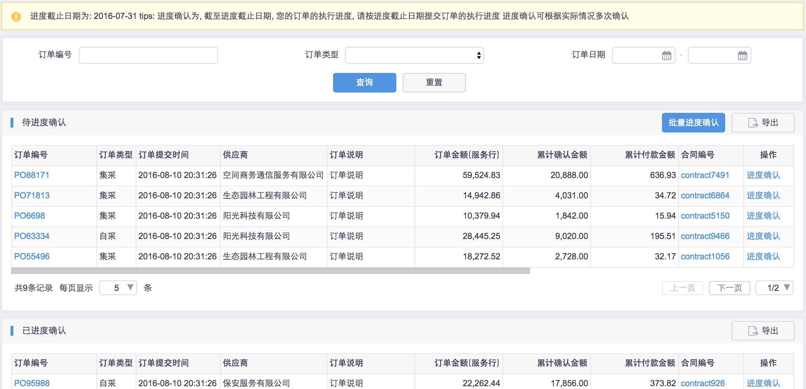

# Beauty of FP and ERP
An incentive of me driving into this topic is that I have been so inspired by Redux and ERP system in solving overly-sized problem using simple function flow. In traditional object-oriented programming, I have been trapped by elusive bugs (which are bugs that do not appear alone within a class, but only appear when few bugs of different classes combined together). With Functional Programming, every process works as a filter, it is relatively easier to track down the specific layer or stage where the bug presents. On top of that, the development of Baidu Procurement Platform opened another view: there exists such a similarity between in concept of FP and ERP systems. I should drive more into this area in the future!