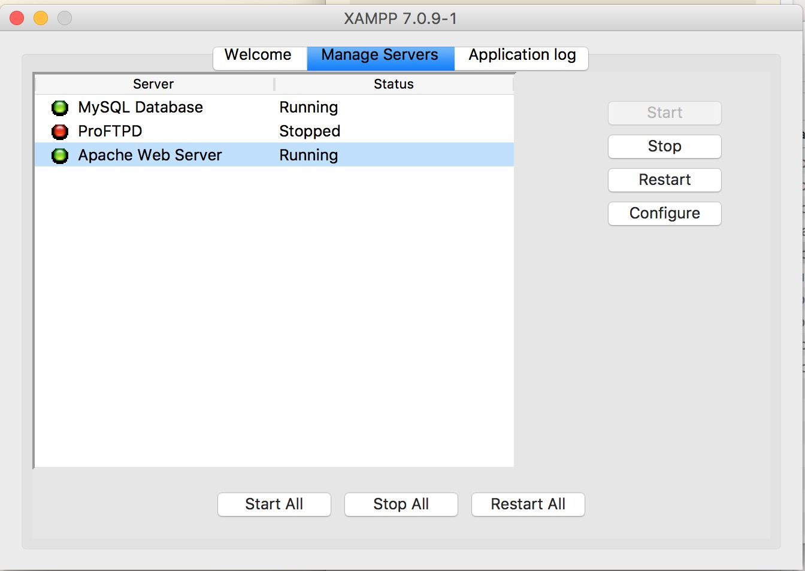
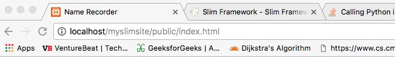
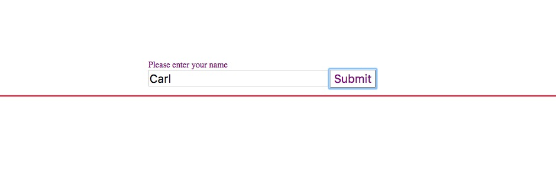
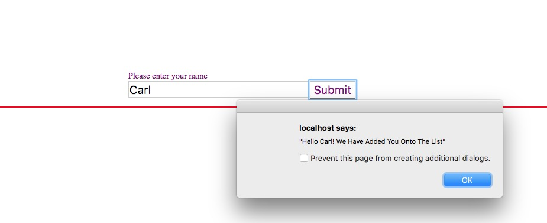
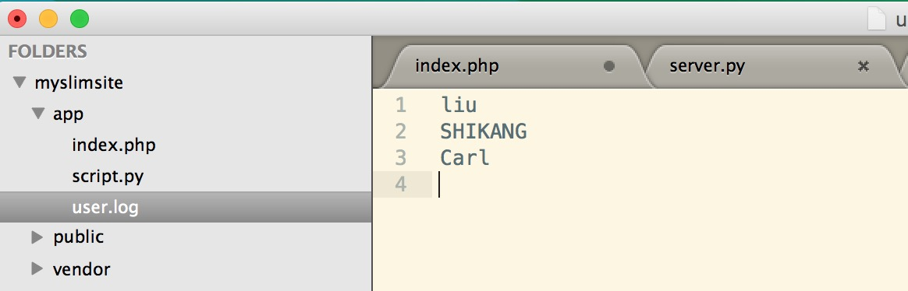

# What Is Slim

Slim is a PHP micro framework that helps you quickly write simple yet powerful web applications and APIs. (Definition on its homepage http://www.slimframework.com/)

Here you can have a taste of it :)

```php
<?php
use \Psr\Http\Message\ServerRequestInterface as Request;
use \Psr\Http\Message\ResponseInterface as Response;

require 'vendor/autoload.php';

$app = new \Slim\App;
$app->get('/hello/{name}', function (Request $request, Response $response) {
    $name = $request->getAttribute('name');
    $response->getBody()->write("Hello, $name");

    return $response;
});
$app->run();
```

I just got introduced to Slim Framework recently, and speaking frankly it is not a good experience working with it and the poor community is nothing like npmjs, which is a place where I hang around most of the time. All the tutorials online are mostly theory-based and really not organized, some of them don't even run properly.
<!--truncate-->

Hence, it will be great to do an example combining Slim with commonly known Jquery and Python to do a quick full stack web app, where you can run it immediately when thrown into XAMPP's htdoc directory.

# Application Description

Let us make a very simple application where the HTML page is hosted for clients to input their name, then Slim takes the JSON api and call python to save the name onto a file called 'user.log'. Nothing complicated!
```
htdocs // just the XAMPP root
|->myslimsite //create this folder
  |->app // our app logics
    |->index.php
    |->script.py
    |->user.log
  |->public // our view level
    |->.htaccess
    |->index.html
  |->vendor
  ```

# Code
## 1.Configuration
under htdocs/public folder, we add '.htaccess' and copy following code into it for server-side cross access
```
RewriteEngine On
RewriteCond %{REQUEST_FILENAME} !-f
RewriteCond %{REQUEST_FILENAME} !-d
RewriteRule ^ index.php [QSA,L]

# for cross domin access 
Header add Access-Control-Allow-Origin "*"
Header add Access-Control-Allow-Headers "origin, x-requested-with, content-type"
Header add Access-Control-Allow-Methods "PUT, GET, POST, DELETE, OPTIONS"

```
## 2.HTML and JQuery
This is the easiest part, everyone knows how to write it, so i'm just gonna go ahead and write the code.

```html
<!DOCTYPE html>
<html>
<head>
	<title> Name Recorder </title>
	<script src="https://cdnjs.cloudflare.com/ajax/libs/jquery/3.1.1/jquery.min.js"></script>

	<script>
	var url = 'http://localhost/myslimsite/app/index.php/savename';
	var input = {};
	var asyn;
	function sendData(){
		var name = document.getElementById("input").value;
		$.support.cors = true;
		$.get(url, { name: name }, function(data){
		alert(JSON.stringify(data));
		});
	}
	</script>
</head>
<body>
<div style="padding:10%">
	<div style="padding-left:20%">
		<div style="color:purple; "> Please enter your name </div>
		<form>
			<input id="input" type="text" style="width:250pt;height:20pt;font-size:16pt;"></input>
			<button id="submit" type="button" onclick="sendData()" style="background-color:white;color:purple;font-size:16pt;border-style:solid 1px">Submit</button>
		</form>
	</div>
	<div id="message" style="color:red; border: solid 1px; margin-top:15px"></div></div>
</body>
</html>
```

## 3.Slim Handling of JQuery Get Request
Within the HTML file we have written a function to parse form input and send the name to the SLIM whose router is '/savename' by JSON.
Now we need to go into that '.php' file and add handler function to handle requests at '/savename' context.

```php
<?php
use \Psr\Http\Message\ServerRequestInterface as Request;
use \Psr\Http\Message\ResponseInterface as Response;

require '../vendor/autoload.php';
$app = new \Slim\App;

$app->get('/savename', function(Request $request, Response $response) {
	$allGetVars = $request->getQueryParams();
	$name = $allGetVars['name'];
    $response->write("Hello " . $name . "! We Have Added You Onto The List");
    return $response;
});	

$app->run();
```

The code handles any request at '/savename' context, and parse the request by `$request->getQueryParams()`, afterwards it returns a response to user through `$response->write` to let the user know it has received the message.

## 4.Python Script As Service
Now we have a working HTML and Request Handler, we need a script to provide actually data saving and fetching as a database. Usually this is done via mySQL which is supported by XAMPP originally. To illustrate flexibility of Slim, we will use Python and .log text file to work as Database.

First we need a properly working python file that takes in an argument of String name and append it to .log file.

```python
#!/usr/bin/python

import sys, getopt

def appendName(name):
	filename = "user.log"
	with open(filename, "a") as myfile:
		myfile.write(name + '\n')
	print 'write ' + name + ' to ' + filename + '\n'

if __name__ == "__main__":
	appendName(sys.argv[1])
	
```

And we can initialize our user.log file with either null or random strings:

```
Liu
SHIKANG

```

To put pieces together, we need call this python file in Slim's php code. Easy:

```php
	$command = "python ./script.py $name";
	exec($command);
```

And our index.php file now becomes

```php
<?php
use \Psr\Http\Message\ServerRequestInterface as Request;
use \Psr\Http\Message\ResponseInterface as Response;

require '../vendor/autoload.php';
$app = new \Slim\App;

$app->get('/savename', function(Request $request, Response $response) {
	$allGetVars = $request->getQueryParams();
	$name = $allGetVars['name'];
	$command = "python ./script.py $name";
	exec($command);
    $response->write("Hello " . $name . "! We Have Added You Onto The List");
    return $response;
});	

$app->run();
```

# Play!

## 1. Start XAMPP


## 2. Open URL


## 3. Input Name


## 4. Submit


## 5. Check DB!


NOW CONGRATS, YOU HAVE GOT A SLIM APP RUNNING