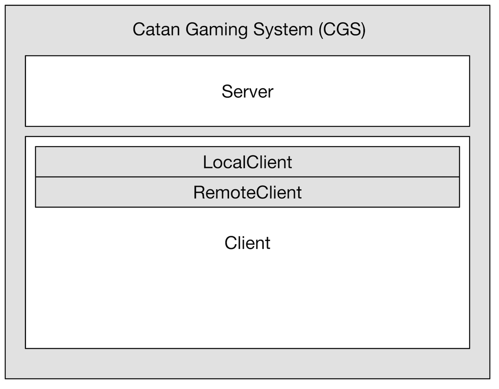
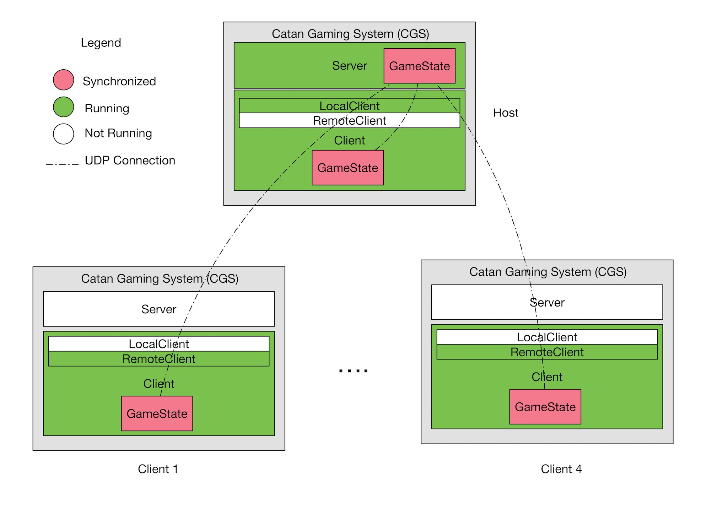

# Settlers of Catan Project

>The Settlers of Catan, sometimes shortened to just Catan, is a multiplayer board game designed by Klaus Teuber and first published in 1995 in Germany by Franckh-Kosmos Verlag (Kosmos) as Die Siedler von Catan. Players assume the roles of settlers, each attempting to build and develop holdings while trading and acquiring resources. Players are rewarded points as their settlements grow; the first to reach a set number of points, typically 10, is the winner. The game and its many expansions are also published by Mayfair Games, Filosofia, Capcom, 999 Games, Κάισσα, and Devir. -- Wikipedia

# Unity Client-Server Architecture
Our Catan Gaming System(CGS) will be based on Server-Client architecture. CGS is based on Unity engine, and since Unity’s networking is integrated into the engine and the editor, it is redundant to treat Server and Client as different executables like how a traditional Server-Client architecture would. In our design, we are treating the entire CGS as one executable, and within the executable there are Server and Client components. An overview structure of our executable is shown here:
<!--truncate-->

The executable provides user options to become either a Host, which is a participant who runs a combination of server and client at the same time (defined by Unity HLAPI), or a Client. When a player running the game acts as the ‘Host’, on that particular player’s instance of the game would be running ‘Server’ and ‘LocalClient’ instead of a normal ‘RemoteClient’. When a player runs the game only acting as a Client, only ‘RemoteClient’ is run:

However, despite the difference between LocalClient and RemoteClient, they both inherit from Client component class called Client. Client component provides all foundations for the gameplay including Graphics, Logics, and States (See Environment Model below for details). To achieve network synchronization during gameplay, our pattern is to have a GamePlay object that manages the current state of the game within each Client Component, and it consistently synchronizes with Server via UDP connection supported by Unity Infrastructure.

# Final Submission
[view pdf](http://carlrocks.com/pdf/FinalSubmission.pdf)