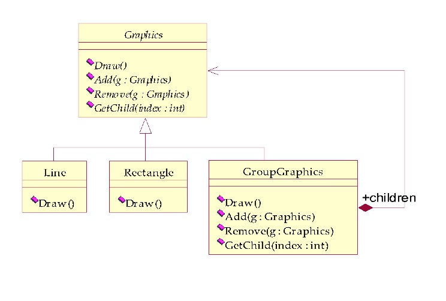
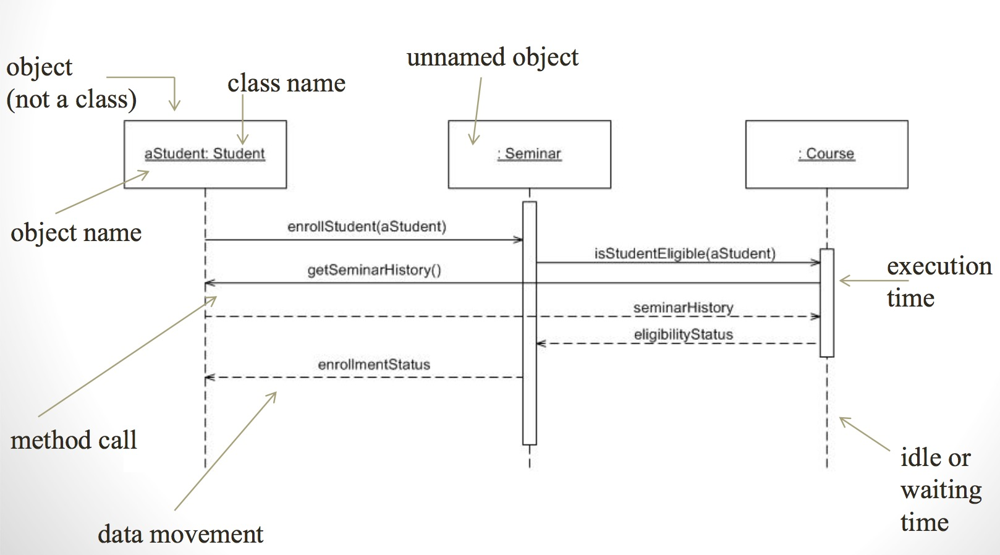
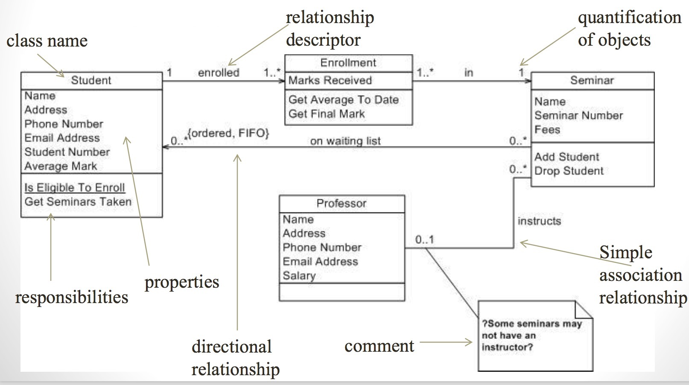

# UML Use Case Diagram
- Describes the different ways user / stakeholders interact with the system
- Analysis technique to describe in a formal way how a computer system should work. It lists a sequence of actions that yields a result that is of value to an actor.
- For each of ellipse we have, there is an use-case template associated with it. 

<!--truncate-->

# UML Domain Model
- Describes the concepts of the problem domain and their relationships

# UML Interaction/Sequence Diagram
- Shows dynamic sequence between objects
- Highlights the sequence of actions between objects
- Shows state changes based on actions

# UML Interaction(Sequence) Diagram vs State Diagram
- A state diagram is better to use when the description we need to make does not striclty follow a single pathway through the code. There are many possibilities and more than one way to implement.
- A Sequence Diagram is better to use when the description follows a certain process and long pathway through the code.
- State models are ideal for describing the behavior of a single object. They are also formal, so tools can be built which can execute them. Their biggest limitation is that they are not good at describing behavior that involved several objects,
