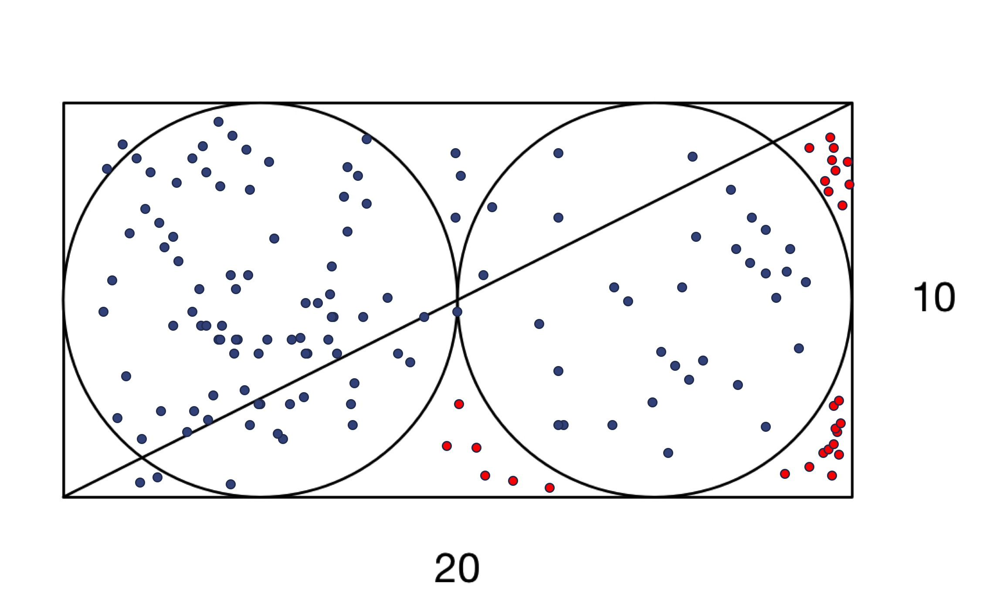
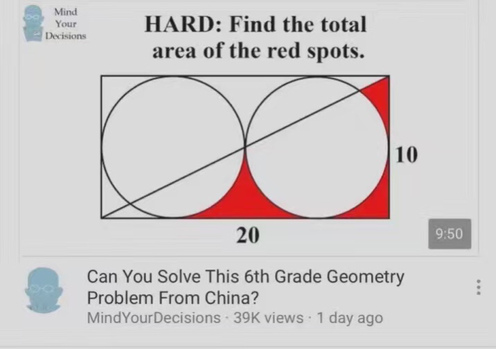
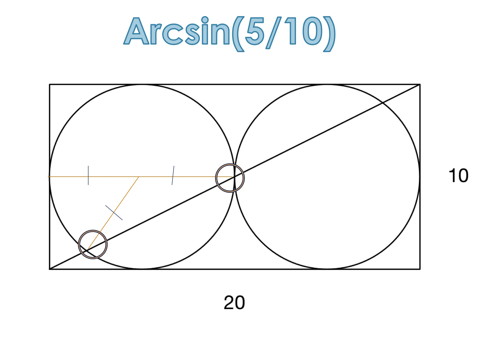
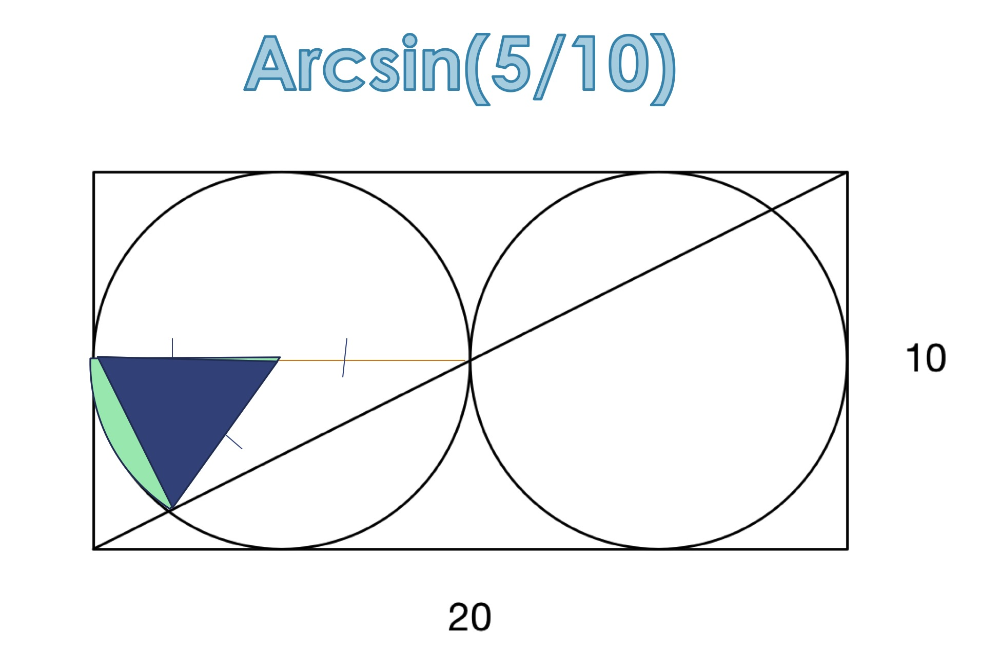
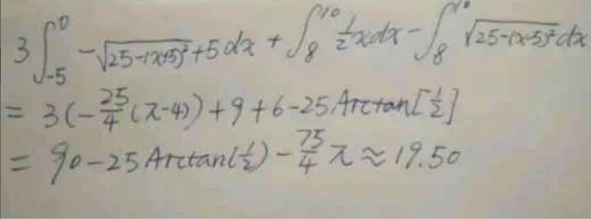
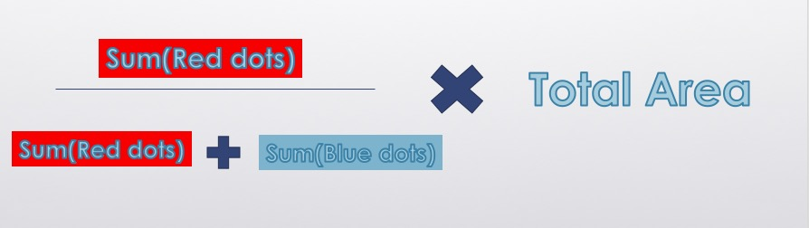
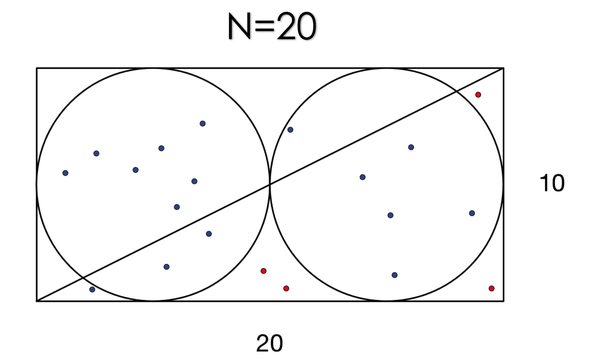
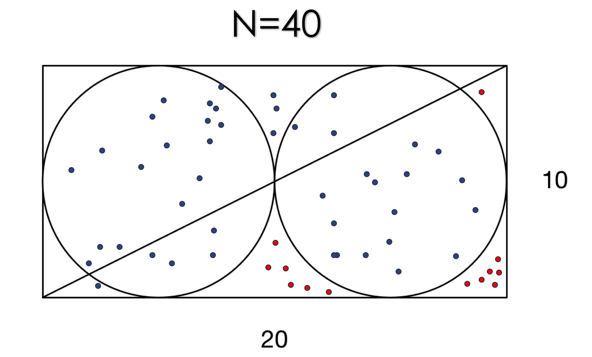
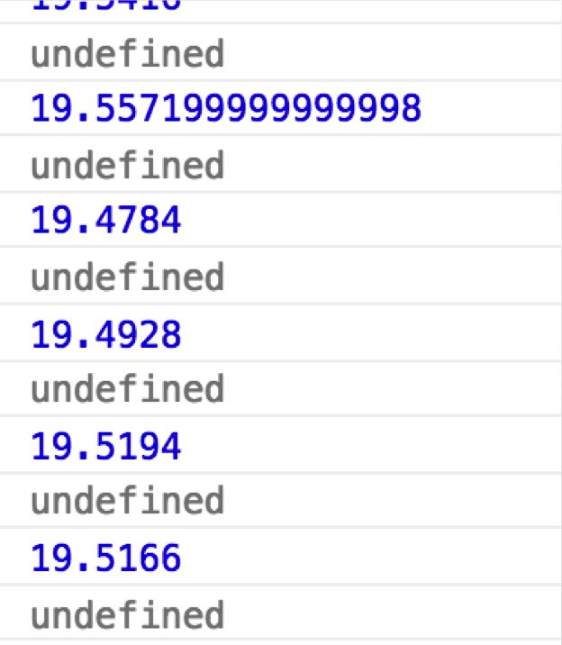
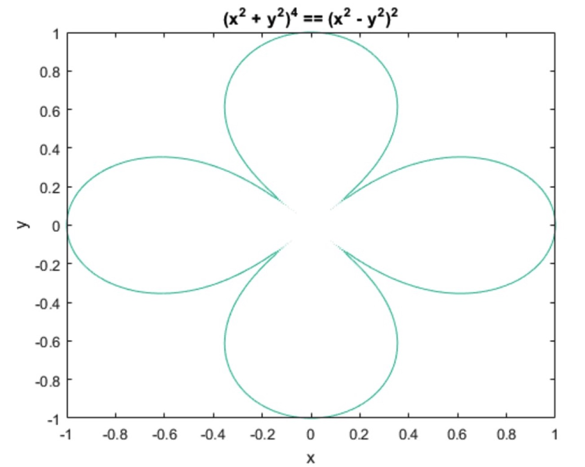

An Introduction to Random Algorithms


<!--truncate-->

# Elementary School Math Problem

This used to be a famous math question on the web:



First things first, it eventually turned out to be a teacher's mistake, but it is quite fun to play around with it and use it as an introduction to random algorithm.

# Possible Solutions
## Trigonometry Solution
The easiest solution that everyone will be able to do it with middle school level of education.


By finding the angle using `Arcsin()`, we can easily get area for the shaded Circular sector. 


Later on we can get area for the left bottom corner by using the larger right-angled triangle minus the smaller triangle and circular sector. Then within short steps we can get the missing area in the original question and use 78.32% to find the total area.

## Calculus Solution

Another guy suggested online that you could use Calculus to solve it. It is a solution to it too, but with some calculations needed.

The result is around 19.50 from both solutions

# Computer Science Way of Solving it?
## Statistics and Monte Carlos
Computers have a huge advantage of generating a large set of data points within a second. This caused the raise of using randomness to solve problems in the past century. Monte Carlos method is one of the most famous method of relying on repeated random smapling to find numerical results.

## Using Monte Carlos as a Solution
So the idea is, within a domain of `(0,20) X (0,10)`, we generate random points. Since we know the function of the shapes (2 circle functions in a rectangular box), we test this randomly generated point to see if it lands inside of the two circles, or out side of the two circles. Then since we know the area of the outer rectangular shape is basically `20x10`, we can just use the area * probability landed in the shaded area in the original question, to find the area for the shaded:



A quick javascript snippet for our algorithm:

```js
var sum_in_area = 0;
var N = 20; // starting with 20
for(let i=0; i< N; i++){
	let x = Math.random()*20.0;
	let y = Math.random()*10.0;
	let condition_1=((x-5)*(x-5)+(y-5)*(y-5)>=25)
	let condition_2=((x-15)*(x-15)+(y-5)*(y-5)>=25)
	let condition_3=((0.5*x-y)>0)
	let condition_4=(x>=5)
	if (condition_1&&condition_2&&condition_3&&condition_4) sum_in_area++
}
```

Lets see the result of our first run of N=20:



Lets see the result of our second run of N=40:



More points:


When N=1000000, the results of multiple runs are shown in the following:



Hence, the result is bound around 19.50, which is exactly what we got from Calculus. 

# Powerful Randomness

Randomness can be really powerful in nowadays applications, many artificial intelligence algorithms like Q-learning use randomness as a way to explore better methodologies for robots. A lot of math problems which were not possible to be solved by Calculus, can be solved easily nowadays:

i.e. getting integral of certain weird shape, with some painful functions:



With Random Algorithm, as long as you have the function, you can find the area by generating random points and plugging into the function for boolean results, and then use the probability to find the answer.

However, one thing to note is that the current day randomness is pseudo-randomness, which means, even if computers generate random numbers based on a uniform distribution, but it still relies on certain heuristic functions. This is like Sophon in "Three Body Problem", if you don't have pure randomness, then your experiments can be baised for a certain cause, and eventually augmented by Butterfly Effect. 