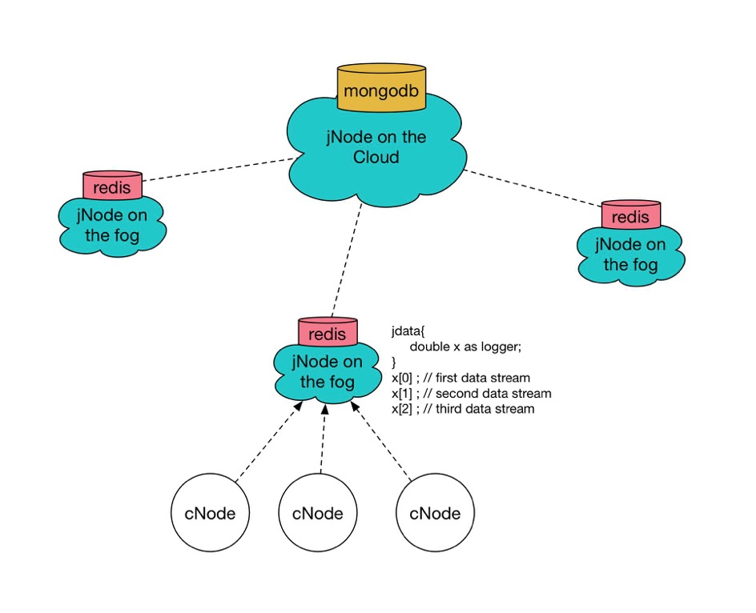
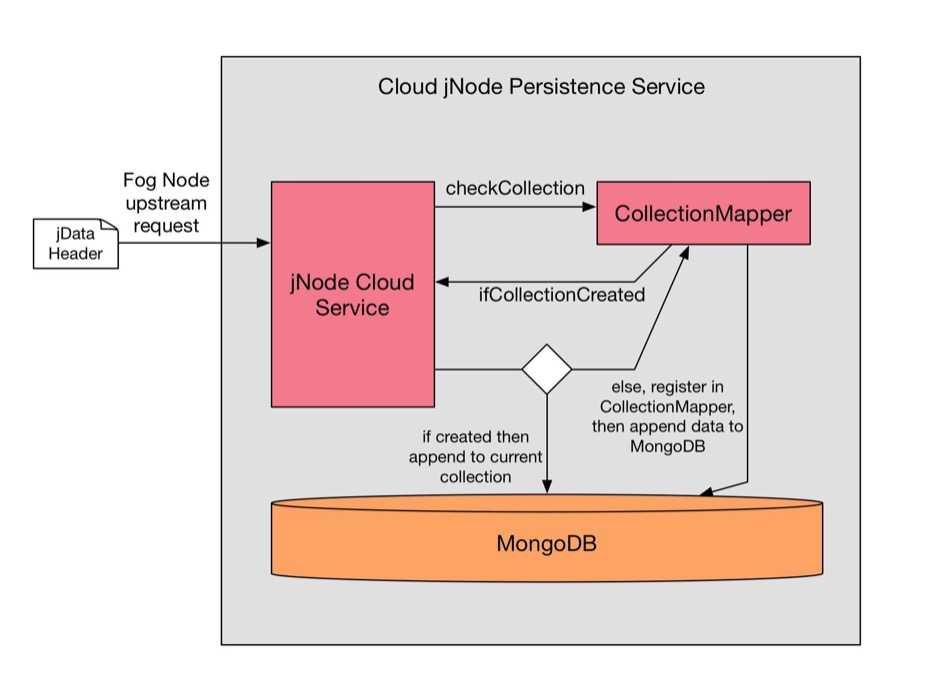
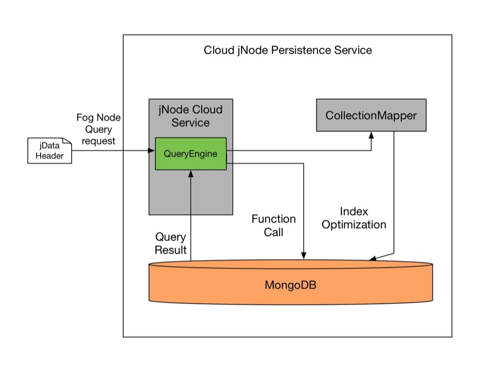
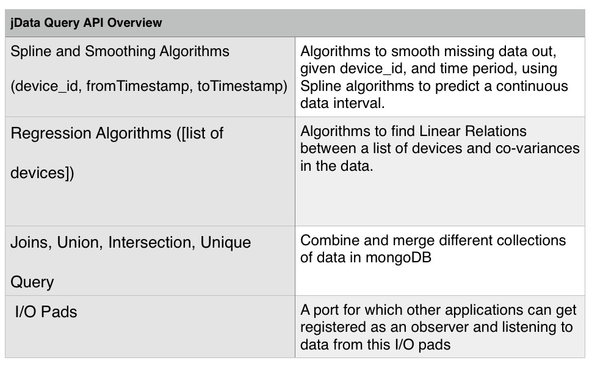
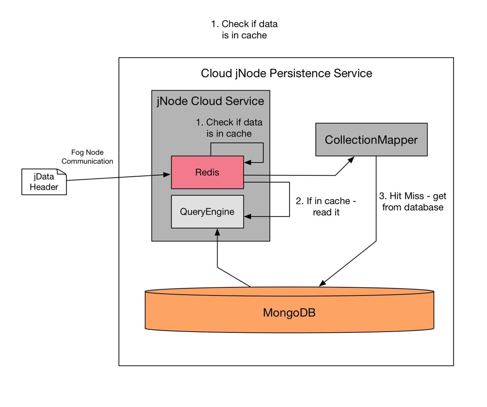

# Introduction 


For jData on the cloud, MongoDB is mainly used for persistence mainly due to the fact that its support for schema-less structure, rich indexing for query support, and scalability. While each jNode on the fog has their own Redis instance running, analytics is done on a centralized persistence data in MongoDB on the cloud. While Redis can be used as a database on its own, it is limiting for it to be used as a centralized database on the cloud since it is in-memory database, RAM size is a condition to be considered and meanwhile analytics in Lua might be tedious. However, in the architect, there is still an instance of Redis running on the cloud jNode for caching.

<!--truncate-->
# Persistence Database Design
## Architect
Each jNode on the fog has a logger description defining the data stream that looks like following:

```js
jdata {
  double x as logger;
}
x[0]; // first data stream of the logger
x[1]; // second data stream of the logger
x[2]; // third data stream of the logger
x[3]; // undefined; logger x has 3 data streams
```

In MongoDB, data is organized by collections in a database drive (equivalent to Tables in Relational Database). The overview of the workflow in data persistence on the cloud jNode is shown in the diagram below. There are mainly three parts, jNodeCloud Service which is mainly implemented in Javascript as a service layer processor, CollectionMapper which is a indexing service over MongoDB collections, and MongoDB.



## jData metadata:

To establish an upstream connection, fog jNode will send the jData header with specified metadata in a JSON format to the cloud jNode. jNode Cloud Service accepts the requests and handling sessions. Once it receives an upstream request, it will parse the JSON file containing metadata, and check with CollectionMapper which maps a given jData file to a specific collection in the MongoDB. Then it will process the jData content, convert the time series stream into documented format.

i.e. 
Create a collection:

```js
> db.createCollection("x")
{ "ok" : 1 }
```

With in the created collection, data is converted into JSON format:

```js
> db.x.find().pretty()
{
	"_id" : ObjectID<"52E748237495EBC0000A00001">,
	"Device" : "D1",
	"Transform" : 0,
	"TimeSeriesData": [
		{
			"TimeStamp" : 2017-02-22T12:55:16.000Z,
			"Value" : 32
		} , 
		{
			"TimeStamp" : 2017-02-22T12:55:17.000Z,
			"Value" : 33
		} , 
		{
			"TimeStamp" : 2017-02-22T12:55:18.000Z,
			"Value" : 39
		}
	]
}
```

Essentially, what was originally in the jdata header file for jNode including Name Space, Data Sources, Data Stream Device Id, and Description on the Cloud can be found in metadata part of the JSON saved in mongoDB. 

## jData Query:
Since we are dealing with persistence data on MongoDB, we will have a specialized Javascript query library and analytics service provided on the Cloud. This is also where the Collection Mapper comes into play for more than just a role of Bitmap. We will implement some algorithm inspired by Dremel ( Original Paper http://www.vldb.org/pvldb/vldb2010/pvldb_vol3/R29.pdf ), when adding in the data to MongoDB, it goes through the CollectionMapper first to check if the collection exists as above paragraphs have mentioned. If the collection exists, CollectionMapper will return true or false, but within itself, it will save values of Repetition Level and Definition Level for each collection. For example, within a area, a certain device has high frequency of data input, the Repetition Level is high, then index with be pushed up to the list, we will talk more into this for Part 3, which is the jdata Cloud cache.



### jData Query Api Aspects

QueryEngine will backward support all the Data Stream Methods on the jNode, and above that provides a list of APIs include following aspects:



# Cloud jData cache:

On the Cloud, even though we have MongoDB, but On the Cloud, even though MongoDB is the main database, it is better to have an instance of Redis running to utilize RAM as a cache. This instance of Redis will works like LRU algorithms for cache management in operating systems, but it will mainly collaborate with CollectionMapper to implement Dremel algorithms for faster response rate over IoT networks.



In implementation, jNode Cloud Service can easily achieve by asynchronous callbacks switching between Redis and MongoDB, some sample code is shown here:

```js
module.exports.findDataByDeviceCached = function (db, redis, logger, device_id, callback) {
	redis.get(logger, function(err, reply){
		if(err) callback(null);
		else if (reply)
		callback(JSON.parse(reply));
		else {
			db.collection('logger').findOne({
				_id: device_id
			}, function (err, doc){
				if(err|| !doc) callback(null);
				else {
					redis.set(device_id, JSON.stringify(doc), function(){
						callback(doc);
					});
				}
			});
		}
	});
};
```

To make it fully agile to achieve the effectiveness of edge computing, what is put into the RAM is not simply decided LRU - Least Recently Used algorithm for page replacement. The Redis instance will highly collaborate with CollectionMapper’s repetition and definition level values for deciding what to put in. For example, a device_id has been queried by many jNodes in the past hours regarding to unknown reasons, the ‘device_id’ attribute of a collection’s metadata will have high repetition level. When it reaches a certain quantum, jNode Cloud Service will automatically switch data within the collection into the Redis cache.