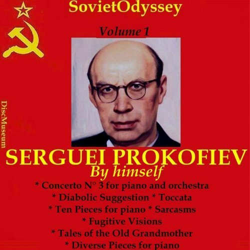
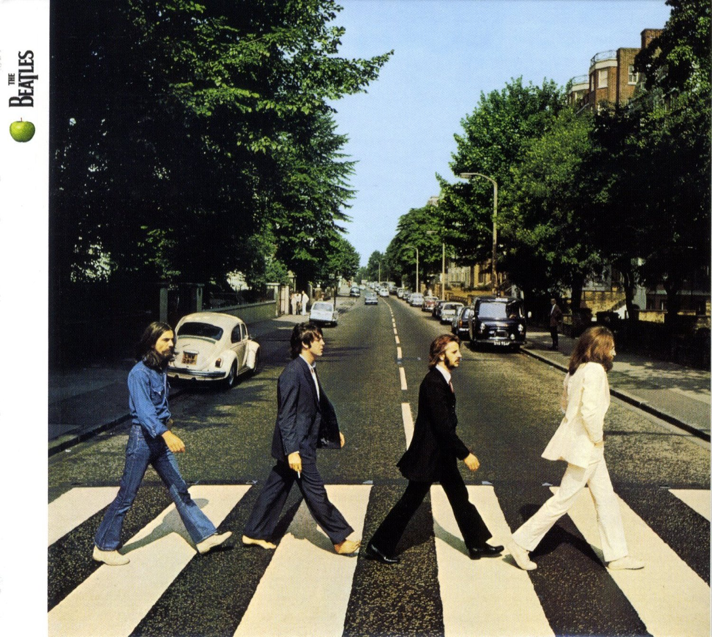
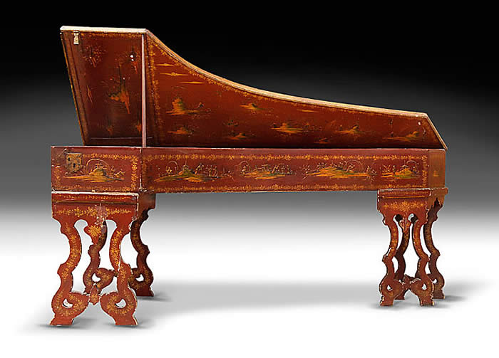

I was browsering on Apple Music recently, and found this album :

Just by the cover of this ablum itself, you can get so many critical data points out of it:

- This recording is Prokofiev playing by himself
- This has a soviet badge on it.
- This has a soviet badge on it but it is recorded with London Symphony Orchestra
- There is Concerto No.3

After investigating into the album a little bit further, I got even surprised more: the recording of this album was actually made at ***_Abbey Road Studios_*** in London, which yes as you may guessed the same studio that the Beatles used to hang out with, and recorded their last album at:

> Prokofiev himself made the first recording of the Piano Concerto No. 3 in June 1932 with the London Symphony Orchestra conducted by Piero Coppola. The recording was made at Abbey Road Studios in London and is the only recording that exists of Prokofiev performing one of his own piano concertos. 
> ---  "PROKOFIEV: Piano Concerto No. 3 / Vision Fugitives (Prokofiev) (1932, 1935)". Naxos.com. Retrieved 28 July 2015.
Jump up 

<!--truncate-->

# What is the difference?

## Comparison of Classic Symphony 3rd Movement

I will bring up with Classic Symphony, as it is the first Symphony Prokofiev wrote, and it was one of the first and most famous neoclassical symphonies. According to Prokofiev himself, this symphony is in a style that Joseph Haydn would probably compose it in if Haydn ever lived at that time. 

Thrid movement is very short, it is a 1 minute and half recording: 

Here is how comtempory orchestra perform the piece:

<iframe width="560" height="315" src="https://www.youtube.com/embed/Cb--4g2Nbbk" frameborder="0" gesture="media" allow="encrypted-media" allowfullscreen></iframe>

Here is Haydn's famous Symphony no.94:

<iframe width="560" height="315" src="https://www.youtube.com/embed/lLjwkamp3lI" frameborder="0" gesture="media" allow="encrypted-media" allowfullscreen></iframe>

Here is how Prokofiev plays it himself (the album on Apple Music):

- [https://itunes.apple.com/us/album/prokofiev-by-himself-vol-1/id493445569](https://itunes.apple.com/us/album/prokofiev-by-himself-vol-1/id493445569)

I think the major differences here are below:

1. Prokofiev played a lot lighter than modern interpretations; this might be a result of the fact that Prokofiev was playing on a piano 

2. Prokofiev played a lot faster than modern interpretations; as the time stands, Münchner Philharmoniker played the piece for 2 minutes, and Prokofiev's recording finished in 1:25 minutes

3. Prokofiev was more into tempo and structure, whereas modern interpretations are more elaborated: this might also be the outcome of Piano vs. Symphony, Münchner Philharmoniker's recording is definitely more elaborated, it sounds more like a romantic piece than classical. ( well, with symphony you do have more color and granularity to elaborate)

# Takeaways

I think the major takeaway here is that it is shocking to see how much of an improvement to understanding of music or its context can a recording bring up with. It is pretty sad we don't really have any recordings by people like Chopin, Mozart, Beethoven; and as a proof of fact, we do know that the way how we play Chopin is different from how Chopin would play his pieces because the technology of making piano has been varied through the years by so much:

Piano in the 17th Century:

Also, going beyond of music understanding, I think these relics from the past can also help to recover of the history too. Just think of the facts related to this album:

- Prokofiev recorded with London Symphony Orchestra
- 1935 Feburary (Great Depression in Western Europe and the US)
- Abbey Road Studios
- The Album featured Concerto No.3

You can see a huge amount of information:

- Prokofiev recorded with London Symphony Orchestra: Prokofiev himself was recognized as a musical ambassador between Russia (Soviet Union) and western Europe, even during the Great Depression, he still had popularity in London
- Abbey Road Studios is not only for Rock music and the Beatles, it might had been a big name back then before the Beatles
- Concerto No.3, even though by number it is after Concerto No.2, but Concerto No.2 was burnt completely during Russian revolution; Prokofiev rewrote the whole piece later on, which some people say you can already say Concerto No.2 is the real Concerto No.4