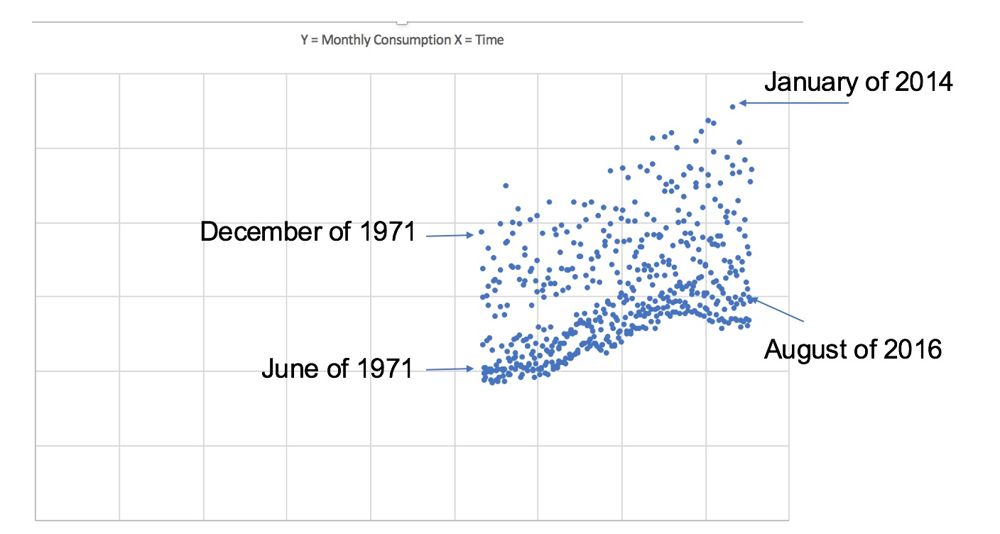

# The HANA Strategy
As Data Analyst and Business Intelligence are becoming familar topics around the business world; SAP, as one of the leaders for enterprise solutions, has been trying to look for new opportunites in the horizon. SAP HANA has become their main strategy, which provides business partners a way to leverage massiave amount of data in real time, query insights and make business decisions more accurately based on anticipated business changes. As SAP official document explains how HANA works, I will not spend too much time on HANA architecture here. In short, SAP HANA is a huge piece of RAM on the cloud that has various systems and algorithms built in ready to go for analytics:


<!--truncate-->

As an intern developer, I work within the SAP Business Suite and Industrial Solution to integrate predictive analysis into our Business Partners's applications. 

# Predictive Analysis Process
This diagram summarizes the whole process of predictive analysis: 


I have to make a declaration here because among many people I have been talking to, they do have the misconception of believing that Analysis is all about Mathematics and Algorithms. NO! When you are talking about Analytics it is not always about Inferential statistics, multivariable calculus, regression or even the fancy Machine Learning. From the following pie-chart provided by SAP's statistics, the longest process in any Business Analytics is to acess and prepare data:


This is similar to how many people think Tableau is just a visualization company, whereas their main technology is to process PB level of data into charts within seconds. When data is small, the overhead for accessing and processing data is trivial, everyone can make visualization technology with D3.js or Baidu Echarts, however, when you are talking about PB level of Big Data, that is a different question. 

# Regression over HANA
Lets play around with HANA and make it to do regression algorithm. 

Since it is not possible for me to expose SAP partner's data on my personal website, I collected monthly data points from 1971 (which is almost close to the epoch time) to 2017 of energy usage in different sectors in unit of Btu, temperature, and fun factor - total number of Internet users at the time from World Bank, Statistics Canada and Google. I am interested in finding the correlations between the data points. 
Here is a basic visualization of data points of energy usage of households (Y) over axis of time (X):


As you can see over time, the energy usage has been going upwards, and reached its peak for 2014's January, which interestingly is the month that Montreal has a high number of depression patients (including me).
There must be some interesting correlation of daily temperature and energy usage.

Linear Regression Formula:


What I am interested in is the Spearman's Rank-Order Correlation (Rho):


HANA Stored Procedure build-up:

```sql
PROCEDURE "CARL"."COM.CARLROCKS.EA::LinearRegression" (
   IN iv_X_column_name     NVARCHAR (128),
   IN iv_Y_column_name     NVARCHAR (128))
  LANGUAGE SQLSCRIPT
  SQL SECURITY INVOKER
  --DEFAULT SCHEMA <default_schema_name>
AS
BEGIN
  SELECT 
   (("Sy" * "Sxx") - ("Sx" * "Sxy"))
   / (("N" * ("Sxx")) - ("Sx" * "Sx")) AS a,
   (("N" * "Sxy") - ("Sx" * "Sy"))
   / (("N" * "Sxx") - ("Sx" * "Sx")) AS b,
   (("N" * "Sxy") - ("Sx" * "Sy"))
   / SQRT(
       ((("N" * "Sxx") - ("Sx" * "Sx"))
        * (("N" * "Syy" - ("Sy" * "Sy"))))) AS r
        FROM
        (
          SELECT SUM(X) as "Sx", 
                 SUM(Y) as "Sy", 
                 SUM(X*X) as "Sxx",
                 SUM(X*Y) as "Sxy",
                 SUM(Y*Y) as "Syy",
                 COUNT(*) as "N"
           FROM
              (
               SELECT
                   "Month",
                   CASE :iv_X_column_name 
                       WHEN 'ResidentialSector' THEN "ResidentialSector"
                       WHEN 'CommericalSector' THEN "CommericalSector"
                       WHEN 'IndustrialSector' THEN "IndustrialSector"
                       WHEN 'TransportationSector' THEN "TransportationSector"
                   END as X,
                   CASE :iv_Y_column_name 
                       WHEN 'Temperature' THEN "Temperature"
                       WHEN 'InternetUsers' THEN "InternetUsers"
                   END as Y
                   FROM "sap.ea.indigo::IndigoDB.MonthlyData"
              )
        );
END
```

Let's checkout the results:


As we can see, regression of Residential Sector vs. Tempearture has the highest Rho index with around `-0.625`, this is interesting and verifies the common sense that when tempearture goes down, energy usage in households goes up. The second biggest Rho index is Residential Sector vs. Internet Users, giving us a number of `0.349`, this is positive because yes, when internet users become bigger, energy usage in general will go up over time due to electricity and wireless boardcasting. The smallest Rho index in our chart is Industrial Sector vs. Temperature, so essentially it is saying that there is no correlation between temperature and industrial sector's energy consumption, which is surprising true because no matter what seasons it is, people still have to work and keep the industrial production going.

# My Thoughts
As you can see, few lines of codes in HANA can bring me insights over data from 30-40 years timeline. From my point of view, I think there are four important challenges in Business-oriented Data Analytics:
## 1. Data Collection:
Data itself is the most expensive asset, period. SAP has an advantage of integrating Data Analysis into their ERP application, which expose its partner a crucial access to data. i.e. for energy production company, if they can integrate Internet of Things such as Time Series reading over an Arduino device to HANA platform, then there will be increasing the number of dimensions for HANA to do analysis with.

## 2. Data Processing and Filtering:
After collecting the data, filtering out the noise and data clusting can be a challenging work.

## 3. Modelling and Business Intuition:
Once you have your processed, how to make a mathematical model and make business decision may take a long time of adaption because it is different from the traditional business decision making and may give you heterogeneity.

## 4. Realtime-ness:
A lot of companies I have researched, especially in Visualization area, declare themselves as Big Data Analytics. However, as I mentioned before, having visualizations and dashboards to wow the boss is not a hard thing to do with Excel already. However, can you really make your business decision based on the charts and graphs? is the data rendered without noise? if so, what is the overhead for your decision to apply and see the reaction? To achieve actual real time analytics is a technical challenges to a lot of startups yet.
