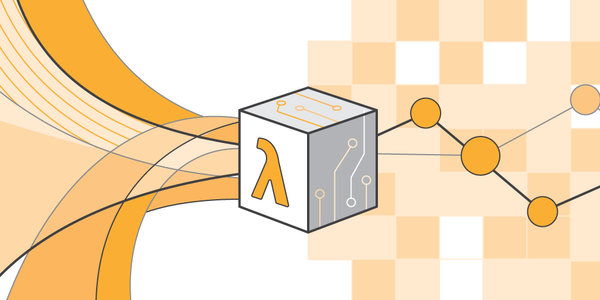

# Serverless Architecture
This page will be my personal notes for a collection of tools and thoughts for Serverless Architecture. I will re-post a complete article to draw my mind mapwhen I am more experienced.



<!--truncate-->
So I have been diving into Serverless, AWS Lambda, and  Headless-chromium recently to automate load tests to improve some project's running efficiency. In short, serverless is just FaaS, Function As A Service, where you don't need to care about runtime instances, you just need to submit a function, either bind it with a certain event or not, the server provider will run the function. You only have to pay for what you get.

### Definitions 
- Serverless Architecture : An event driven system that utilizes FaaS(function as a service) and other fully managed services for logic and persistence
- FaaS: Function as a Service is a category of Cloud Computing Services that provides a platform allowing customers to develop, run, and manage application functionalities without the complexity of building and maintaining the infrastructure typically associated with developing and launching an app.

### Development
- A Few Options to code and create infrastructure :
	1. AWS console
	2. Tools:
		- a. Terraform (This makes Lambda functions reproducible ) : https://seanmcgary.com/posts/how-to-deploy-an-aws-lambda-with-terraform
		- b. Serverless Framework (youtube tutorials)

Load-Testing
1. Set-up a lambda function for page rendering
2. Setting up connections to SQS
3. Huge loads of requests testing on the public server

### serverless-chrome
- Link : https://github.com/adieuadieu/serverless-chrome
- Headless Browser : A headless browser is a great tool for automated testing and server environments where you don't need a visible UI shell. For example, you may want to run some tests against a real web page, create a PDF of it, or just inspect how the browser renders an URL.
- Serverless Chrome contains everything you need to get started running headless Chrome on AWS Lambda (possibly Azure and GCP Functions soon).
- *a combination of chrome-headless and serverless on aws*:
	
### chrome-headless might be worth to check out. 
- Installion [sitepoint](https://www.sitepoint.com/headless-chrome-node-js/):

		```bash
		brew install Caskroom/versions/google-chrome-canary
		sudo find / -type d -name "*Chrome Canary.app"
		
		```
		- add alias to .bash_profile
- Good Tutorial https://riston.github.io/post/headless-chrome-scrape/
- Can I just wait till the page loaded and then do DOM parse or screenshot ? :
	- No! [https://github.com/cyrus-and/chrome-remote-interface/issues/184](https://github.com/cyrus-and/chrome-remote-interface/issues/184)
- Utilizing Tabs Parallelism [https://github.com/cyrus-and/chrome-remote-interface/issues/92](https://github.com/cyrus-and/chrome-remote-interface/issues/92)


### Load-Testing
- [https://stackoverflow.com/questions/45500146/how-to-get-multiple-dom-elements-with-chrome-remote-interface-node-js
](https://stackoverflow.com/questions/45500146/how-to-get-multiple-dom-elements-with-chrome-remote-interface-node-js)
- [https://github.com/GoogleChrome/puppeteer/blob/master/README.md](https://github.com/GoogleChrome/puppeteer/blob/master/README.md)
- [https://github.com/adieuadieu/serverless-chrome](https://github.com/adieuadieu/serverless-chrome)

### Important Links:
- [https://acloud.guru/](https://acloud.guru/)
- [https://hackernoon.com/how-to-build-powerful-back-ends-easily-with-serverless-17a833bc7ede](https://hackernoon.com/how-to-build-powerful-back-ends-easily-with-serverless-17a833bc7ede)
