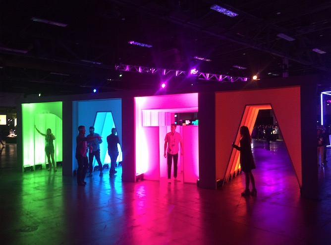

# Tableau Conference
Tableau Conference in general is a platform that Tableau hosts every year for Tableau community and users to learn, collaborate, and network.

The previous company I used to work with was in Tableau Conference 2014, and they had a demo back then with a lego car:

<iframe width="560" height="315" src="https://www.youtube.com/embed/pxFytHbozpI" frameborder="0" allowfullscreen></iframe>

<!--truncate-->

# Las Vegas

It was not the first time for me to be in Vegas, but this was one of special time for me to be in Vegas.
Well, first, it was the first time for me to fly on a business trip to Vegas; but, sadly, 4 days before my arrival, Vegas experienced the worst mass shooting in the modern american history.

You can still see the windows of the shooter's rooms were not replaced by the day I arrived.

The city was a little bit calmer than usual after the tragedy: 

Attendees of TC17 hosted a donation event as well:

# Conference Timeline

My job was room management (aka. room guards), so I had to carry a radio with me throughout the week

## Monday 

Monday was the openning day, so a lot of firms have set up their panels at Mandalay Bay (including, Google Deloitte, GE, Teradata):

Tableau also set up a Tableau Store which is pretty sick:

I also met a guy who works for VirtDB, which is a nitch startup on SAP, my previous employer, and Tableau, my current employer. Interesting:

## Tuesday

Tuesday started with a talk from our CEO, Adam Selipsky, who was the co-founder of Amazon AWS, and lead the team from a small group of 12 people to billion-dollar giant platform:

People listening to the keynote:

## Wednesday

Wednesday was sick, we started with Freakonomics guys Steve and Stephen's keynote:

I got a chance to collect some toys and gifts from other sponsors:

And we also had a Data Night Out, which featured Empire of the Sun:

Also, a great aspect of Tableau Culture. I crashed into our CEO, Adam Selipsky, outside of Mandalay Bay. He was really chill, any employee could shake hands and talk to him:

## Thursday 

Thursday was the last day of my duty. Most of the attendees were heading off in the afternoon that day:

# Takeaway

So yea, it was a great experience at TC17 after all. 

The major takeaways are:

- Tableau is very popular in BI industry:

	I have basically met every single Amerian company I know from all backgrounds:
	- Finance: JPMorgan, Goldman Sachs, Morgan Stanley, UBS, Wells Fargo...
	- Entertainments: Blizzards, Warner Bros, Disney, Casinos, EA...
	- Airlines: United, Delta, AA, Boeing...
	- Tech: Apple ( a lot of ppl, some of them have been coming for > 5 years ), Amazon, MS, Google, Facebook, Pinterest, Zillow...
	- Schools: Stanford, MIT, Yale, UChicago, UBC, UT Austin...

- Tableau is getting more popular:
	- If you look at sponsors of Tableau Conference, in 2014, there were rarely big tech companies. In TC17, almost all tech giants have their panels, incl. Facebook, Cloudera, Google...
	- SAP used to blacklist Tableau within the company, they even had a prescence at TC17 as well, a large number of them as well.

- Big Data Culture is increasing
	-  As I have talked to a few pepole at TC17. Some of smaller businesses are also transformming from traditional text/excel to databases and Tableau to become more data driven.
	-  One of the Lady I talked to works at a public high school. She has been coming to TC for 5 years. She said, even in some suburb areas, Tableau is getting popular, and there are schools that even use Tableau to analyze students' performance, which is pretty awesome.