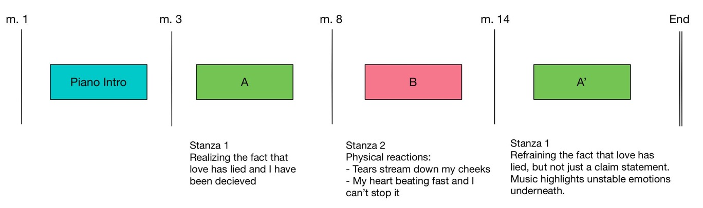
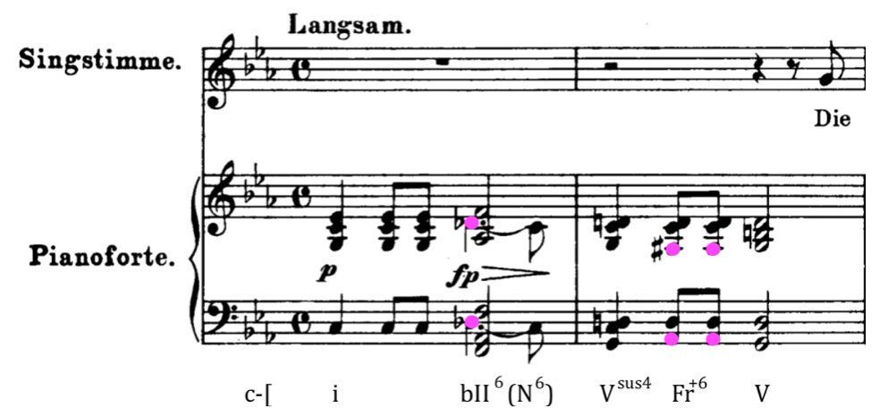
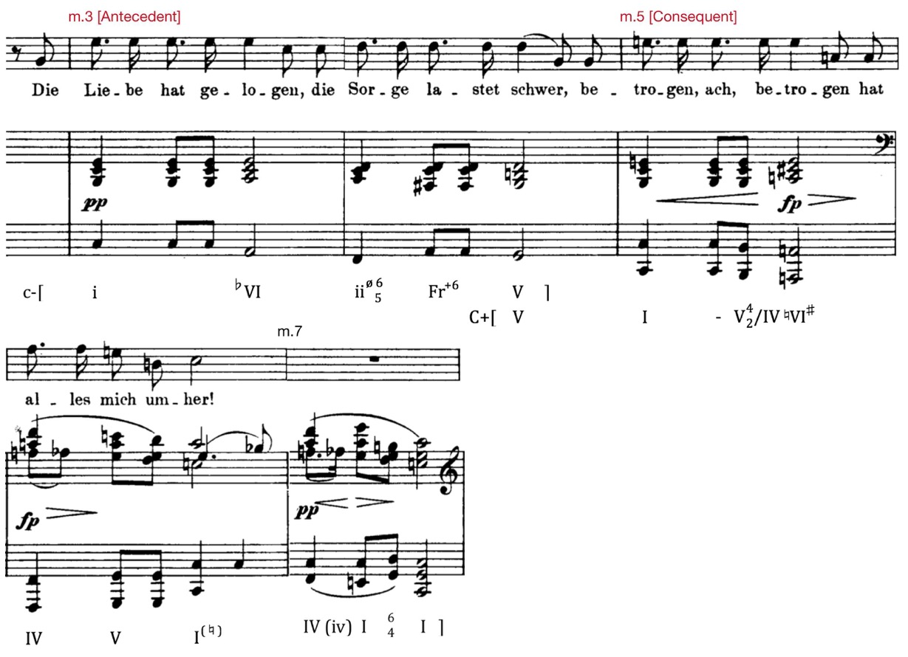
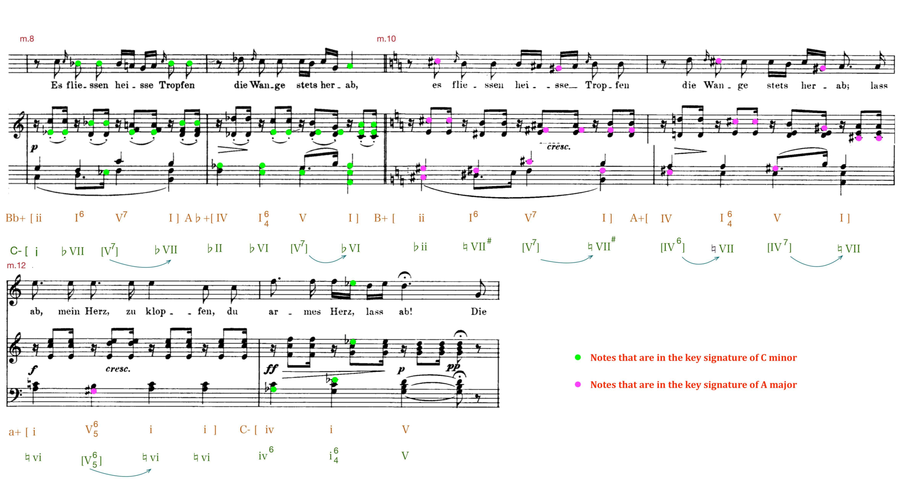
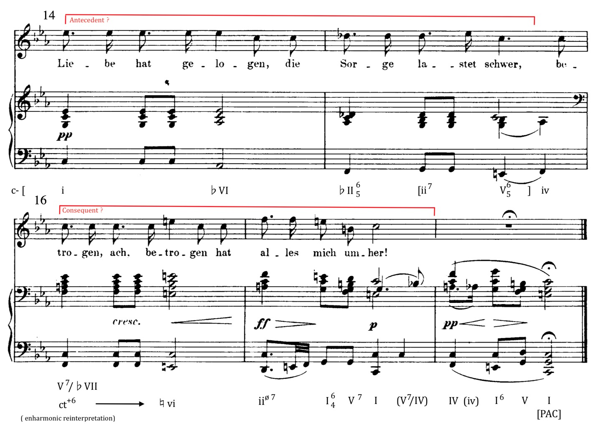

## Introduction

This paper analyzes Schubert’s “Die liebe hat gelogen” with a focus on the form, harmonic, and rhythmic elements. The piece is a musical setting to portray the original poem written by August von Platen-Hallermünder in 1822. The title of the piece translates to “Love has lied” in English. Hence, through this musical setting, Schubert elaborately used music to depict “deception”. He did this by first giving the audience certain expectations and then altering the music material to something completely unexpected. 

## Context

The earliest version of the song can be found in “Schubert's Werke, Serie XX: Sämtliche einstimmige Lieder und Gesänge Band 7”, which was published in 1822. However, the earlier critic for the Allemeine musikalische Zeitung of Leipzig attacked it harshly due to Schubert’s departures from principles of unity, order, and academic definitions of the Lied, as the reviewer wrote — “Naturally, the former characteristics alone do not suffice to elevate an ordinary work to a work of fine art, but without them, only bizarre, grotesque works can arise” (Muxfeldt, p.480). The reviewer also attacked Schubert’s “Du liebst mich nicht”, another music setting to Platen-Hallermünder he composed in the same year, by quoting “he modulates in such alien ways and so unexpectedly to the most remote regions in a manner unlike any other composer on the face of the earth” (Muxfeldt, p.482). Hence, it is not hard to see during the period of time, Schubert was trying to take on the challenge of finding musical equivalents to notions that were rarely exploited. By trying to portray “deception” through music, Schubert definitely went through a reflection on what the common music conventions were and what his audience would expect — because a “non-deceptive” or “truthful” music setting simply means comforting and satisfying the audience with their expectations. 

<!--truncate-->

## Literature Review

There are not that many published analysis of “Die liebe hat gelogen”. Reed 1985 (238) provides general historical context for the piece. Stein 1989 (109-131) features detailed harmonic and rhythmic analysis of the piece, mainly concentrating on the mode mixture and tonal elements. Muxfeldt 1996 (480-527) provides some analysis but mainly talks about Schubert’s aesthetics and how he was influenced by Platen-Hallermünder. My analysis will not only go through the musical elements of the piece, but will also focus on the comparison between this piece and common practices Schubert used in his other famous musical settings, such as “Der Erlkönig” (1815), “Ich wollt, ich wär ein Fisch” (1817) and “Nacht und Träume” (1825), to illustrate what the regular, common, and predictable practices the audience back then would expect and how Schubert “deceived” them.

## Form

The overall form of this piece is ternary, which is ABA’. The first two measures feature a piano intro. A is 5 measures long from m.3 to m.7. B is 6 measures long from m.8 to m.13,  A’ is 5 measures long from measure 14 to measure 18. While the original poem has only two stanzas, Schubert modified the poem by making A’ start with a repetition of A. However, even though the first stanza itself is repeated in A’, the meaning of the text is completely different. From an overall structure point of view, section A is a statement of what has happened — “Love has lied… I am deceived, alas! deceived by everything around me”. Later on, section B illustrates the aftereffects and physical reactions after the poet is aware of the fact that love has deceived. Last but not least, section A’ seems to be a restatement of the fact in the text but the music underneath highlights how unwilling and agitated the poet is about the character facing the reality? no matter what. This makes a huge difference compared to the relatively calm and mild A section,  even though these two sections have the same text. A sketched visualization of the form follows:

## Harmony

Harmony takes a critical part as this piece is notoriously famous for its tonal ambiguity - mainly the alterations between C minor/major and A minor/major. At first glance, it seems the piece is set in C minor, but the song doesn’t stay in C minor long at all. I will go through the harmony part by part. To help explain, in the following sketches, I will use pink color to highlight the notes that are shared between C minor and A major and are enharmonically reinterpreted in both keys. 

### Piano Intro

The piece begins with a piano introduction for two measures. The harmony here is fairly complicated already:

It starts with the tonic C minor chord followed by a Neapolitan chord, which is a rare harmony to have this early in a piece. The Neapolitan chord itself is ambiguous. First, it does not really resolve itself nearing the end of measure 1 - the D♭ slips down to a C and the harmony suddenly becomes a subdominant iv chord; also the first harmony of measure 2 is a Vsus4 instead of a straightforward dominant chord which a Neapolitan chord usually resolves to. In measure 2, instead of doing a 4-3 resolution of the dominant chord, it goes to a French 6th chord and then finally lands on the dominant. In many of Schubert’s other Lieds such as “Der Doppelgänger”, “Der Erlkönig”, “Nacht und Träume”, the introduction prolongs the tonic or alternates between the tonic and the dominant, but it mainly functions to set up the main key. I think the reason behind Schubert’s complicated intro is that he wants to bring in the notes D♭, in the Neapolitan chord, and A♭ and F♯, in the French chord (highlighted in pink), because these exact three notes are enharmonically respelled into C♯, G♯ and F♯, notes belonging in the key of A major, a key we will later return to. 

### Section A

The vocal melody comes in at end of measure 2, which marks the start of section A. The harmonic analysis for section A of the Lied is below: 

The phrases of section A works as a period: measures 3 and 4 work as the antecedent, and measures 5 and 6 work as the consequent. Contrary to the norm, the antecedent and the consequent are not in the same keys, as the antecedent is in C minor and the antecedent is in C major by substituting E♭ with E♮. Then, while the second harmony of measure 5 adds a B♭ to the C major chord, which changes the tonic chord into a dominant chord that is leading to F, the F harmonic never comes. Instead, we have a completely unexpected A major chord serving as a word painting for “betrogen” (“deceived”). It is possible that the usage of C major for the consequent phrase is actually used to deceive the audience by having the keys resolve from C major to A major. This modulation is a typical RP transformation defined by Hugo Riemann — A major is the parallel major of A minor, which is the relative minor of C major. The stanza finishes in measure 6. However, in the piano accompaniment for both measure 6 and 7, Schubert exploits modal mixture to confuse the audience with deceitful tonal gravitation — both F major in measure 6 and 7 has an A♭ on the upbeat, which makes it into F minor. The B♭ at the end of measure 6 denies a solid perfect authentic cadence landing on C major by again, making the tonic chord into a dominant seventh chord leading to F. 

### Section B

B section is from measure 8 to measure 13 including a group of sequences. We can analyze this section in two different ways. First, we can interpret each measure in a different key. The first two measure is a sequence going from B♭ major to A♭ major. The following two measure is a repetition of the same sequence one half-step up from B to A major. Measure 12 moves back to A minor, the relative minor of C major. Then in measure 13, the B section lands on the dominant of C which prepares for the section A’. The second way of analyzing this section is to treat the whole section in C minor. The first two measure starts with C minor chord and lands on a ♭VI chord. The following two measures start with a minor chord half step above C minor which is a ♭ii so that the sequence ends a half step above ♭VI, the ♮VI chord which is A major. Schubert used the A major harmony again to achieve tonal ambiguity. One way to help us understand what Schubert did here is to draw a visualization and denote all the notes in the key signature of C minor (B♭, E♭, A♭) as green and notes in the key signature of A major (C#, F#, G#) as pink, shown below:

As this visualization shows, even though section B only lands on A major by end of measure 11, it has long been prepared since the beginning of measure 10. The reason for a half-step up sequence repetition is really to bring out the notes that are foreshadowed in the piano intro — C#, F#, and G# — which are the key notes of A major scale. Hence, the tonal ambiguity is quite self-explanatory as exactly half of section B has notes that signify C minor while the other half has notes that signify A major.

### Section A'

Section A’ starts from measure 14, and the beginning sounds exactly as section A in both the vocal melody and accompaniment harmony. Yet, section A’ is not a repetition. The first harmony of measure 15 — a♭II seventh chord here -denies a repetition of the same harmony as section A. Without the C note, the ♭II seventh chord is basically the Neapolitan chord that appears in the piano intro. Followed by the ii and V chord of iv, section A’ no longer is a period similar to A anymore as both half cadence and imperfect authentic cadence are absent at the end of what is supposed to be the antecedent phrase. In measure 16, the starting chord is a dominant chord of B♭. It turns out, however, that this chord is actually a common tone augmented sixth chord leading to A minor, another unexpected harmony to word-paint “betrogen”. The last two measures are similar to section A. What is different is the half-diminished seventh chord at the beginning of measure 17 is used to substitute the IV chord for “alles” to intensify the harmony. To recap, even though section A’ is considered to be a repetition of A since they have the same stanza in the original poem, there are however many changes in the harmony which results in the change in vocal melody and formal structure accordingly.  

## Rhythm

Last but not least, the rhythm of the piece does not remain constant throughout. While the piano intro and section A sets the song in a deep and heart-broken mood using a relatively slow tempo, section B brings a certain degree of rhythmic tension to the piece. In section A, the piano accompaniment is mainly in groups of a quarter note, two eighth notes, and a half note. In section B however, each quarter note is followed by a dotted eighth note plus a sixteenth note. This adds a lot more momentum to the section. This is quite different from Schubert’s other musical settings such as “Ich wollt, ich wär ein Fisch” and “Nacht und Träume” where the rhythm stays pretty much the same across the piece portraying a constant mood and setting. In Schubert’s “Erlkönig”, there is a change in its rhythmic pattern when there is a change in the singing character. For example, the son’s singing is accompanied by a series of tremolo in the piano, while the Erl-King is accompanied by groups of eighth note. In contrast, This poem itself does not have a dramatic change in the text or singing character. The only difference between stanza 1 and stanza 2 is that stanza 1 is a realization of being deceived and stanza 2 gives a description of what happens physically, like tears and beating heart. The piece could have been in a uniform and constant rhythmic pattern instead of the said alterations in section B.

## Conclusion

In conclusion, “Die liebe hat gelogen” is a great asset for further research in early 19th century musical settings. By trying to portray “deception” through music, Schubert definitely reflected upon common music conventions and audience expectations — because a “non-deceptive” or “truthful” music setting simply means comforting and satisfying the audience with expectations. By using elements like rhythmic pattern change, destabilizing tonal gravitation, and alternating chord functions, Schubert definitely achieved his goal of portraying “deception”.

## Bibliography

- Muxfeldt, Kristina. “Schubert, Platen, and the Myth of Narcissus.” In Journal of the American Musicological Society, vol. 49, no. 3, 1996. p. 480–527.

- Reed, John. The Schubert Song Companion. Manchester: Manchester University Press, 1985. p. 238.

- Stein, Deborah. "Schubert's “die liebe hat gelogen”: The deception of mode and mixture” In Journal of Musicological Research 9.2-3, 1989. p. 109-131.