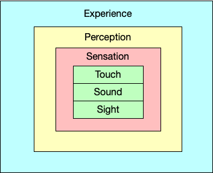
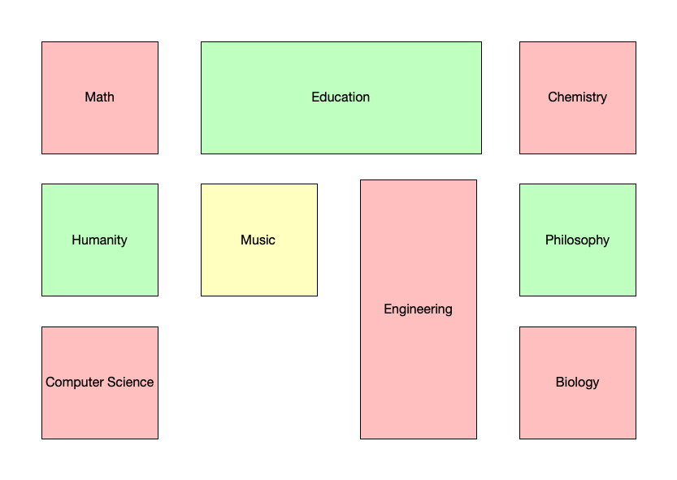
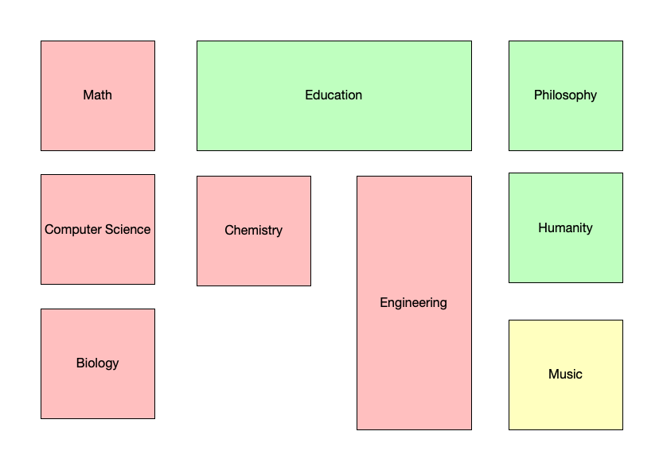
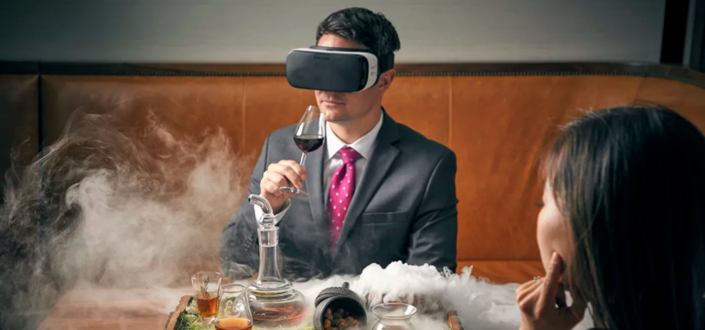
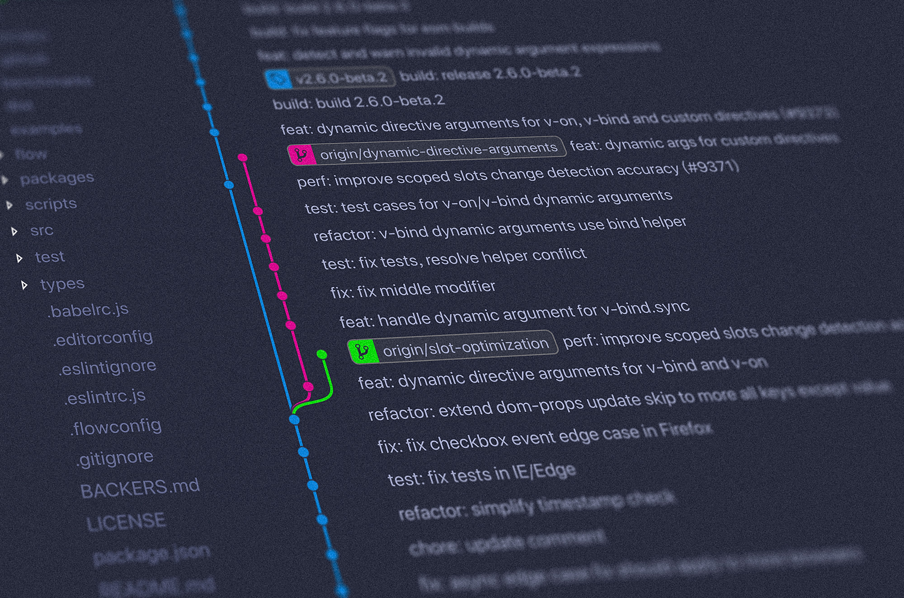

# What is Experience

I was talking to my friend who does meditation on a routine the other day. I have always wondered why someone enjoys spending the time to meditate. His theory is that the idea of meditation is to focus on living experience because not everyone is experiencing living. He gave me a few examples:
- When you are enjoying an extremely fancy dinner that costs you 300$, but you know that you are having a technical interview tomorrow morning, you have to go back and sleep early. Are you enjoying the dinner, and tasting every single spice in your food?
- When you are drinking an amazing espresso shot, and someone is knocking on the door which draws your attention away from the espresso. Are you tasting the coffee?
- You can stay in the library for 12 hours and chatting with friends on Facebook. Does that count as studying if your library experience is not studying?

<!--truncate-->

## Separation between Sensation and Perception
> Sensation and perception are two separate processes that are very closely related. Sensation is input about the physical world obtained by our sensory receptors, and perception is the process by which the brain selects, organizes, and interprets these sensations.

In my personal opinion, I think experience is the next level up, which is a combination of all the sensational processes plus all subconsciousness that exist in your brain:

## Peak Experience
Abraham Maslow developed the concept of [peak experience](https://en.wikipedia.org/wiki/Peak_experience) in 1964, which describes as "rare, exciting, oceanic, deeply moving, exhilarating, elevating experiences that generate an advanced form of perceiving reality, and are even mystic and magical in their effect upon the experimenter".

That what happens when you feel extremely peaceful when you walk in a snowy night listening to some Jazz melody on your headphone; but at a different time, you want to get the same experience, you can't find it anymore.

# Experience Matters
Given that experience is a combination of both sensation and perception, it's not easy to find the formula of creating a good experience. However, it is extremely important to try to maximize "experience", because what makes a difference is not the total amount of physical material but the overall experience of your creation.

I think this is a simple example I can think of, I have been to many colleges; different colleges design their campus differently. Some campuses are super intuitive for a newcomer to navigate, while some other campuses still confuse senior students who have been there for years.

A BAD campus design could look something like this:

If you want to go anywhere, you have to pull out your map and scan through every single building.
Whereas a good campus design looks something like this:

In computer science terms, the bad campus design takes O(N) for anyone to track down the location of a building simply because you have to scan through every single build on the map; whereas a good campus design takes O(LogN), you know the left-hand side of the campus has all the buildings associated with Science faculty, and right-hand side of the campus has all the buildings associated with Arts faculty, and then iteratively, after you turn left for the Science faculty, you know the upper campus is all about Math and Computer Science, and lower campus is all about Bio-Chem. Your decision making is much faster.

Hence as you can see from the campus example, the person who designs a college campus has to have navigation experience in mind, the same mentality applies everywhere. I will share a few experiences I think that matters to me personally:

### Living Experience
- Atlantis in Dubai and Hainan have this underwater hotel room, which got me extremely excited the first time I saw. It was crazy!

- Habitat 67 in Montreal:

### Dining Experience
- This is a straight forward one. People are getting more and more creative with food these days. When I was in Montreal in 2019, I went to this restaurant called Jerome Ferrer's Europea; they even prepared a VR headset for the guests so that they can see how the lobster was cooked:

### Learning Experience
- When you are a teacher, you have to consider the learning experience of your students. The best teachers I have seen in my life could explain extremely hard problems with simple words and visualizations.
- Adam Wolff from Facebook is a perfect example, at React Conf 2019, he used Keynote animation to explain Dead Letter Queue, it was a great experience to listen to his talk:

### Product Experience
- Apple is a good example. As Andrew Clark, the core member who maintains React at Facebook, pointed out, Apple integrated concurrent feature in Objective C early on so that when the UI on iOS is extremely smooth because it makes sure that the menu that's about to show next is fully prepared before it renders so you don't see the spinner like modern websites. React just added concurrent mode in 2019, and it's still in experimental mode. I really admire their craftmanship of changing the language for a better user experience.

### Working Experience
- This is an important one! When people go to work, they should be enjoying their work, not complaining about their work. If they do, that means there is something wrong with the working experience itself.
- In software engineering, I admire and appreciate the amazing work people did put in improve our dev experience. There are so many examples I can think of -- Linux, Git, React, Kubernetes, GraphQL, tmux, yarn, Slack...

