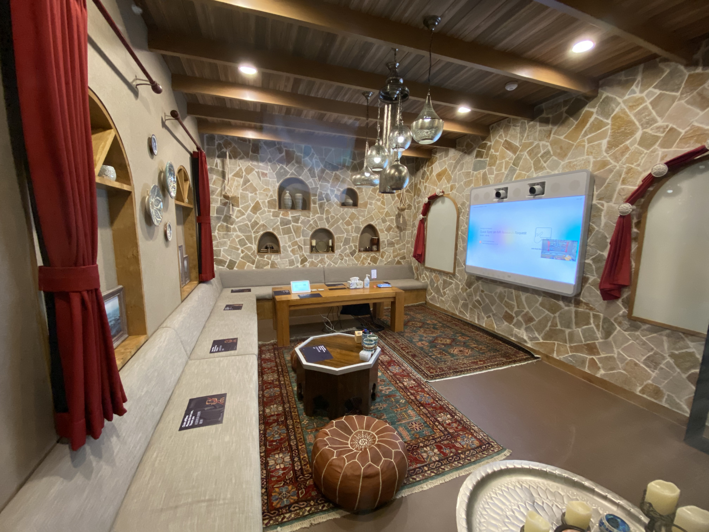
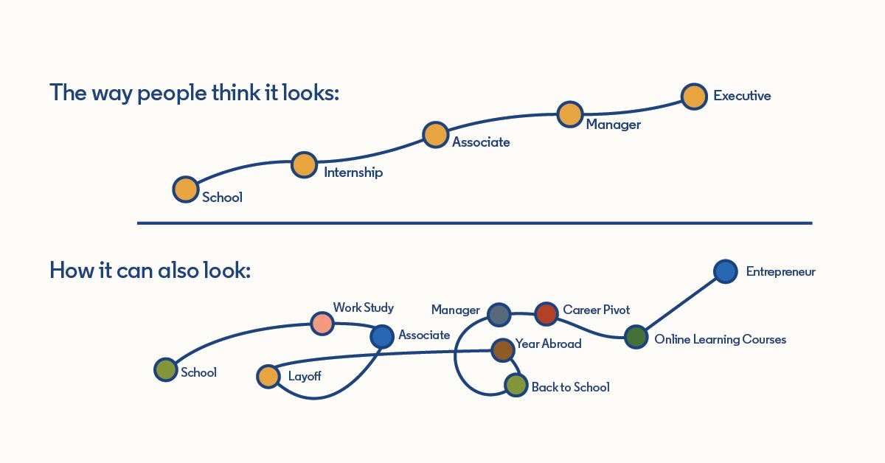

# First 3 Months of Working in China 🇨🇳

At the end of 2021, I decided to relocate back to China due to both family and personal reasons. Extended WFH was a huge one: I was losing a ton of passion and efficiency. After evaluating a few opportunities, I decided to join Airbnb, and work out of their Beijing office!

<!--truncate-->

# Why Airbnb?

## Open-source

- I am a huge fan of open-source projects, and Airbnb is one of the top-tier companies in the Open-source space (Woohoo! I said hi to Harry Shoff on Day One!)

## American 🇺🇸 "Internet"/"To-C" company in China 🇨🇳:

- My background was pretty “Westernized”, I like openness, direct feedbacks all that stuff of the US companies. In the past 10 years, China’s Internet market was carved up by domestic companies, rarely you will find American companies. Some of them such as Google/Facebook quit China before 2010 due to political concerns. Post-2010, Uber was successful in China, but they eventually got acquired by Didi.
- Airbnb is the only American company (AFAIK) that has a dev (non-outsourcing) office where you can have access and contribute to the main codebase in China.

## Mission

- With COVID19 and George Floyd’s accident, hatred/discrimination between races and anti-globalization-ism is an all-time high. Airbnb puts anti-discrimination into practice, and I appreciate that (I can write a blog on how Airbnb does that, but trust me, Airbnb did a lot of work).
- In my opinion, misunderstanding is the cause of all conflicts, I think travel is a great way to help people understand each other :)
  

# Learnings for the first quarter of 2021

## A/B Testing

- At the previous companies, we used to make test plans and we have a threshold for unit test coverage, etc. That is part of our OKR. However, at Airbnb, people rarely treat unit testing as the single source of truth (well, there is a minimum percentage of coverage), instead people talk about experiments and A/B testing extensively.
- I like this approach of not putting unit test in the OKR. If you write a unit test, it’s static, logically not failing a previous written test doesn’t mean you’re doing a better job, sometimes it will block your creativity. Testing should be product-driven.

## Airbnb's perspective on efficiency

- A lot of people evaluate performance and efficiency by LOC (lines of code), amount of features shipped, or how much money they earned or saved for their employer in a period.
- Airbnb has an interesting perspective: <u>**_efficiency should be measured by the number of learnings in a product team in a period_**</u>
  - This is for both personal and team
  - Personal learnings: <u>**_learning is a skill_**</u>. Getting many offers from companies for the same job doesn't make you a better engineer, but taking more courses on Coursera will.
  - Team learnings: When a dev team optimizes for learnings, they will have to do decomposition so that they can get learnings early in the dev cycle by running smaller and incremental experiments and A/B tests.
- This "Career Path" sketch on LinkedIn is quite interesting. My friend [Dr.Kazem Jahanbakhsh](http://www.kazemjahanbakhsh.com/) mentioned the term [Orthogonal learning](https://medium.com/@tak_lo/orthogonal-learning-eca7667ea27a), which is the active approach of gathering inputs that are drastically different from the status quo, in as much diversity as possible. I think in a software engineer's career development, it is important to optimize for orthogonal learnings.
  

## Design

- 798 Beijing had a movie expo that demoed the storyboards of a few award-winning movies such as "Shape of Water" and "Avatar". One takeaway I got is that a successful movie usually has a strong team, and a strong team should have a set of tools to help them communicate abstract art ideas (the members also have different backgrounds, directors, actors, photographers, musicians etc.). This is appliable to my experience at Airbnb. A lot of companies have content and design teams, but in the development cycle, there is always a gap between the designers and engineers (One reason being the terms and technologies designers use are different than engineers, another being the designers only take parts during review time, they don't work closely with the engineers during the development time). I think one metric to evaluate if a team is good at design is <u>**_how well can the knowledge be transferred between the designs and engineers_**</u>, Airbnb has a stack of technologies that help designers to deliver design concepts to engineers.
  

## Synergy

- I learned this through a feature work I did: I love greenfield development, you can write a whole new service, ship a ton of code, and adds a lot of features in a short period of time. When I worked on a feature for the China region, my initial approach was to create a new service from scratch because the feature will only be applied to the China region; it is faster since we could waive off all the global procedures. My manager talked to me and asked why I didn't reach out to the global team first to see if they also need a similar feature -- if it is useful for China teams, it is also useful for the global teams. So I reached out to the global team, and well, it turned out to be synergy:
  - The global PM liked our feature, and she also had a similar feature planned for the future
  - The global team has a workflow built already, if I modify their code, it only a few lines of change; whereas if I create a new service, it would take at least 2 extra weeks of work for researching, developing, and deploying
  - Personal impact is bigger since the feature will be delivered to the global platform

# Things to improve

Here are a list of things I want to improve and do more for the next quarter.

- [ ] Books reading:
  - I am planning to read [Trustworthy Online Controlled Experiments: A Practical Guide to A/B Testing](https://www.amazon.ca/Trustworthy-Online-Controlled-Experiments-Practical/dp/1108724264/ref=sr_1_1?dchild=1&keywords=ab+testing&qid=1619413246&sr=8-1)
- [ ] Do more second order thinking:
  - I have been impressed by the way how my colleagues think; A good team or a good manager should make people think and learn ;)
  - Try to go beyond conventional thinking and approach a problem using different angels
- [ ] Writing monthly update:
  - Some of my colleagues have a practice of sending out an email at the end of the month to summarize and share some of their learnings for the month. This is a good practice, when you write things down, you can solidify some vague ideas and thoughts, and put them into systematic reasonings. When you share it with other people, it makes others to think, discuss, and provide you valuable feedback, a good echo!
  - An analogy for this is writing is like giving your code to a compiler and run it, you will see your thinking flaws.
- [ ] Sleep Schedule:
  - Try to sleep early
- [ ] Do more backend development:
  - Kafka, OOP patterns
- [ ] Build more connections
- [ ] Sports
