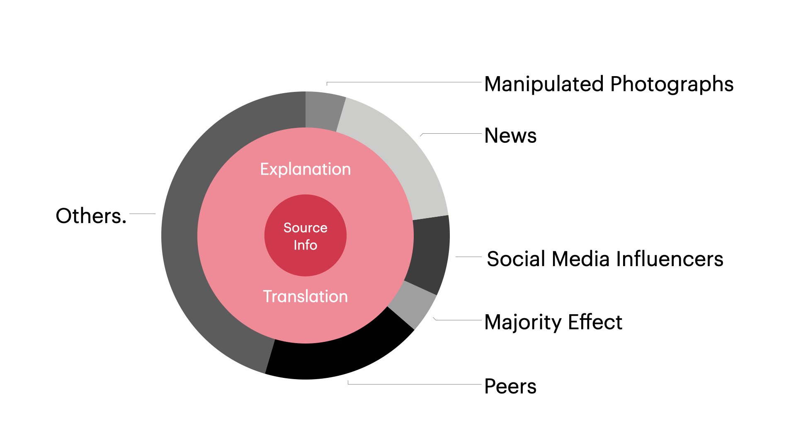

For the past year, I have met a lot of entrepreneurs and engineers. I found a common pattern: these knowledgable people not only read more than me but are very smart in choosing the right information to read and digest.

In terms of intelligence, everyone is similar. What matters more is whether a person wants to learn/read and from which source the person learns (the information input). Just like what people always say in the gym -- 'You Are What You Eat', this applies to information and learning.

## Information Hygiene 👩🏻‍⚕️
The first thing to practice is to identify the quality of information. For the modern era, a lot of online media sites and content creators tend to tune their content to maximize the impression rate or view count (if you want to learn how to write news to catch eyeballs 👁 [here is a link](
https://www.digitalthirdcoast.com/blog/values-content-newsworthy)) a better term to describe the quality of information is __Information Hygiene__

The following chart is my understanding of information distribution:

<!--truncate-->
- The **source information** gets released through a paper, a book, or media. 
- Since the source information is usually professional, atomic, and primitive; to help the audience understand its information, it has to be interpreted, translated, or explained:
    - __Translation__: A translator interprets and translates the source information into the audience’s language.
    - __Explanation__: For professional source information, a translator needs to interpret and explain the professional terms into concepts that the audience can comprehend.
- On the outer circle, information gets distributed through omni-channels such as news, social media, or friends and peers.

__The closer you are to the source information, the higher the information hygiene level is at__.

That's why we should try to read original papers and textbooks written in the author language. Because the process of explanation and translation is opinionated (try to read a book that has been translated by different translators, you get different information out of it, there is some "pollution"). When a information gets distributed through media or news, it will be "heavily polluted" with third-party values and biased opinion, which is even worse!!! (i.e. Covid-19 News)

## Information Category 🧪 
It's important to also categorize information, the major and important categories are:
- Timeliness
    - The newest information that keeps you updated on what's going on around the world
    - Usually has an expiration date (time-bound; of course you won't read news about a new Nokia phone annoucement in 2003)
    - Location matters sometimes too (I read less European news because I don't live there. I don't read news on pigeon birth rate in South Pole at all!)
- Knowledge
    - Boolean or linear, you know it or you don't know it
        - Do you know the recipe of Tom Yum Soup?
        - Do you know how to wire GPU with motherboard and PSU?
        - Do you know how dispatch queue works in Swift?
    - Scientific, Acedemical.
- Wisdom
    - Higher level, usually abstract, sometimes meta-physics and philsophical
    - Should teach me how to think

:::info
And of course there is other categories such as Entertainment, etc. But those are probably not the most important ones for learning.
:::

To combine the information hygiene level and category, I can draw a table like this:

Hygiene Level|Timeliness|Knowledge|Wisdom
---|---|---|---
Good|Hackermoon, HBR, WSJ|Textbook, Research Papers, Reputational Magazine|Philosophy/Literature Classics, Autobiography, Dairy or Memoir
Bad| Media, News Feed|Reddit, Forum|Celebrity Biography
Ugly| Rumor, Gossip|Advertisements|Book or article that teaches you "The Principles of Success", Business story (not Case Study)

_* This is a very general sketch, there are exceptions: books like Ray Dalio's Principle, Steve Jobs are all about teaching you the principles of success and celebrity biography, but those are good sources that have high information hygiene (written by the man himself or a friend that's close to the author)_

## Further Thinking 🤔
- You can't learn everything because time is limited:
    - Don't try to learn all the information in the universe

> 
> 吾生也有涯而知也无涯，以有涯随无涯，殆已 -- 庄子
>
> Our life has a limit but knowledge has none (You cannot learn all in your life. There is no destination for pursuit of knowledge in the finite lifetime). --  Chuang Tzu

- Prioritization based on the profession matters
    - I am a software engineer, so my ranking of information is probably:

    High Priority | Medium Priority | Low Priority
    --- | --- | ---
    Tech, Logic, Math, Physics | Design, Product Management | Economics, Humanity, Marketing, Public Relationships

- Knowing when to concentrate and when to exclude:

> Do not many of us who fail to achieve big things fail because we lack concentration -- the art of concentrating the mind on the thing to be done at the proper time and to the exclusion of everything else? -- John D. Rockefeller

- Orthogonal Learning - It's useful to be exposed to things completely outside of your core realm so that you know how the world is changing:
    - Many people in tech missed crypto and many tech people are missing what's happening in AI applications these days

- Become more aware of:
    - [News Aggregators](https://en.wikipedia.org/wiki/News_aggregator)
    - [The Echo Chamber Effect](https://en.wikipedia.org/wiki/Echo_chamber_(media))
    - [Filter Bubble](https://en.wikipedia.org/wiki/Filter_bubble)

## Great Information (Updating) 📚
- Paulgraham.com
    - http://www.paulgraham.com/think.html
    - http://paulgraham.com/ds.html
- Elon Musk: [First Principal Rule](https://medium.com/the-mission/elon-musks-3-step-first-principles-thinking-how-to-think-and-solve-difficult-problems-like-a-ba1e73a9f6c0)
- Charlie Munger: 100 Frameworks
- Peter M. Senge: The Fifth Discipline