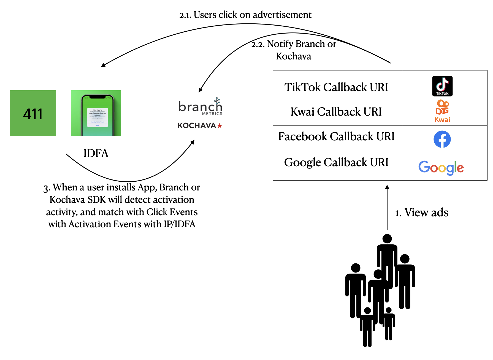
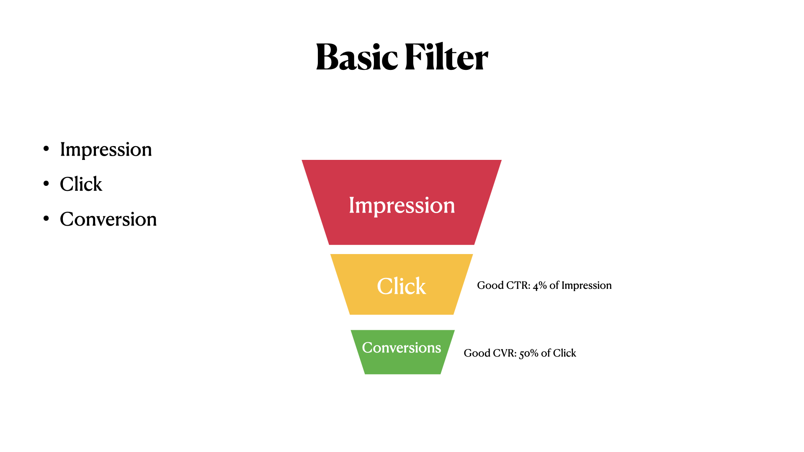

_Carl: Max had an introduction tutorial session for the full stack engineers, It was really educative. Writing down this note for sharing._

## Basic concepts

### Mobile Linking and Mesaurement Platform
To place ads on various platforms, we need a complete system to link and measure the performance of omni-channel media advertisement campaign. Commonly used linking and mesaurement platforms are [Branch.io](https://branch.io) (paid) and Kochava (free).
The general idea is to configure the callback URL of each advertisement delivery platform on the mobile linking platform, and at the same time embed the SDK of the mobile linking platform in the App. The platforms collect data and calculate the attribution.

<!--truncate-->

1. When users browse Tiktok, Kuaishou, Facebook, Google, they will click on the ads depends on their interests
2. When the user clicks on the advertisement, a click event will be triggered, and the advertising platform will call the callback URL of the mobile linking platform to tell the mobile linking platform that the user has clicked the advertisement through a particular channel. The mobile linking platform will save this data and detect whether there is an Activation event, that is, whether the user has installed the App in the App Store or Google Play
3. The SDK of the mobile linking platform needs to be configured in the app. Generally, the SDK will send an Activation event to the mobile linking platform when the app starts up.

Generally speaking, if the user has given the Ads Tracking permission on Android or iOS, the data monitoring platform will directly use IDFA for identification. If the user didn't give Ads Tracking permission, the user's IP will be used to make a judgment to see if the user downloads and installs the App after clicking on an advertisement on a certain channel.

### What about offline advertisement?
- Advertisements in bus stops and elevators are offline advertisements (cannot call the callback API because they are not connected to the Internet). How to see the performance of those advertisements?
    - Need to use A/B testing: first do the campaign in Seattle for a few months, collect the data, then stop the campaign in Seattle, do the campaign in San Francisco. Compare to see if there is any change in the number of apps installed by users in these two areas

## Ad Conversion Rate (CVR) Funnel

:::info
- Click Rate: Generally, after seeing the advertisement, a click rate of 4% is already very good
- Ad Conversion Rate (CVR), usually 50% of CTR
:::

## Media Buying Model
Media buy (also called media buying) is a way of advertisement and promotion. Simply speaking, companies like Tiktok or Facebook offer or buy advertising spaces on influential media, and fill the spaces with their own advertisements. After the target audience sees the advertisements, they might make some purchases and become valueable customers. There are many kinds of media buy models and strategies depends on what type of customers you are looking for specifically, we have only discussed CPM, CPC, CPI today. There is more to read on [Media Buying Models](https://www.singular.net/blog/media-buying-models/)
- CPM: Cost Per Thousand - the advertising pricing model that is billed by the number of impressions of the advertisement
- CPC: Cost Per Click - advertising pricing model that is billed per click
- CPI: Cost Per Install - Ad pricing model that is billed per install

### Things to consider when choosing a buying model
- CPM: If you only choose CPM and only look at the number of impressions, it is possible that the user saw the advertisement and did not install it at the end.
    - Ads Fraud: Advertisers can farm impressions with bots.
- CPI: If you only choose CPI, the user installation rate is very high, but most users just install it and then delete it, and there are not many profitable users
    - Some advertisers can also farm installs with bots and mobile simulators
- You can also choose a more complex model, such as we only pay when the advertisers get a user that's loyal to our product (Some advertisers have AI and recommendation algorithms to do so, such as Facebook will see the relationship between customers and only promote in a particular circle)

:::info
- CAC one-time users vs LTV long-term profitable users
    - LTV I: User's profit - Advertising cost
    - LTV II: User's Profit - (Advertising Cost + Staff + Operations)
    - LTV III: User's Profit - (Advertising Cost + Staff + Operation + Office + System Maintenance + etc.)
:::

Lets do some exercises

:::note Exercise 1
- Suppose we put 100 dollars, the following is the data we received, what are the CPM, CPC and CPI?

|Impression|Click|Conversion|
|---|---|---|
|5000|200|100|
:::

:::tip Answer
CPM|CPC|CPI/CPA
---|---|---
$20|$0.5|$1
:::

:::note Exercise 2
- Suppose we put $10,000 on Tiktok and Facebook at the same time, the following is the data we received, Facebook data is not as good compared to Tiktok, where is the problem at?

Platform|CPM|Clicks|Installations
---|---|---|---
Facebook|10000$|5,000|2,500
Tiktok|10000$|10,000|4,000
:::

:::tip Answer
Something is wrong with the clicks, Facebook's advertising content may not be the most popular. The potential customers saw the advertisement but didn't want to click on them. Should consider to replace the content with different video, image, text.
:::

## Ad Space
- There are many types of ads, such as video, graphic, plain text
- The Ad Space is the advertiser's inventory/Stocks:
    - For example, on Tiktok, an Ad video will appear for every three videos you swipe. Instagram, every few pictures are mixed with an Ad image slot, these are embedded Ad Space within the apps
- Companies compete for Ad Space:
    - Large companies have more inventory in terms of Ad Space than small companies
    - Small companies want to expand their inventory of Ad Space and need to unite the resources, i.e. a few smaller video game apps can aggregate their Ad Space and sell as a bundle together, when buying from them, your Ad will appear in all of their games

:::info Affiliates
- Large companies will aggregate some advertising spaces and put them on different platforms
- i.e. Facebook owns Instagram, Whatsapp, etc.
- Alibaba owns a lot of apps, ByteDance is simlar (text ad space in Toutiao or Lark, video ad space in Tiktok, etc.)
:::

## Chinese Version
[Chinese PDF](./Media_101_Chinese.pdf)