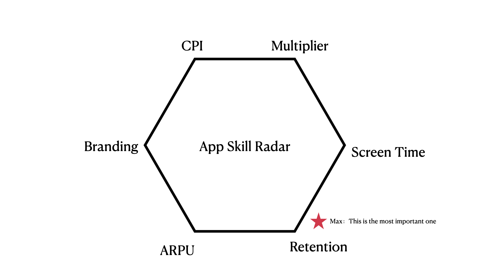

_This is an introduction blog to some knowledge (basic) and vocabs I have learnt at Presence. _ 

## App's Skill Radar
- For any Mobile/Web/Internet startup, you need to know your advantages and disadvantages just so you don't get lured down a blind alley.
- This is appliable not only to Mobile Apps, but also to any modern startups (i.e. Website for delivery call, aka. Doordash/Palo Altos Delivery)

### CPI
- Cost Per Install:
    - Web: 0$
- Top tier compnay examples
    - Any web era startups: Google, Yahoo, Portal sites

### Muliplier
- How fast does the product spread, is it exponential or linear?
- Top tier compnay examples
    - Uber, UberEats

### Screen Time
- How long does your user spend on your app
- Top tier company examples
    - Tiktok -> 100 Mins
    - FB -> 45 Mins
    - Bytedance Toutiao -> 75 Mins

### Retention
- How long does a customer keep your app:
- 2nd/7th/30th day Retention:
    - 4-2-1 -> OK (40% users kept your app on the second day, 20% users kept after a week, 10% after a month)
    - 6-4-3 -> TikTok, Facebook, Google
    - 5-3-2 -> Very good, you can go IPO
- for Web, DAU/MAU is commonly discussed. It is the same thing as Retention
    - The formula is: `DAU / MAU = 2nd day retention / 30th day retention`
    - 20% -> Ok 
    - 60% -> Tiktok level
    - 66% -> Facebook level
- Top tier compnay examples
    - Tiktok, Facebook, Snapchat
    - To-B apps: Salesforce, Slack, Tableau, needed for work, mandatory retention

### ARPU
- How easy is it to generate cash from your customers
- Top tier company examples
    - Airbnb: extremely high ARPU, extremely low Screen Time
    - Amazon: Okay Screen Time, but high ARPU

### Branding
- Top tier compnay examples:
    - Apple
    - Amazon: return policy, Amazon Prime

## Experiment vs. Error
