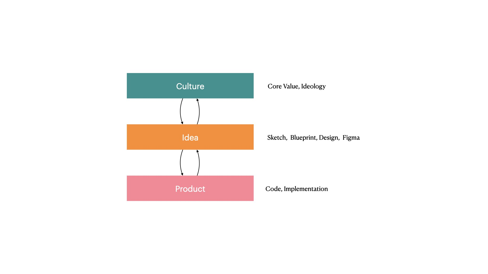

_This is a personal blog of some thoughts._

# Culture

Impact of Caligraphy on product:

- Design:
  - Margin, Padding, Baysian curve
- Cultural background:
  - 布达佩斯大饭店
- Revolution
  - When something is too common, people tend to use another text. Times New Romans -> Hervertica -> Menlo Park

Impact of Music on Product:

- Music Theory

  - Highly associated with Philosophy and Literature
  - The Austrian Committee for music composition
  - Two voice medival counterpoint
  - Musical Language

- Strawberry Field Forever
  - 26 takes, Steve Jobs quoted on how the Beatles tried to make a perfect product through each of the takes
  - Major III Chord
- absorbed mathematical tools for constructing and decon- structing atonal compositions. But I did not learn anything whatsoever about jazz, Debussy, Ravel, Shostakovich, Messiaen, or minimalism.

- Social apps generations

# Thoughts

- The past generation of Chinese people tend to build products by copying from successful products, "I am Chinese, so I am good at copying"
- Accessibility (A11Y)
  - People with better technology will be easier to get more information (Google, ChatGPT, Dev Experience)
- The problem is that in music, unlike science, “experiments” rarely produce unequivocal answers: it is entirely likely that a particular compositional style — be it impressionism, atonality, or bebop — will attract some adherents while repulsing others.
- For every musician who thinks that tonality is a thing of the past, there is another who thinks that atonality was a vast and horrible mistake—the musical analogue, as Milan Kundera once wrote, of the Dictatorship of the Proletariat.

- When evaluate a product, try to not just copy the cover, but understand the culture and context behind it
- Get to know the younger generation's language
- Accept the fact that most of things other than science, “experiments” rarely produce unequivocal answers

# References

_[1] Chua, H. F., Boland J. E., & Nisbett, R. E. (2005). Cultural variation in eye movements during scene perception. Proceedings of the National Academy of Science, 102, 12629-12633._

_[2] Masuda, T. & Nisbett, R. E. (2006). Culture and change blindness. Cognitive Science, 30, 381-389_
