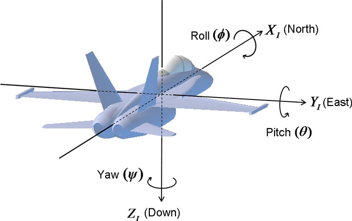
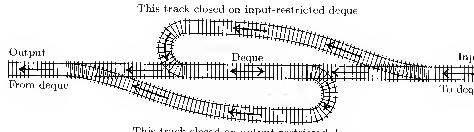
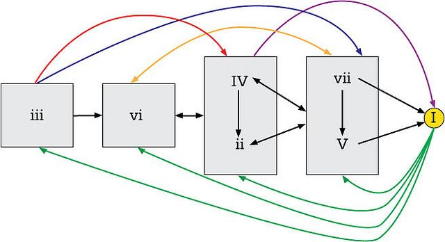
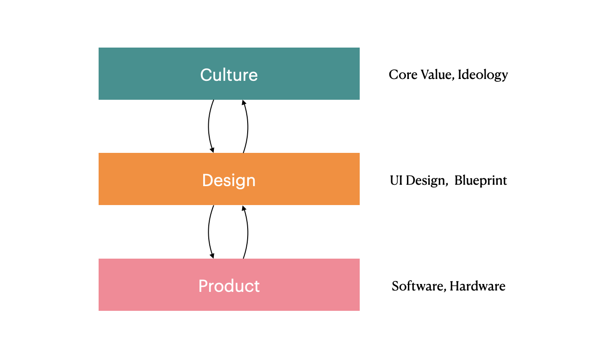
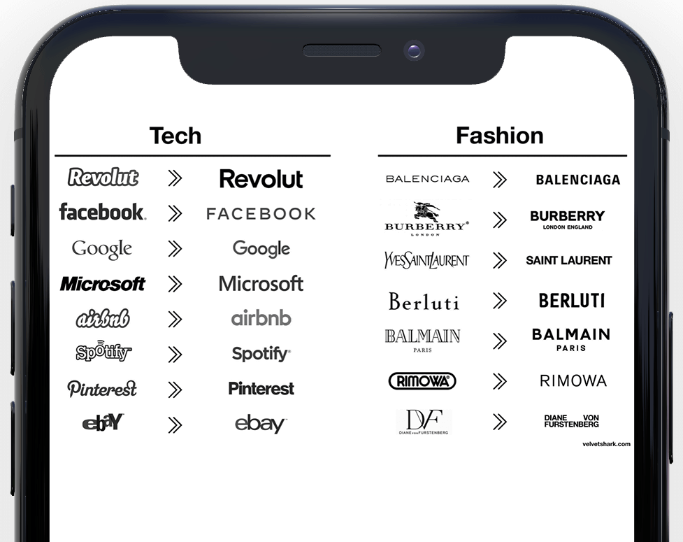

_**Definition of Liberal Arts**: Liberal Arts is intended to provide chiefly general knowledge and to develop general intellectual capacities (such as reason and judgment) as opposed to professional or vocational skills._

Growing up in two different countries, China and Canada, I encountered a common trend: faculties were often divided into the Faculty of Arts and Faculty of Science. However, my experience working as an engineer at Presence, a pioneering AR tech startup, has taught me that what is often underestimated in the tech industry is the value of liberal arts education.

In some extreme cases, engineers believe that hard skills like coding are the only skills that matter, while liberal arts education is dismissed as irrelevant or impractical. However, I argue that this is a flawed perspective. In fact, liberal arts education can be just as valuable as hard skills for engineers working in the tech industry.

## Limitation of Engineering Education

Throughout my academic and professional experience in the technology industry, I have come to recognize three major issues that are rarely discussed.

### 1. Fixed Reward Mechanism

In academia, technical interviews, and in the industry, the standards for evaluating and rewarding engineers are often fixed. Engineers tend to obsess over code cleanliness, optimization of memory and computation usage, and test coverage. While these standards may contribute to the development of better engineers, they may result in less creative problem-solvers overall. In fact, some experts in the field, like Dan Abramov, have highlighted [how an obsession with clean code can be problematic](https://overreacted.io/goodbye-clean-code/). Although there is value in these standards, they prioritize certain skills over others, and consequently, limit engineers' capacity to be well-rounded creators.

Examples of these reward mechanisms include getting an A in a course because your exam answers were elegant, or landing a job offer because you wrote a perfect algorithm that solved a Hackerrank problem faster than anyone else. Additionally, building a better API product than Stripe does not necessarily mean that people will abandon Stripe and use your product.

### 2. Narrow Field of View

Engineers often have limited interaction with customers. Typically, they focus on writing code, allowing product managers and designers to define the features that need to be implemented. This can result in a bottom-up working model where engineers remain in the background. However, numerous thought-leaders, like Paul Graham and Clayton Christensen, have emphasized the importance of understanding and interacting with customers. In his essay ["Do Things That Don't Scale"](http://paulgraham.com/ds.html), Paul Graham remarks that:

> A lot of startup founders are trained as engineers, and customer service is not part of the training of engineers. You're supposed to build things that are robust and elegant, not be slavishly attentive to individual users like some kind of salesperson... **They'd rather sit at home writing code than go out and talk to a bunch of strangers and probably be rejected by most of them.** -- Paul Graham

### 3. Limitation of Experiments

Although science is rooted in experiments, many liberal arts subjects such as design, calligraphy, and music produce results that are not always unequivocal. In music, for example, different compositional genres (romanticism, atonality, jazz) will attract and repel different audiences. This subjectivity within certain fields means that experimentation produces more open-ended results.

Overall, recognizing these three limitations of engineering education can encourage engineers to develop broader skill sets so that they can become better communicators and creative thinkers.

## Universal Understanding

> The liberal arts were the continuation of Ancient Greek methods of enquiry that began with a "desire for a universal understanding." [1]

I am a strong believer in "Orthogonal Learning", an approach to gathering inputs as much diversity as possible in a learning process. In Computer Science, there is Problem Reduction, which is transforming one problem into another problem. There are many examples of studies in other industries that have helped to explain and solve computer problems:

- For people familiar with Unity or video game development, the quaternion is a common technique for object rotation used in character movement. I was not aware of this terminology but it is no stranger to folks who studied Physics or Aerospace engineering.

| Quaternion (Physics and Aerospace) | Leg rotation (Unity) |
| ---------------------------------- | -------------------- |
|                   |       |

<!--truncate-->
- Donald Knuth used a lot of real-life problems to describe algorithms problems in his book _"The Art of Computer Programming"_, the example of using train track design to explain dequeue data structure is fascinating:

| Track Design (Civil Engineering) | Dequeue (Computer Data Structure) |
| -------------------------------- | --------------------------------- |
|                   |                   |

- And as a music minor student, composing with chord progression is simply building up a finite state automata:

| Chord Progress (Music)      | Finite-State Automata (Computer Science) |
| --------------------------- | ---------------------------------------- |
|  |            |

<!--truncate-->

:::info
There is Baader-Meinhof Phenomenon, which refers to an impression that something happens more frequently than it actually does after we learn something new
:::

## Impact on Tech Product

As creators, we have to understand how a Tech product is built. I think there are three levels, there is implementation, design, and culture.

At most software companies, the product is an implementation of a design; on a higher level, a design is inspired by culture. One observation I found is in Steve Jobs's favorite subject - _**calligraphy**_:

### Case 1 - Sans Serif Evolution

In recent years, brands are moving from Serif to Sans Serif for minimalism, which is identified as the mainstream culture of our era, Google, Facebook, and Airbnb all rebranded their logo to use Sans Serif to look techier, interestingly, so did the traditional fashion brands including Burberry and Saint Laurent.

| Serif vs. Sans Serif         | Brand Logo Evolution From Serif to Sans Serif |
| ---------------------------- | --------------------------------------------- |
|  |                                |

> I learned about serif and san serif typefaces, about varying the amount of space between different letter combinations, about what makes great typography great. It was beautiful, historical, artistically subtle in a way that science can’t capture, and I found it fascinating. -- Steve Jobs

### Case 2 - Airbnb

Another case is related to my experience at Airbnb. When we were building customer support products at Airbnb, a research we had was that Gen Z and Millennials (1995+) prefer to resolve product issues with text and messages, whereas Gen X (1964 - 1980) love to resolve issues by calling on their cellphone ([Millennials and Gen-Z Hate Phone Calls](https://godeskless.com/blog/millennials-and-gen-z-companies-adapt/)). This is related to the minimalism culture that arose among the younger generation - "they prefer faster, more direct communication, with straightforward results". As a result, Airbnb invested more on developing better Chatbot and self-solving support products than bigger call centers. On top of this, there was also a shift in Airbnb's Design Langauge Tone of Voice in order to speak better to Millennials in their language:

- [Airbnb's Design Langauge](https://airbnb.design/building-a-visual-language/)
- [Airbnb's Tone of Voice](https://airbnb.design/content-strategy-at-airbnb/)

Brian Chesky himself is a man of liberal arts education, importance of culture at Airbnb has been emphasized not only on the product level but also on the company level ([Brian Chesky - Don't fuck up the culture](https://medium.com/@bchesky/dont-fuck-up-the-culture-597cde9ee9d4)).

_Not to mention, a product can also influence design and culture in return from the ground up. i.e. Beethoven has been viewed more as a cultural hero than just a musician, as his revolutionary compositional elements and life story helped to define the Romantic culture of that era. Other examples of product influencing culture include works of Nietzsche, Brahms, Wagner, von Neumann_

## Thoughts

Professional learning is crucial to engineers, but general learning in liberal arts can also contribute to engineers' career growth as it goes above and beyond just the professional skills and let us become more insightful of the correlation between subjects and understand products from a new persepctive.

Further thoughts I didn't get to elaborate:

- First Principle thinking and Creativity:

  - Design and build products that root from a culture vs. copying from successful products is completely different
  - When seeing a product, try to understand the culture and context
  - Understand the target customer's language, culture and ideology

- Ethics:

  - Ethics in A.I.: Trolley Problem
  - Access to Tech

    - People with more access to technology will get more information (people who knows how to use Google, ChatGPT, etc.) than people who don't have access

- Leaky Abstraction:
  - How to learn a new subject without leaky abstraction problem (understand from high level but missing a lot of foundations due to insufficient education/training)

# References

- [1] Tubbs, Nigel (2014). Philosophy and Modern Liberal Arts Education: Freedom is to Learn. Houndmills, Basingstoke, Hampshire: Palgrave Macmillan.
