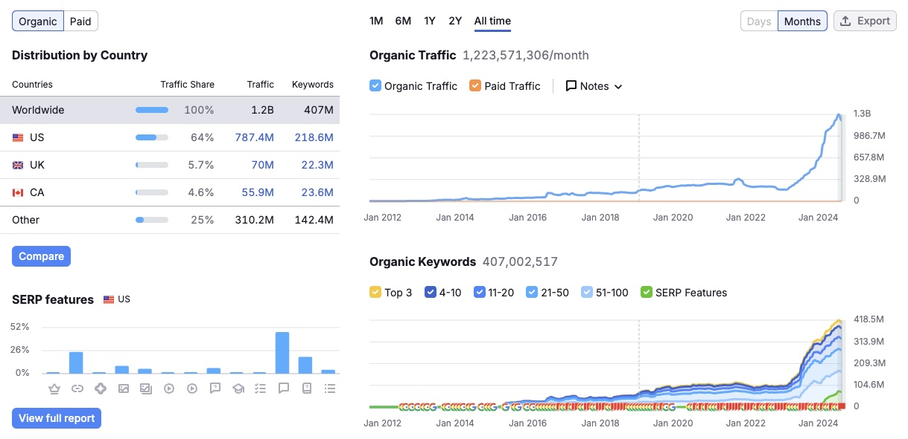

## Goal

In this analysis, we explore how Large Language Models (LLMs) and AI technologies have fundamentally transformed the internet landscape since ChatGPT's debut. By examining market dynamics and how major players are adapting, we present four key predictions for the AI industry through 2025. Our forecast draws from current trends, market data, and emerging patterns in how businesses and users interact with AI technologies:

1. **New Frontiers in Product Design**
2. **The Search Will Shift**
3. **LLMs as a Market Disruptor**
4. **Future of LLM Development**

## New Frontiers in Product Design

### Shifting Metrics at Airbnb

A conversation with a senior design manager at Airbnb revealed a paradigm shift: instead of focusing on Page Performance Scores, the company now measures “Resolution Time”—how quickly an AI agent can meet user needs, whether it’s booking a stay or finding relevant info.

- **Implication**: Traditional UI metrics, such as load times and animations, may soon take a back seat to AI responsiveness and contextual understanding.

<!--truncate-->

### UI & UX Evolution

Historically, thoughtful design and playful animations helped mask slow load times or complicated workflows. In an AI-empowered future, design may prioritize minimizing friction:

- **Fewer Visible Elements**: As AI handles more behind-the-scenes tasks, users may interact through chat-style or voice-based UIs rather than multi-step pages.
- **Analogies in Tech**: Cars evolved from bulky dashboards with physical buttons to sleek touchscreens—and now, self-driving vehicles with minimal driver interaction at all.

| Evolution of Car Interface | Description |
|---------------------------|-------------|
|  | Traditional dashboard with physical buttons (2017 Porsche Macan) |
|  | Minimalist touchscreen interface (2024 Porsche Macan) |
|  | Future autonomous vehicle with minimal driver controls |

### Designing for “Agentic” Experiences

With AI agents poised to handle complex tasks autonomously, product designers must consider how to balance transparency, control, and convenience. Users may want to see how an AI is making decisions, but they also want effortless, immediate results. Striking this balance will define UX best practices in the years ahead.

<!--truncate-->

## The Search Will Shift
### Niche Queries and Google’s Traffic Decline

Until recently, Google dominated the long-tail search market. Users would type in very specific questions—ranging from study materials (the Verge, StackOverflow) to community-driven insights (Reddit)—and Google’s algorithm would serve relevant links. However, since ChatGPT’s launch, anecdotal data shows a notable dip in organic traffic for these niche content platforms. Instead of browsing multiple webpages, users are increasingly seeking direct, AI-generated answers.

### The Impact on Traditional Players

- **the Verge & StackOverflow**: Once heavily reliant on search referrals for study questions and coding solutions, these sites have reported traffic losses as users lean on LLMs for instant, context-rich answers.
- **Reddit & Wikipedia**: Despite AI's emergence, these platforms have seen growth in user engagement, likely due to their unique value proposition in hosting diverse, community-driven content and verified information.

Explore Traffic Data for These Platforms

| Platform | Traffic Data |
|----------|-------------------|
| the Verge |  |
| StackOverflow |  |
| Reddit |  |
| Wikipedia |  |

### Google’s Response

Recognizing the potential threat, Google has launched AI-powered initiatives to handle niche queries. While these specialized searches might not contribute significantly to Google’s core ad revenue, the shift raises larger questions about how the search giant will maintain its overall market share. Ultimately, the user preference for direct AI answers—without multiple clicks—is reshaping the fundamental dynamics of online search.

## LLM as a Market Distruptor

### The Innovator’s Dilemma

LLMs exemplify a classic “innovator’s dilemma.” They provide a fundamentally new way to find information and solve problems, forcing established players to either cannibalize their existing revenue streams or risk becoming obsolete. Google, for instance, is under pressure to integrate AI technologies more deeply into its product suite, even if that risks reducing some of its traditional ad-based income.

### Monetization Challenges

While OpenAI, Google, and other AI-focused companies are front and center in public discourse, the question of monetization remains unresolved:

- **OpenAI**: Has experimented with subscription models and API licensing.
- **Startups Leveraging LLMs**: Many rely on venture funding while searching for a scalable model—some of which aim to specialize in vertical markets (e.g., code orchestration, AI-driven search, or customer service).

It is entirely possible that a new entrant—neither a Big Tech incumbent nor the current AI darlings—will discover a breakthrough revenue model, potentially transforming the competitive landscape yet again.

### Companies Must Adapt or Vanish

For internet businesses, the message is clear: adapt or risk disappearing within 3–5 years. Traditional platforms that fail to weave AI into their core offerings could see their user bases dwindle.

- **Verticals at Risk**: Sites that rely on crowd-sourced content (e.g., Q&A platforms, educational resources) face immediate pressure to innovate or partner with AI services.
- **Opportunities**: Incorporating AI-driven personalization, content summarization, or advanced analytics can help these companies stand out and maintain user loyalty.

### Customer Acquisition in an AI-First World

Beyond traditional advertising on Facebook or Google, new affiliate models driven by AI-generated content are proving highly cost-effective:

- **AIGC Affiliate Networks**: Marketers use AI tools to produce social media posts at scale, building large audiences at minimal cost.
- **Cost Savings**: Apps that once spent $10 per user via Google Ads are now acquiring users at a fraction of the cost (e.g., $0.50) through these AI-powered affiliates.
- **Implication**: Lower customer acquisition costs open the door to a wave of new apps, while also challenging legacy players reliant on pricey pay-per-click models.

## Overhype vs. Underhype & Future of LLM Development
### Overhyped Startups

The AI gold rush has spurred countless startups to claim they have the next groundbreaking LLM application. Yet the reality is that many will struggle with:

- **Product-Market Fit**: Users may be intrigued by AI-based features, but enthusiasm alone doesn’t guarantee sustained adoption.
- **Commoditization Risk**: Improvements in LLM models (GPT-4, GPT-5, etc.) quickly level the playing field for all AI-driven products, eroding competitive advantages unless startups offer unique, high-value workflows.

### Underhyped Niches

On the flip side, certain specialized areas—like code orchestration, domain-specific search, or automated compliance workflows—may quietly gain traction. These niches focus on concrete, high-value problems that general-purpose LLMs or “agentic solutions” don’t fully address.

### Scaling Law and Data Constraints

The race to build bigger and better models is exemplified by rumors of Elon Musk assembling GPU clusters of unprecedented scale. While throwing more compute at the problem has historically yielded large performance gains, experts warn of hitting a “data wall”:

- **Data Limitations**: High-quality training datasets are finite, and repeatedly feeding the same data to larger models hits diminishing returns.
- **Agentic Aspirations**: Future LLM iterations promise advanced reasoning or even self-awareness, but actual progress toward “true AGI” remains hotly debated.

### Long-Term Outlook

Although some researchers are skeptical of short-term breakthroughs, most agree that LLMs will continue to evolve in capability and sophistication. The question is not if they will improve, but how these improvements will manifest and whether business and legal frameworks can keep pace.