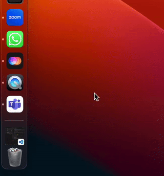

> 在我来 Presence 之前实际上我对[retention](https://articles.sequoiacap.com/retention)这个概念并不是很敏感，因为我之前工作的两个公司 Tableau toB 只注重 Market Acquisition 和 Gartner Quandrant 的 ranking，Airbnb 只注重 Booking rate - Retention has always been a number there we look at once in a while...

> 加入到 Presence 之后，retention 几乎改变了我的思维定式 - It's the most important thing in a business。AI 时代的产品可能确实需要跳出之前思维的框架，重新用第一性思维来思考。这篇文章就是来记一下我们最近对于 retention 的思考。

# Scenarios Retention doesn't work

## Type 1 Error - 假留存

- Tricky 刷数据的方法

  - 签到，推送，小红点
  - 病毒类型的软件 - 装上删不掉

    

  - 薅羊毛类型的留存 - 红包，Coupon：
    - Groupon，Honey 之前增长最强的几个公司，现在已经没多少人听说过了
  - HipChat
    - Atlanssian 的 IM 产品，北美大厂之前统一用的，Retention 一直是超 80%，因为在公司工作就得用。没有注重体验，最后被 Slack 这种注重 individual user 的用户体验的产品给干掉了。
