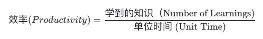

July 15, 2023

最近读了一篇Paul Graham的文章感觉醍醐灌顶，文章名叫做[How to Lose Time and Money《如何丢失你的时间和金钱》](http://www.paulgraham.com/selfindulgence.html)，文章的核心观点：
  - 在大多数人心目中，财富的损失是因为“过度支出”；时间的流失则是因为我们“把时间花在玩耍娱乐上”。
  - PG的反直觉理论：“大多数财富损失的方式不是通过过度支出，而是通过不良投资。同样，失去时间最危险的方式不是花时间去玩，而是花时间去做假工作。”

在过去几年，我一直以这个公式作为效率的最佳衡量标准：

依此公式，我需要先定义一下生活中工作种类的The Good, Bad, Ugly：
- The Good: Real Work = 高效率，即每单元时间内，我们可以尽量最大化学习到的知识
- The Bad: Daily Work = 低效率，每单元时间内没有任何学习，但是对于生活非常重要的事情
- The Ugly: Fake Work = 低效率，即每单元时间内，我们并没有任何学习到的新知识

## The Good 🤩
能够感受到成长的工作：实践过的知识 > 未实践的知识

### 实践过的知识
- 经历过假设验证的知识
- 关于Type-1/Type-2 Error:
    - 犯错误是很多人非常忌讳的，但是实际上真正犯了错误实际上是好事 - 当你实验结果和假设不一样的时候
    - 如果100个假设里有一个是真的，如果能验证99个都是错误的，那就是好事
    - 需要很好的归因，下次避免再犯错误

### 犯错误 True Negative
### 有效认识到 Type-1/Type-2 Error
- Type-1 你认为你学习到了，但是是错误的信息:
    - Abstraction Leakage
- Type-2 你认为你不知道，但是实际上是知道的:
    - 不自信导致Actionable层面差一些

## The Bad 😐
每天生活中必须要面对的工作，Enabler，和Strategic工作

### 每天生活中必须要面对的工作/维护性工作
- 做饭，洗衣，剪发，报税
- 尽量外包出去

### Enabler
- 跑步，健身，康复训练
- 这些是必须要做的，因为运动可以使我可以更专注，从而让效率变得更高
- 可以同步带着耳机听一些Podcast/或者跟伴侣，朋友，同事一起做

### Strategic
- Take a hit, but then improve。需要时间投资才能有收获的工作
- 面试，社交，Meetup

## The Ugly 😭
应该避免的工作！

### Non-essential/Non-impactful work - 不本质的工作
对结果产生不了任何影响的工作

当一个事情在处理中的时候，非常着急，不停拉取状态信息，而不是等待回调.这个我觉得有时候是因为情绪所引起，要尽量学习拿得起放得下，比如我最近被税务局收取了一个Savings账号的罚金，写信提出了上诉，但是每天还会花一些时间去查看上诉的状态。其实这种情况，如果已经做完了能做的，就应该尽快Wrap-up，然后忘掉这件事情，直到收到回复的Email之后再看看下一步的Actionable是什么

这个在《第五项修炼》里还有一个极端情况，就是消炎药效应，即应该是按量吃了消炎药之后，等待几个小时之后再按照医嘱进行下一次服药，而没有人会因为吃了消炎药之后，没有感觉头疼得到缓解，而疯狂地吃消炎药，直到头疼好了（到那时候就已经Overdose了！）

### Duplicated Work - 多次造轮子
不用多讲，常见问题

### Ineffcient Tool - 用牙刷刷墙
用二进制作为首要编程语言

### Work about work
花过多时间切换版本控制或者项目管理软件

### Living the same day twice - 无法总结归因
当一个问题出现了一次，没有及时归因，第二次遇到了坑，又踩一次

### Ego - 因为保护自己Ego的争论和工作
比如证明Headless Chrome也可以用serverless架构跑