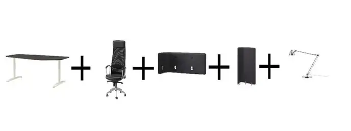
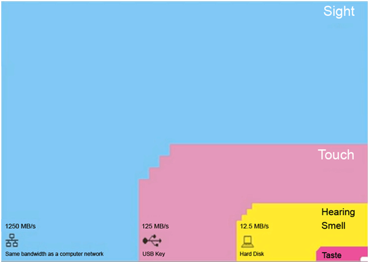

import Tabs from '@theme/Tabs';
import TabItem from '@theme/TabItem';
import GearCard from '@site/src/components/Gears/GearCard';

July 20, 2023

从2017年开始我一直在研究人体工学，人机交互，Dev Experience的产品，其中有很多我非常喜欢的品牌：Apple，Herman Miller，HHKB，Miir，JetBrains，Hashicorp

Work Ergonomics（工作人体工程学）其实是影响工作效率的一个非常重要的因素，这个最早可以追溯到二战的太平洋战争，美军经常需要开很长时间的飞机飞到日本进行轰炸，所以更好的人体工学设计可以让飞行员飞行更长的时间。

我一直有个理论，设计和人体工程学往小了说可以是一个舒适度的差别，往大了说可以到让一个国家输掉一场战争 -- 我之前在博物馆试过99式坦克和美军的m1a1，99式坦克几乎完全没有考虑人体工学，像我这样的大个头甚至都在驾驶舱坐不下，操作界面基本都是物理按钮和瞄准系统；而美军的m1a1是超级大皮椅，非常舒适，而且在2008年就已经配备了HUD，坐上去操控体验有点像在玩游戏。如果真正发生战争，两辆坦克在战场上的“收割”效率估计会大相庭径。

> "Why can't we do good work at work?"
> (“我们为什么不能在职场做让人满意的工作？”)
>
> -- Herman Miller CEO Edward Simon

一个人每天的工作实际上就是大脑和身体同时在做工的产物，我觉得人体工学系统应该分为支持身体的硬件系统，和支持大脑的软件系统。

## 硬件系统

### 硬件系统基础原则
Sitting: 1 calorie per minute while sitting.
Sleeping: 0.5 calories per minute while sleeping.
Walking: 5 Calories per min
Gyming: 7 Calories per min
Running: 10 Calories per min

#### Static Posture 静态姿势
- 每一个需要长时间工作的姿势需要尽量舒适

#### Dynamic Movement 促进运动
- 人的体态需要经常活动，不能长时间保持一个姿势
- 在人体工学和健康领域，"Transitions between Postures" 指的是身体从一种姿势转换到另一种姿势的过程。这种过渡可能发生在日常生活中的各种活动中，比如从坐姿转换到站姿，从站姿转换到蹲姿等。

  
人体工学椅

<Tabs>
    <TabItem value="大小" label="大小">
    不同人的身高需要买不同型号的椅子，这一点很少有人关注，但是非常重要
    </TabItem>
    <TabItem value="可调节性" label="可调节性">
    大多数椅子都支持高低调节，但是除了高低以外，还有肘部支撑，前后倾斜，以及背部曲度调整也是非常重要的
    </TabItem>
    <TabItem value="颈椎支撑" label="颈椎支撑">
    Herman Miller基本在Cosm之前都没有带颈椎支撑的椅子，他们的理念是颈椎对头部的支撑需要保持自然状态，如果有了头枕后，反而会把头往前推，造成不自然的颈椎倾斜
    </TabItem>
    <TabItem value="透气性" label="透气性">
    夏天和秋天的舒适度
    </TabItem>
</Tabs>

  
桌子

<Tabs>
    <TabItem value="稳定性" label="稳定性">
    唯一重要的衡量标准 -- <a href="https://www.btod.com/blog/wobblemeter-results/">稳定性</a>
    </TabItem>
</Tabs>

  
屏幕

<Tabs>
    <TabItem value="分辨率" label="分辨率">
    越高越好
    </TabItem>
    <TabItem value="显示技术" label="显示技术">
    注意避免背光过高的显示器
    </TabItem>
</Tabs>

  
键盘，鼠标，触控板

  Macbook的一套解决方案基本已经很完美了，但是用笔记本电脑的键盘和触控板有一个很大的缺点就是位置是固定的，时间长了会导致动作过于固化，违反第一个原则

  
水杯

  之前家庭医生给的一个很好的tip，就是作为电脑从业者，最简单能督促自己活动方式就是多喝水，且增加喝水频率

## 软件系统

乔纳森·卡特是GitHub首席执行官的技术顾问，过去他讨厌打扫。因为他的吸尘器放在家里的一楼，把它搬到主楼上非常繁琐。但当他意识到他可以将吸尘器放在需要的地方时，这项任务就不那么难了。现在他每隔一天就会用吸尘器清理。“这在构建软件时也是如此，”他说。“当我们构建的体验自然而轻松地增强所需的行为时，我们就能得到很好的结果。”

### 软件系统基础原则

$$
效率(Productivity) = \frac{\text{学到的知识（Number of Learnings)}}{\text{单位时间 (Unit Time)}}
$$

#### 减少干扰
- 一个人每天的真正能深度思考和集中注意力的时间是有限的。
- 直击重点

#### 追求可视化体验：一图胜千言
- 简化复杂信息：大脑对处理视觉信息的带宽要比触觉，听觉，嗅觉高很多倍。可视化可以更快速地抓住主要信息和关键趋势
  
- 提高沟通效率：通过视觉化展示，人们可以更清楚地传达想法、观点和发现，使沟通更加直观、生动、有说服力，减少了理解上的误差
- 增强记忆和理解：视觉信息通常更容易被记住和理解，可视化能够帮助人们更好地记忆和掌握复杂的信息

#### 追求REPL(Read-Eval-Print Loop)体验：减少行动与结果之间的延迟
- 集中注意力：人的注意力是有限的，每天就那么些时间是真正能够高效的，更好的REPL体验可以让你更专注于问题的解决而不是等待编译或执行的过程。
- 方便查错：实际上打断点（breakpoint）的体验也是一种REPL，你可以逐行地执行代码，查看每一步的结果，有助于更好地理解代码的执行过程和发现潜在的问题。
- 快速试验和学习：可以帮助初学者迅速验证代码，并在错误和问题出现时提供实时反馈。这种学习过程可以增加学习的信心和动力。

<GearCard></GearCard>
