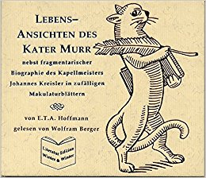
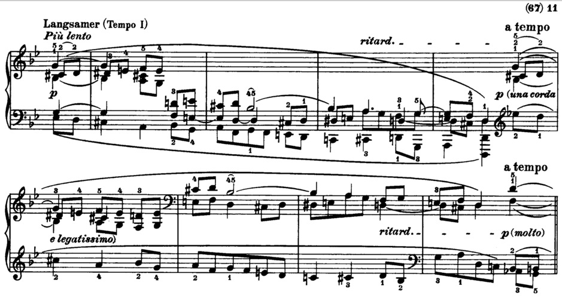
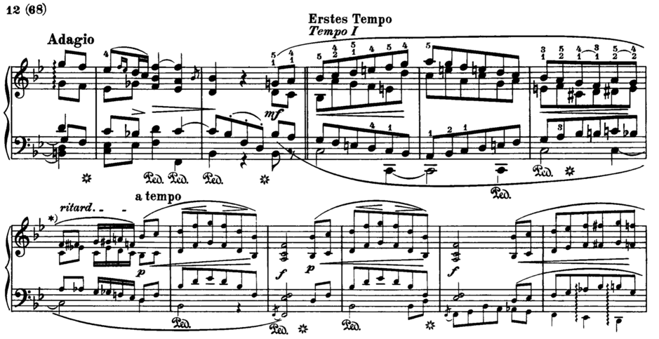
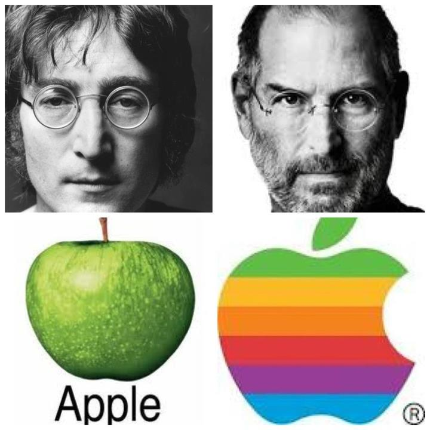

&nbsp;&nbsp;&nbsp;&nbsp;	As a student majoring in both music and computer science, I have always believed that different subjects share the common values and influence each other intrinsically and extrinsically. Even in the modern age, technology has been dominating the world and changing the way people live; good products are all inspired and influenced by art, culture, and mentality. However, back to the Romantic era, the mutually connected influences between music and literature are even more tight. Robert Schumann and E.T.A Hoffman are both great artists in the 19th century. Even though they were not close friends proved by any historical material, they shared the same spiritual connection between each other in the struggle against Biedermeier and ignorance over good and creative arts among the middle class. Comparing Hoffman's The Life and Opinions of Kater Murr, and Schumann's Kreisleriana, which Schumann was inspired by Hoffman's writing of the character Kreisler, there are many interesting aspects to target and discuss. I think the most interesting crossing aspects Schumann and Hoffman share are Style, Unusual Form, and Spirit.

<!--truncate-->
# Style

&nbsp;&nbsp;&nbsp;&nbsp;	Starting with Style, it was not a coincidence in music and literature that Schuman and Hoffman started to compose and write in a complete new aesthetic style. During the Classical period, Ludwig van Beethoven and Franz Schubert were already starting to explore and experiment new and more expressive musical styles. Later on, with arrival of Strum und Drang, there was clearly a turning point in music and literature that transit from a more entertainment approach to actual works that depict the real emotion and world. In both Kater Murr and Kreisleriana, the style is very emotional expressive and imaginative. In the part where Princess Hedwiga and Julia found the stranger (who turned out to be Kreisler) in the fragment of Kater Murr, Kreisler's strange behavior and confusing talk scared the princess and Julia. There are a lot of exclamatory marks and sudden emotional changes such as "Suddenly the stranger's face transformed itself again into that ludicrous mask, and he spoke in a shrill, cutting tone…" and later on the princess changed from "blushing deeply" to "shouting loudly, 'A madman! A madman has escaped from the lunatic asylum!'", which goes from an extreme of shy and innocent to an extreme of being threatened and irritated. The way how Kreisler speaks in general is almost like a stream of consciousness -- whenever he has a thought, he just shouts it out in any form as long as it is expressive of himself and he is completely ignorant and carefree of the listener's reaction and level of understanding. He even used words in foreign languages like "Kakodämon" is a devil in Greek, "ex abrupto" and "subito" means "abrupt" in Latin, "che far, che dir!" means "what to do, what to say!" in Italian, which are words popping out from sub consciousness he might had memorized through score and literature readings somewhere before. These exaggerations in Schumann's Kreisleriana are expressed by a large amount of articulation and dynamic marks noted on the score. For example, the opening scene (Op.16 No.1) is "Äusserst bewegt" (Extremely Moved), there are accent marks on every beat of the first 8 measures, and a crescendo from measure 2 to measure 4, and measure 5 to measure 8. The sixteenth-notes are in groups of three in the first half and then transformed to groups of two, and then transformed back to three. This expressiveness in opening of the piece is similar to the way how Kreisler talks in Hoffman's book - he has a lot of content to give away, but he expresses exactly what comes into mind completely without any gravity or focus. Schumann completely woke me up and grabbed my attention with his "extremely agitated" opening. Later on, in No.2, Schumann brought up a huge amount of chromaticism and broad spanning left hand figurations that are distinguishable from the "Alberti Bass" of the Classical period. One example can be found in the middle of Intermezzo II of No.2. (Beginning of page 11) with a rich amount of chromaticism and complicated left-hand figuration which you don't commonly see in the Classical era:

And another example is near the end of No.2, where Schumann used counterpoint techniques that sounded similar to Bach to me:

It would make sense if Schumann was thinking of referencing to Bach when he composed the piece, as Hoffman had a bunch of references to classic literatures like Shakespeare's Midsummer Night's Dream and Hamlet. In comparison to the amateur Biedermeier view towards music, which portrayed by Hoffman in Kapellmeister Johannes Kreisler's Musical Sufferings as a decorative entertainment for parties and social events, the virtuosity and craftsmanship of Schumann's composition completely distinguished the piece as if he is telling the audience that this piece is not decorative and entertainment, this is a masterpiece of an elite artist. I imagine the references in Hoffman's literature, and some of the abstract references in Schumann's music like the previous example, which sounds like a Bach Fugue to me, are expressing their opinions on what good arts should be.

# Unusual Form

&nbsp;&nbsp;&nbsp;&nbsp;Unusual form is another aspect Kreisleriana and The Life And Opinions of Kater Murr share in common or at least Schumann was trying to capture in his music. Kater Murr unceremoniously wrote his autobiography on the back of manuscripts which caused the whole book to be messed up, and the autobiography of Kater murr and biography of Kreisler progress in parallel with abbreviations of "s.p." and "M.c." to switch between the storylines. Kater Murr and Kreisler are not completely independent though, they are connected by Meister Abraham; in some sense, Hoffman is telling the same story but from two very different point of view. However, the transitions between these two storylines are very abrupt, which creates a lot of suspensions and leave the readers unexpected. For example, right after Kater Murr introduces himself, and when he wants to explain further at "However, in considering…", Hoffman suddenly cut by a "s.p." abbreviation and jumps on to Kreisler's biography. Later on, on page 53, "'In two words,' Benzon spoke, 'I will explain everything. Five years ago when I -' (M.C.)", when Benzen just tried to explain to the frightened princess after encountering the crazy stranger in the park, and she even promised to be short ("in two words"), Hoffman still ruthlessly cuts the plot again and leaves his readers behind by jumping back to Murr's autobiography. This unusual form is similar in Schumann's Kreisleriana as Schumann showed radical changes in each of the 8 sections of the piece. No.1 is "Äusserst bewegt" (very moved), but No.2 is "Sehr innig und nicht zu rasch" (very heartfelt and not too fast moving), which is directly the opposite of No.1; No.3 is "sehr aufgeregt" (very excited), and then No.4 is "Sehr langsam" (very slowly), which is another counterpart; then, No.5 is "Sehr lebhaft" (very lively), No.6 is "Sehr langsam (very slowly), No.7 is " Sehr rasch (very quickly), and No.8 is "Schnell und spielend" (fast and playful). Moreover, with in each section, there are abrupt tempo changes and intermezzos to fragmentate the piece even more. The transition between each section, similar to Hoffman's transitions between Murr and Kreisler, is also very direct, straight forward and completely free of warnings or hints. Another continuous alternation in Kreisleriana exists in the tonal layout. Most of the sections are all alternating between D minor and B flat major - either starts with D minor, transposes to B flat major and ends on D minor, or starts with B flat major, transposes to D minor and ends on B flat major (but with a smaller granularity, there are parts with chromatic notes, you are confused and uncertain to tell if it still has a tonal gravitation). This contrast of major and minor keys is similar like the contract Hoffman portrays between the sentimental and extremely talented Kreisler and the happy but extremely vulgar Murr in his literature. The best concrete example here is the transition from Section No.7 to Section No.8 - No.7 ended with a slow tempo, but when No.8 came in with "Vivace e scherzando" (fast and playfully), it sounds completely broken and unrelated. Personally speaking, I do visualize section No.8 as Kater Murr jumping around even though Schumann did not specify that the piece had any influence from Kater Murr, and there should be a "M.c" between Section No.7 and Section No.8.

# Spiritual Connections between the artists

&nbsp;&nbsp;&nbsp;&nbsp;	Going beyond style and structural forms of Kreisleriana and The Life And Opinions of Kater Murr, another crossing between these two great artists from the Romantic era is the spirit. Both Hoffman and Schumann shared the same views and ideologies of the Romantic artists: passionate, imaginative, suffering, elitism, etc. From Hoffman's literature, Schumann could have found spiritual supports for both his life experience and his aesthetic values. For multiple times in Hoffman's book, he expressed this view through Kreisler. The best example would be on page 65 of The Life And Opinions of Kater Murr, Kreisler quoted "through the vacuous, childish playing with sacred art to which I was forced to lend a hand, through the idiocies of the soulless dabblers in art, through dilettantes without taste, through the whole crazy activity of a world peopled by puppets, I came to recognize the wretched uselessness of my existence". Through this passage, and the life time struggle and suffering of Kreisler, Schumann did see a lot more of his own image as a musician himself. This is crucial to how Schumann was so interested in Kreisler and eventually composed a piece that portrays Kreisler so well -- he just had to portray himself but with a third character as a proxy. Other than that, Hoffman's literature might have also been a confirmation to Schumann's aesthetic values as the exaggerated expressiveness and formal alternation might have caught Schumann's attention and gave him a sufficient reason to come up with fresh musical material that might seem eccentric and alienated at first. However, having Hoffman paved the ground for him, he could go ahead and realize his ideal. A similar but modern example would be how Steve Jobs got spiritually inspired by the Beatles' psychedelic musical works during the 60s which were considered completely avant-garde, and later on came up with crazy and eccentric products that changed the world!

