# A Life Goal Achieved

Grand Canyon is usually what comes to my mind when I think of Western USA. I have seen it only in movie and game material, but never really experienced it. After TC17, a friend of mine at Tableau, An, asked me if I wanna do a rim to rim crossing of Grand Canyon, I gladly accepted the offering :) My other friend Fez was really interested in the hiking too; so he flew all the way from Seattle to Las Vegas to join us.

# Route Plan

We were originally gonna do a rim-to-rim hiking. However since its October already, North Rim was closed due to the weather condition.

Original Plan:

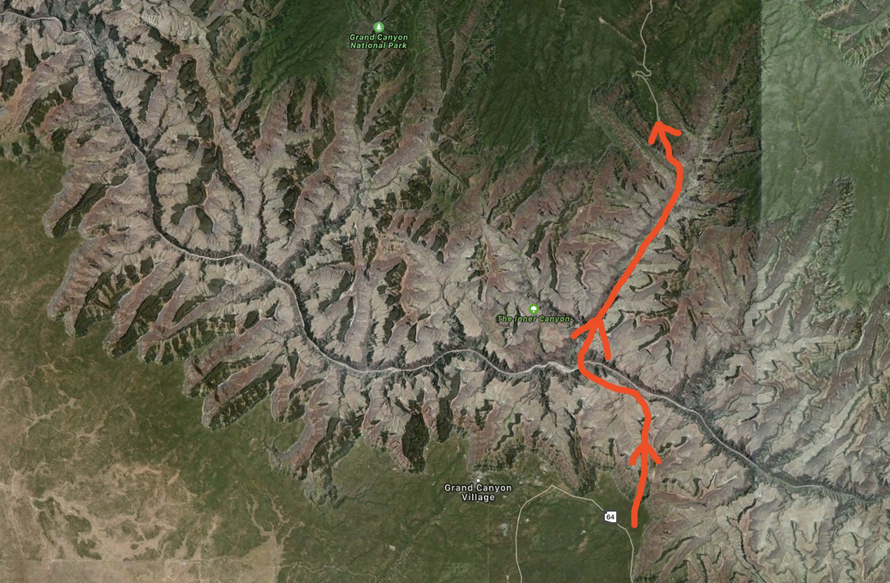

New Plan:

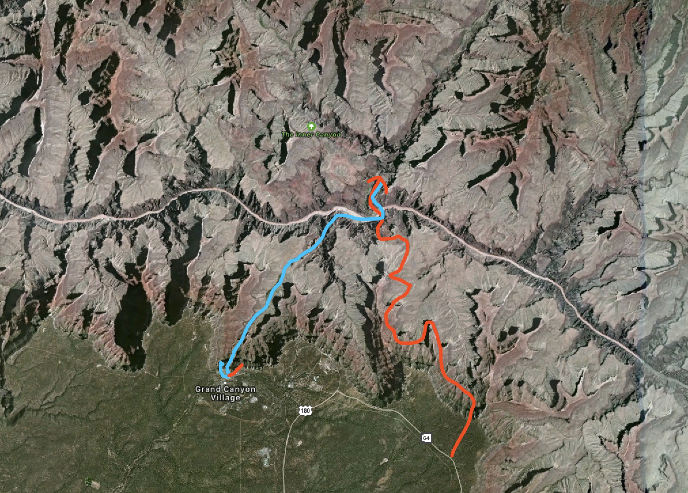

<!--truncate-->

# Hazard!

We arrived at a motel in Grand Canyon National Park a day in advance; and we started the hiking challenge officially at 5 am, Oct 14th.

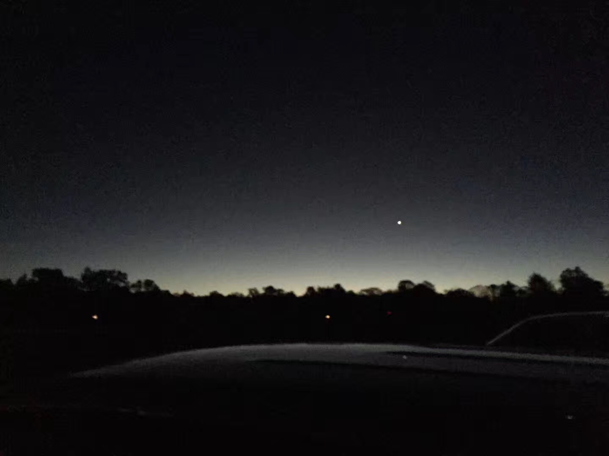

I took this photo when we were almost half way through on our way back, but yea, the National Park firmly said that it is a hazard if you want to hike down to the colorado river and come back in a day:

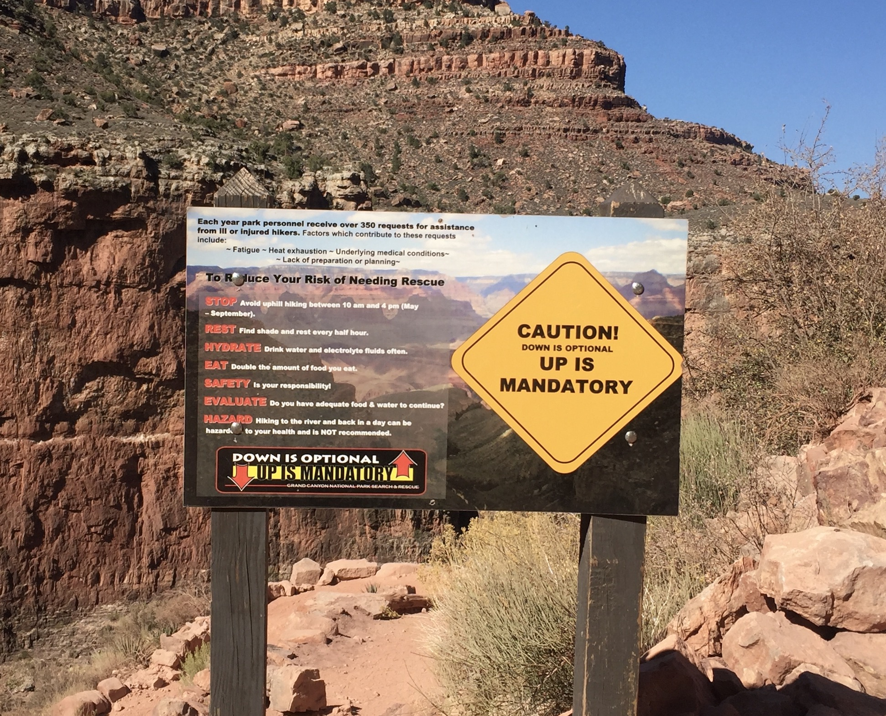

The canyon is very dangerous, there are some cases where if you miss a step, you will fall off the canyon and die:

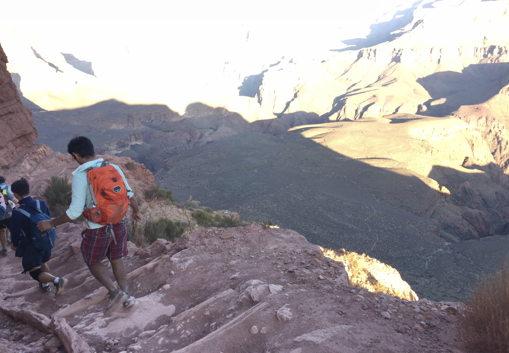

# Stunning Views

I would have to say that the view of Grand Canyon is definitely Stunning. The following pictures are scan shots based on a time frame:

8:05 AM:

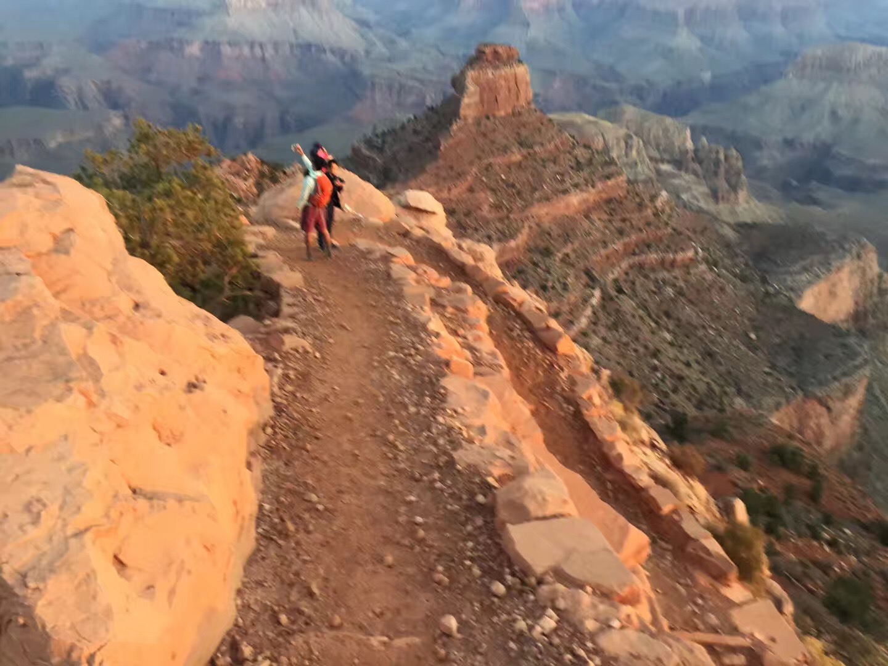

9:02 AM:

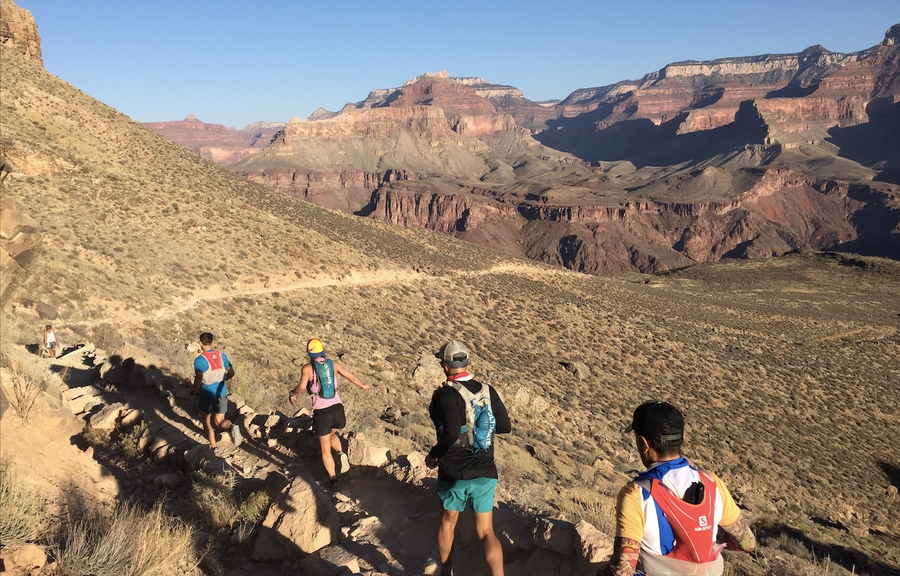

10:00 AM - A Mesa :

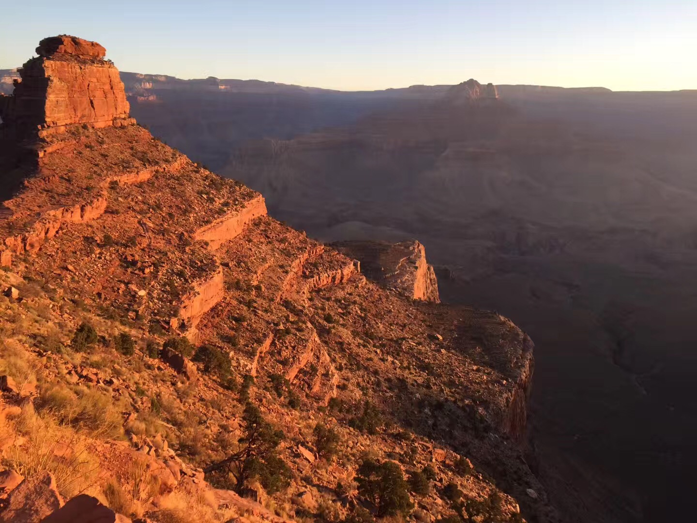

10:30 AM - In the Desert:

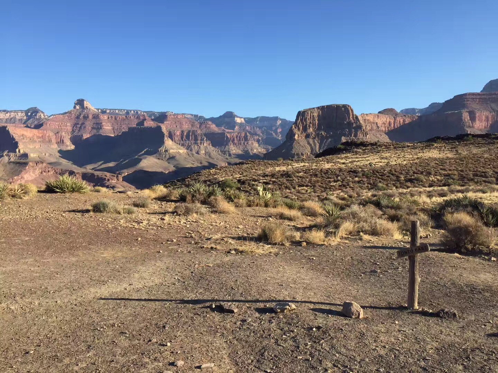

10:40 AM - Deeper in the Desert:

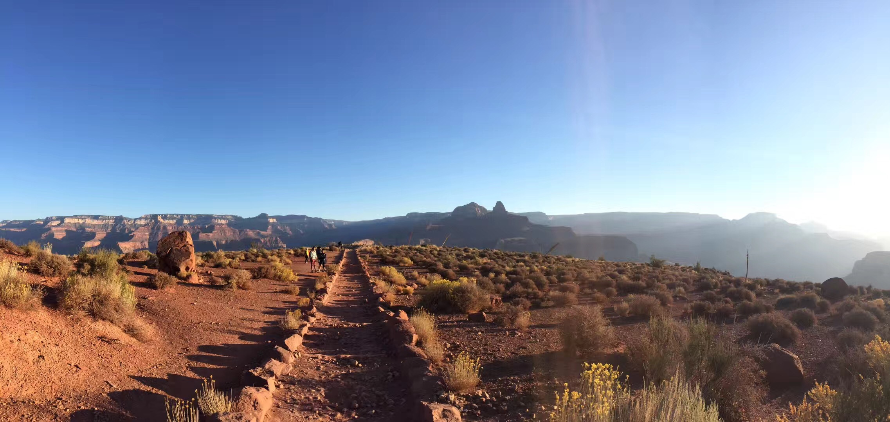

11:00 AM - at Colorado River:

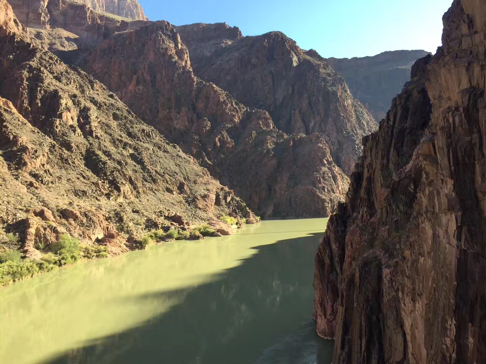

11:30 AM - at Phantom Ranch:

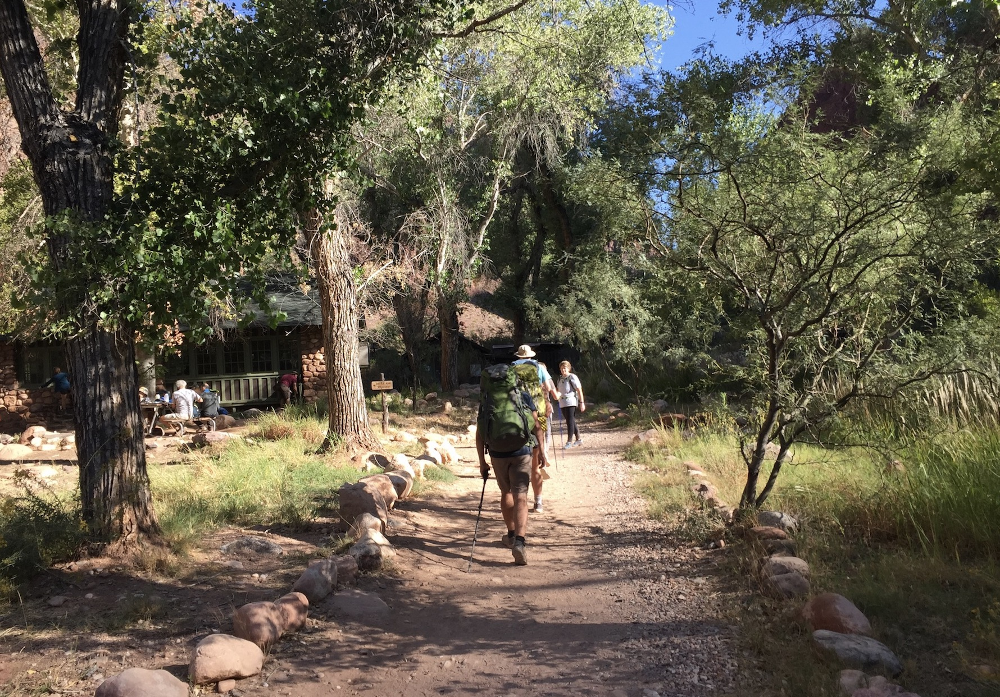

1:00 PM - Going Up

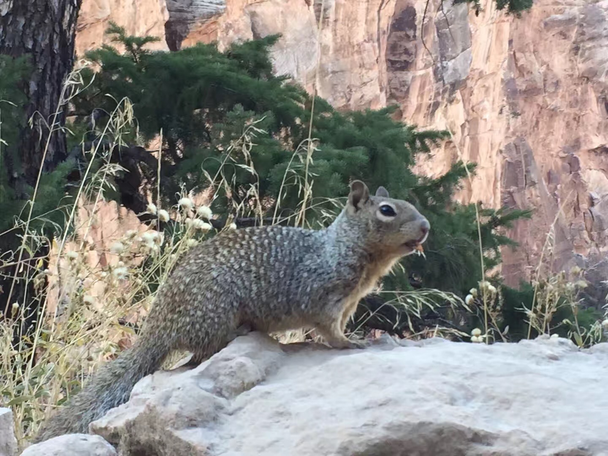

2:00 PM - Me and my team

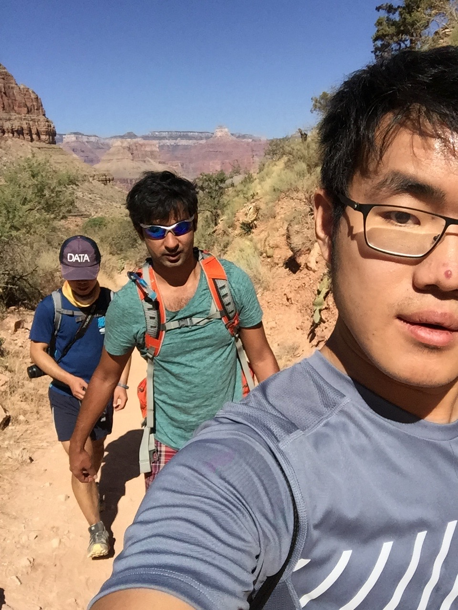

....... No Energy for Pictures anymore ..........

5:00PM - Sunset at Canyon village

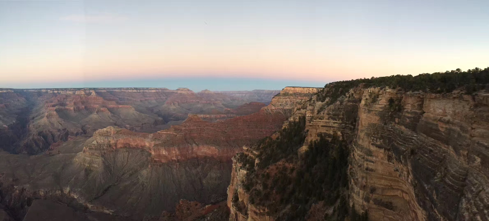
