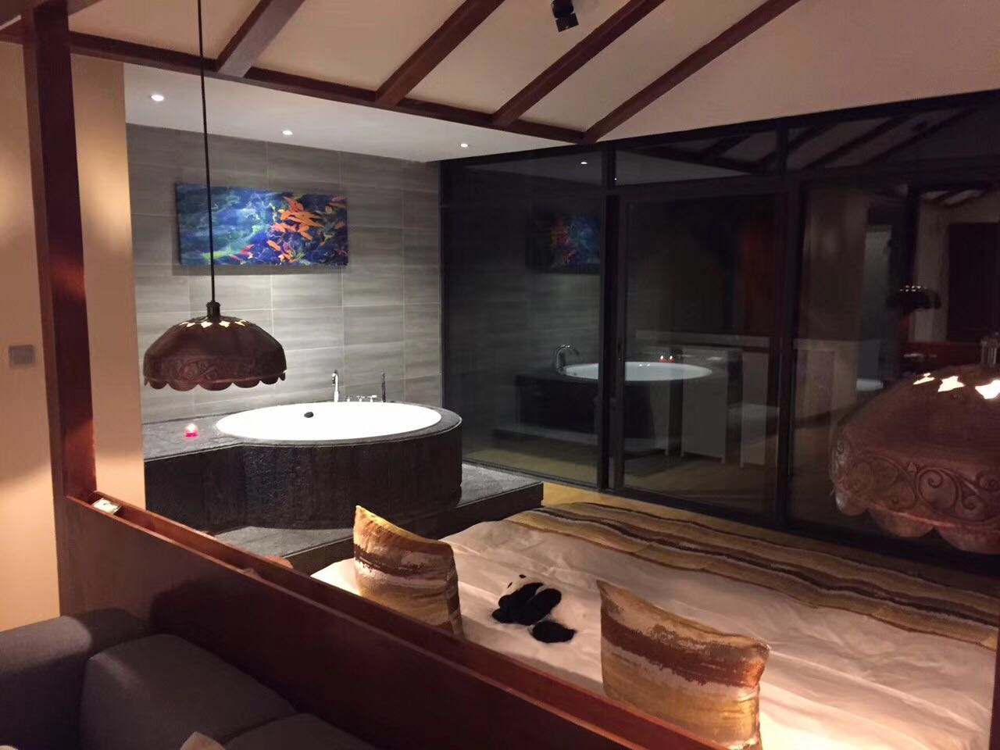
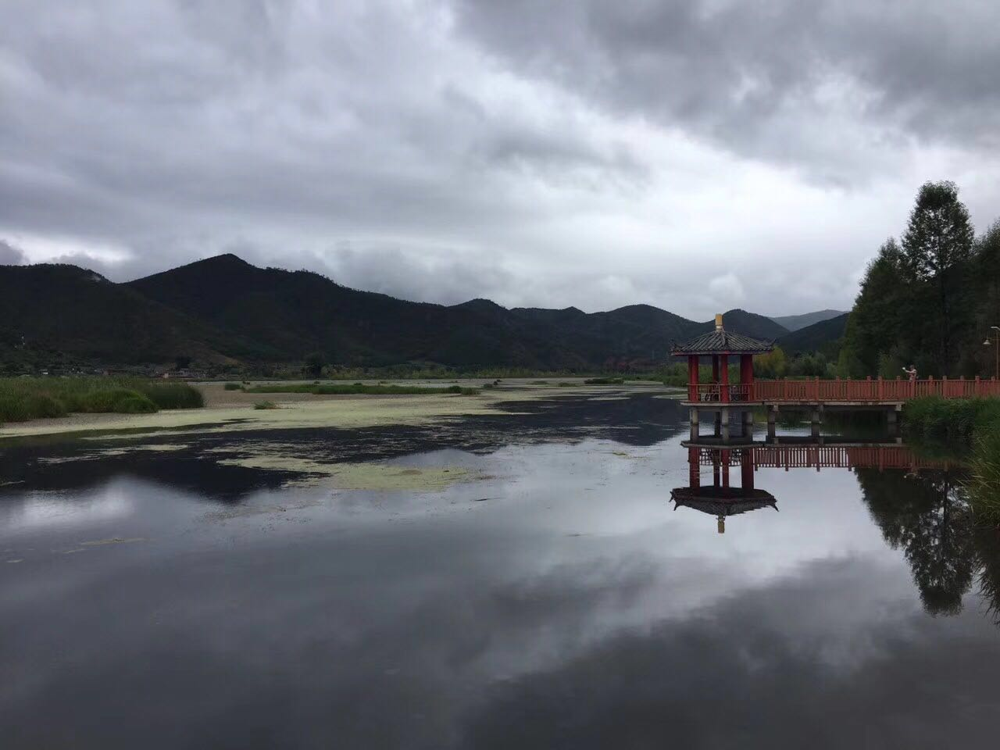
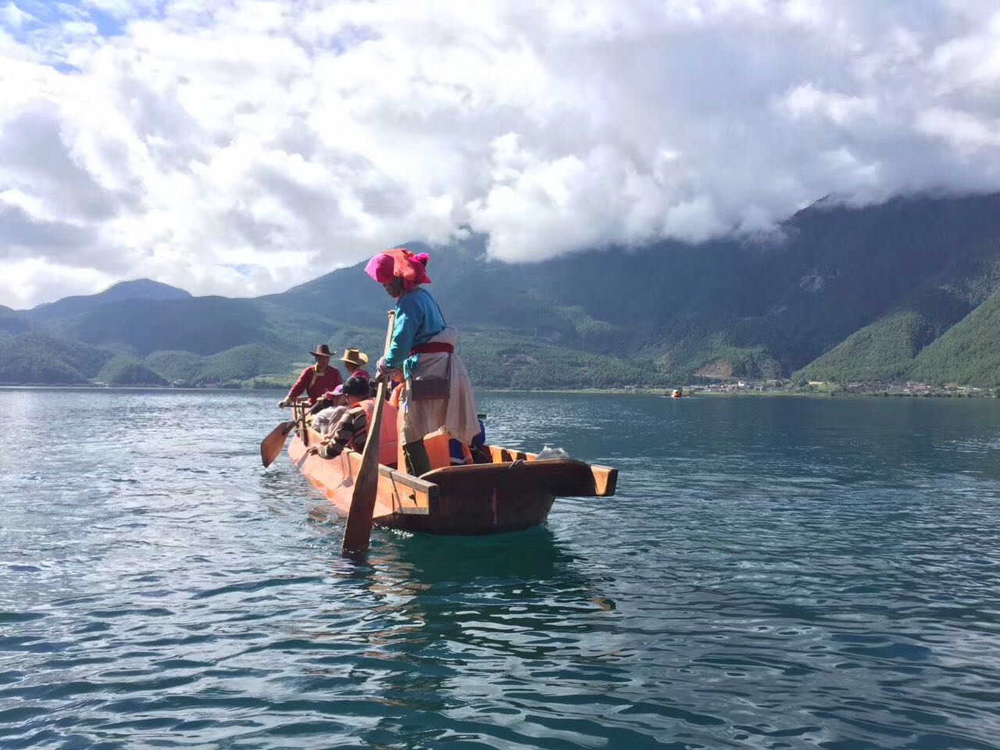
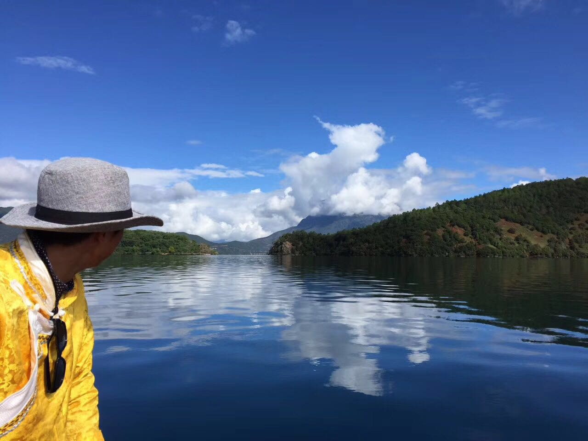
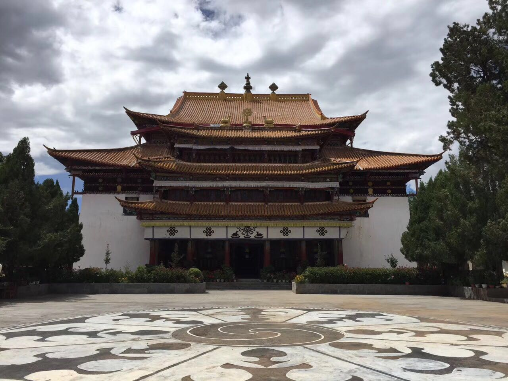
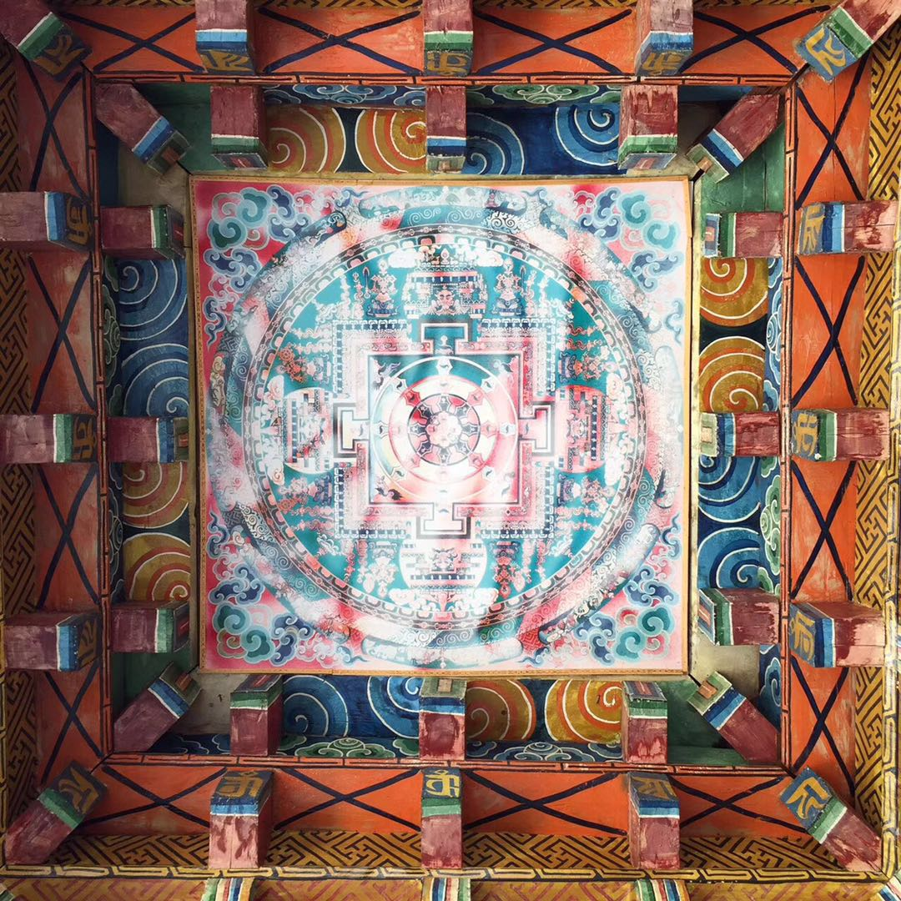
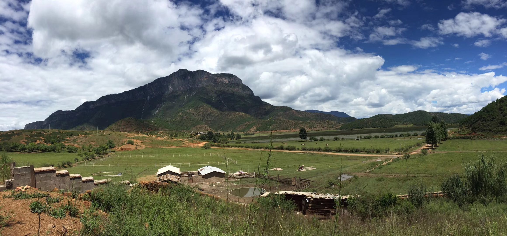
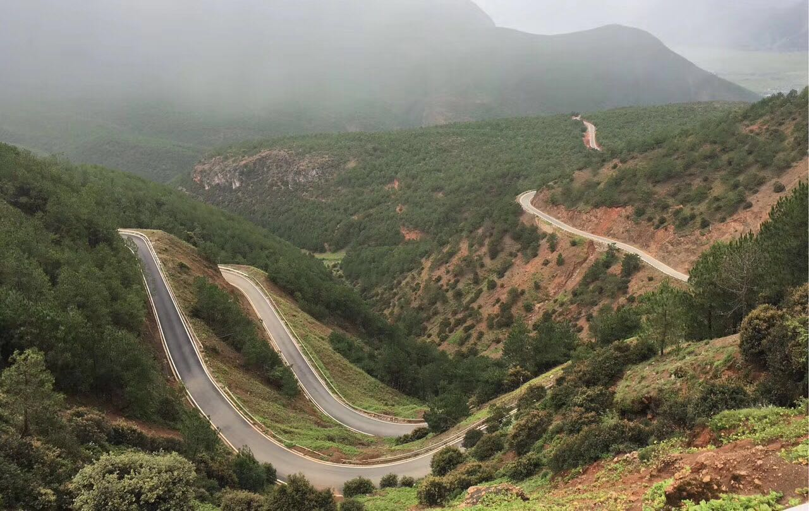

I just had a dreamy trip with my family to Yunnan over the weekend. My Dad's friend, after retiring, opened a hotel called Mistry Mountain there:

The hotel is right cross the Lugu Lake, in the morning you can enjoy the peaceful sunrise:

<!--truncate-->

# Highlight 1 : Yunnan and Mosou (摩梭）'s "Free-Love"

The Mosou people are a small ethnic race living in Yunnan, and interestingly it has this culture of Zouhun (走婚）, which is matriarchy plus free-love in a sense.

Mosou poeple: 

So the idea is that people don't really get marriage there. The males can meet their lovers' houses during night time. However, the newly born babies are owned by the mother side, and she/he will get the heritage from the mother family as well.

Mosou poeple II: 

# Highlight 2 : Culture Influence From Tibet

Since Yunnan is very close to Tibet, they have a huge degree of Cultural influence from Tibet and Buddism.

Walking around the small villages, you can see temples all around the places:

Many of the religions are based on Buddism, even among the Mosou people, they also have this mentality of having the Circle of Life (轮回）:

# Highlight 3 : Hill Climbing Rally

China has invested in a huge amount of money for infrastructure building including High-speed trains and highways. 

My dad's friend loves rally racing a lot, he himself used to organize big events in rally racing. Hence we went on a hill climbing rally trip one day:

I used to play a lot of racing games like DIRT. But this is the first time that I actually got to enjoy it in real life :) 
