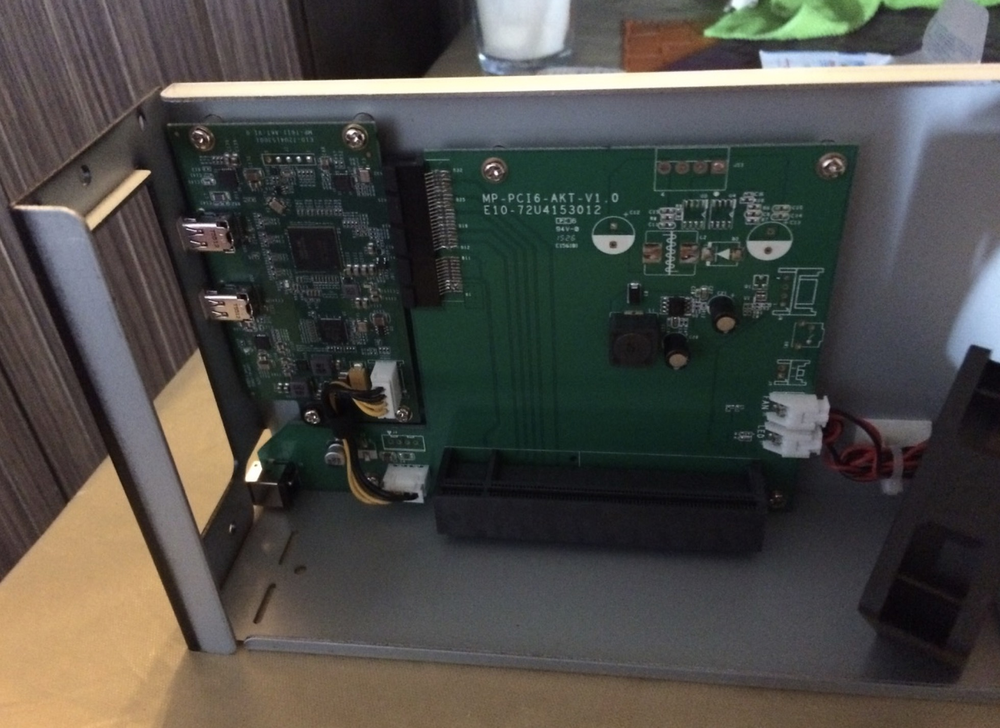
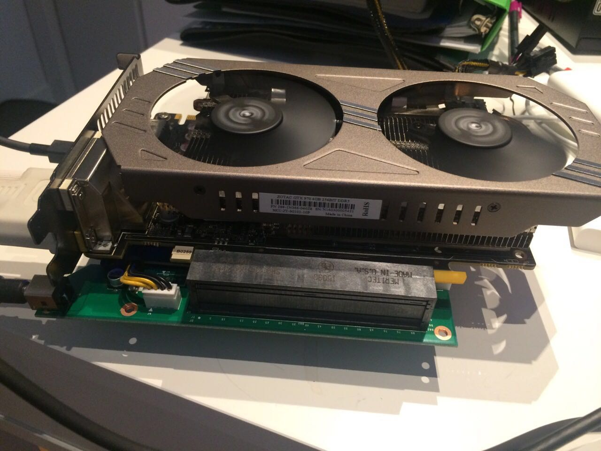
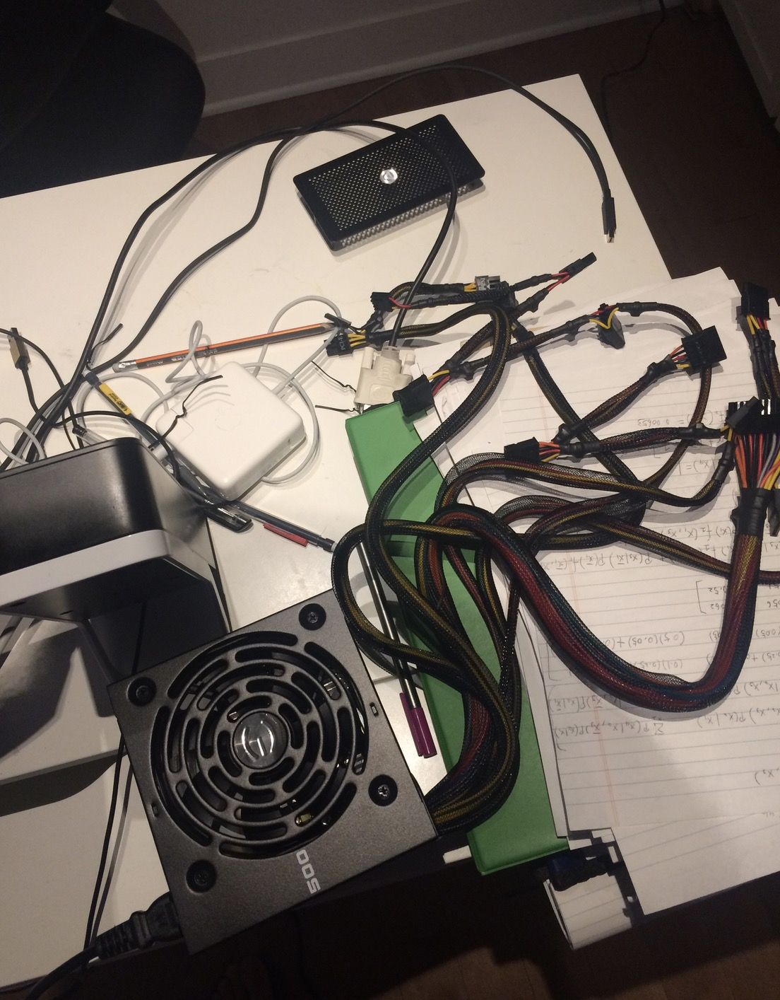
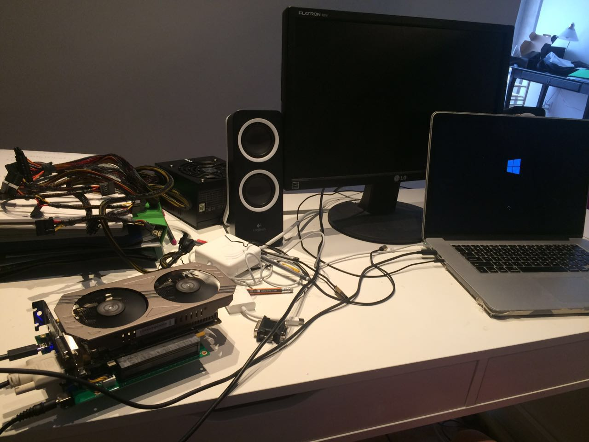
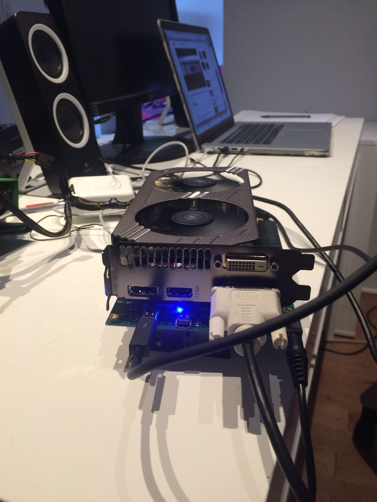
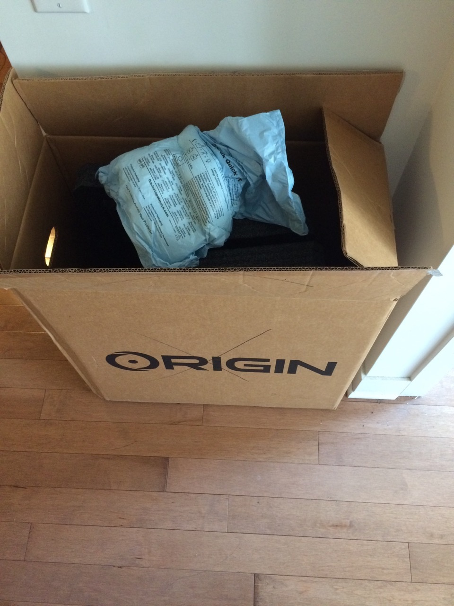
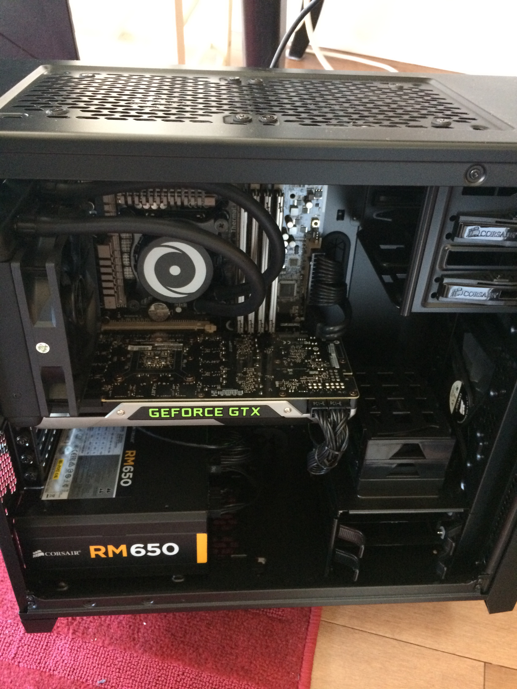
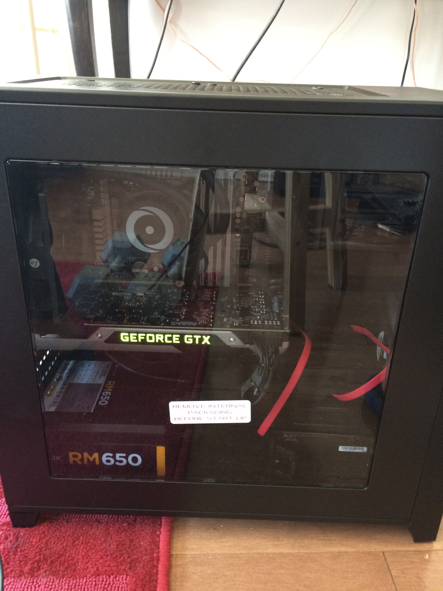
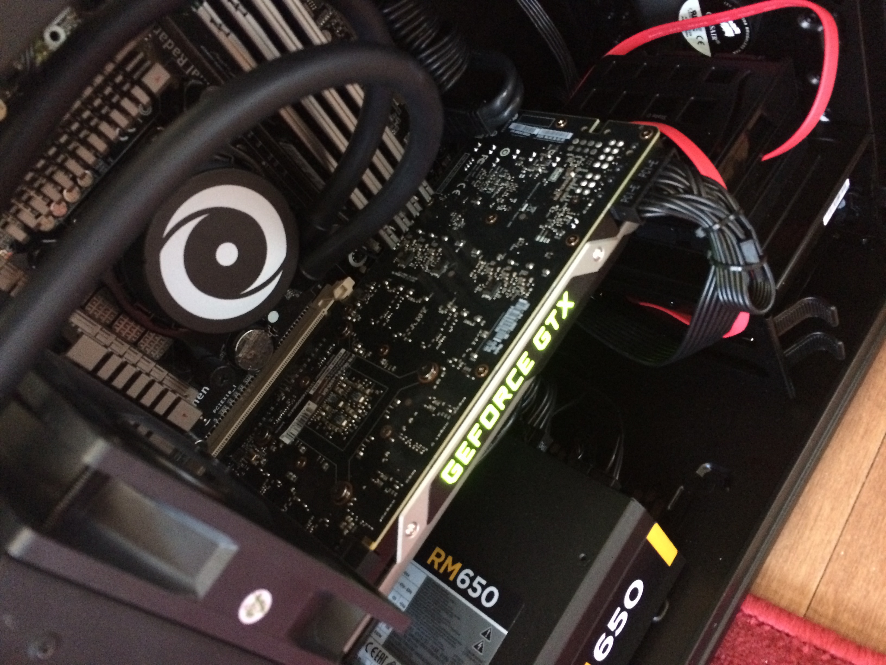
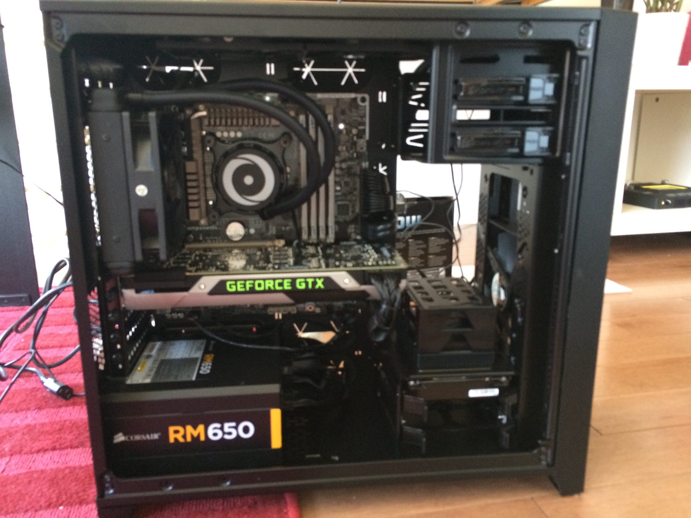

# E-GPU

E-GPU just stands for External GPU. I always found it redundant to have a desktop set up - my Macbook has a powerful CPU, why not just use the CPU and add an external GPU?

This is my little EGPU experiment with an Akitio box.
I just took out the motherboard of akitio (PCIE to Thunderbolt) and plugged my video card in :

<!--truncate-->

You will also need a PSU for the videocard:

# However, **_*NOTE*_**!

The 2012 MacBook Pro lacks support for external GPUs. E-GPU functionality relies on Intel Iris graphics technology, which was introduced in 2013 MacBook models and newer. This technology enables mirroring of graphics computed by the external GPU to the laptop's display. Since the 2012 model predates the Intel Iris graphics card, it cannot utilize this mirroring capability, making E-GPU setups incompatible.

So this is a failed experiment !

I ended-up building a desktop instead.

