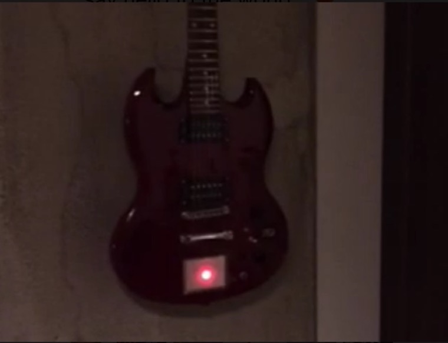
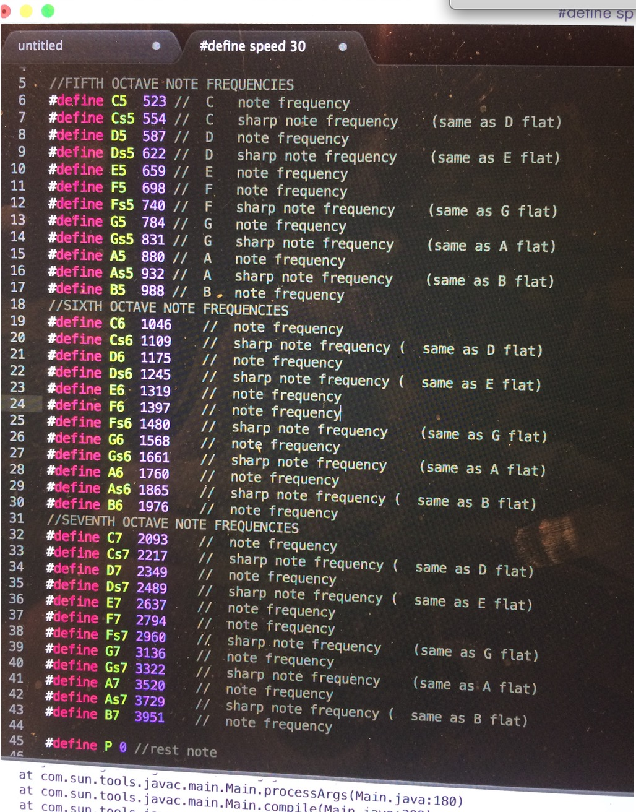
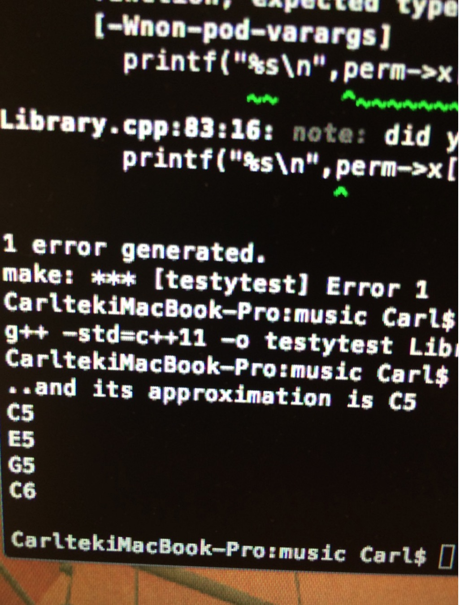
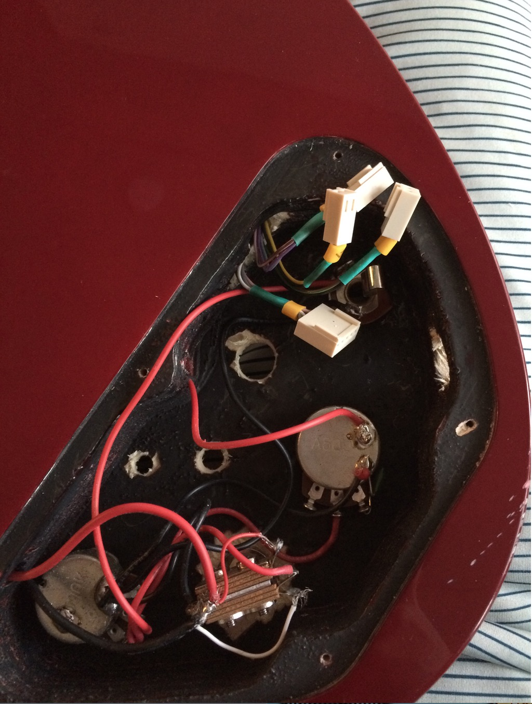

# Guitar with a Touchpad

Here is a quick showcase of a project I have been playing around with recently. An Midi Control Pad installed on SG being synced with an arduino.



<!--truncate-->





- MINI Control-pad
<iframe width="500" height="315" src="https://www.youtube.com/embed/blKrwAbuQig" frameborder="0" allowfullscreen></iframe>

Sample Code:

```c
#include <iostream>
#include <string>
#include <fstream>
#include <sstream>
#include <iostream>
#include <vector>
//FIFTH OCTAVE NOTE FREQUENCIES
#define	C5	523	//	C	note frequency
#define	Cs5	554	//	C	sharp note frequency	(same as D flat)
#define	D5	587	//	D	note frequency
#define	Ds5	622	//	D	sharp note frequency	(same as E flat)
#define	E5	659	//	E	note frequency
#define	F5	698	//	F	note frequency
#define	Fs5	740	//	F	sharp note frequency	(same as G flat)
#define	G5	784	//	G	note frequency
#define	Gs5	831	//	G	sharp note frequency	(same as A flat)
#define	A5	880	//	A	note frequency
#define	As5	932	//	A	sharp note frequency	(same as B flat)
#define	B5	988	//	B	note frequency
//SIXTH OCTAVE NOTE FREQUENCIES
#define	C6	1046	//	note frequency
#define	Cs6	1109	//	sharp note frequency (	same as D flat)
#define	D6	1175	//	note frequency
#define	Ds6	1245	//	sharp note frequency (	same as E flat)
#define	E6	1319	//	note frequency
#define	F6	1397	//	note frequency
#define	Fs6	1480	//	sharp note frequency	(same as G flat)
#define	G6	1568	//	note frequency
#define	Gs6	1661	//	sharp note frequency	(same as A flat)
#define	A6	1760	//	note frequency
#define	As6	1865	//	sharp note frequency (	same as B flat)
#define	B6	1976	//	note frequency
//SEVENTH OCTAVE NOTE FREQUENCIES
#define	C7	2093	//	note frequency
#define	Cs7	2217	//	sharp note frequency (	same as D flat)
#define	D7	2349	//	note frequency
#define	Ds7	2489	//	sharp note frequency (	same as E flat)
#define	E7	2637	//	note frequency
#define	F7	2794	//	note frequency
#define	Fs7	2960	//	sharp note frequency	(same as G flat)
#define	G7	3136	//	note frequency
#define	Gs7	3322	//	sharp note frequency	(same as A flat)
#define	A7	3520	//	note frequency
#define	As7	3729	//	sharp note frequency (	same as B flat)
#define	B7	3951	//	note frequency

#define P 0 //rest note


//NOTE DURATION FACTORS (THEY MULTIPLY THE WHOLE NOTE DURATION)
#define	N1	1.0				//		whole note
#define	N2	0.5				//		half note
#define	N2h	0.75			//		dotted half note
#define	N4	0.25			//		quarter note
#define	N4h	0.375			//		dotted quarter note
#define	N8	0.125			//		eighth note
#define	N8h	0.1875		//		dotted eighth note
#define	N16	0.0625		//		sixteenth note
#define	N16h 0.09375	//		dotted	sixteenth note
#define	N32	0.03125		//		thirty-secondth note
#define	N32h 0.046875	//		dotted thirty-secondth note

#define Major 'a'
#define Major7 'b'
#define Dom7 'c'
#define Minor7 'd'
#define Dim7 'e'
using namespace std;
const string notes_name [] = {"C5","Cs5","D5","Ds5","E5","F5","Fs5","G5","Gs5","A5","As5","B5","C6","Cs6","D6","Ds6","E6","F6","Fs6","G6","Gs6","A6","As6","B6","C7","Cs7","D7","Ds7","E7","F7","Fs7","G7","Gs7","A7","As7","B7"};

const int notes [] = {C5,Cs5,D5,Ds5,E5,F5,Fs5,G5,Gs5,A5,As5,B5,C6,Cs6,D6,Ds6,E6,F6,Fs6,G6,Gs6,A6,As6,B6,C7,Cs7,D7,Ds7,E7,F7,Fs7,G7,Gs7,A7,As7,B7};
//[0][]=major,[1][]=maj 7,[2][]=dom 7,[3][]=min7,[4][]=dim7
const int chord[5][4]={{0,4,7,12},{0,4,7,11},{0,4,7,10},{0,3,7,10},{0,3,6,10}};
const string chordNames []= {"Major", "Minor", "Diminished","Major 7","Minor 7","Dominant 7","Diminished 7"};

struct chordnotes
{
    string x[4];
};

vector <string> stringReadIn(string line)
{
    size_t comma = 0;
    size_t comma2 = 0;
 	vector<string> s;
        comma = line.find(',',0);
        s.push_back(line.substr(0,comma).c_str());
        while (comma < line.size())
        {
            comma2 = line.find(',',comma + 1);
            s.push_back(line.substr(comma + 1,comma2-comma-1).c_str());
            comma = comma2;
        }
    return s;
}

const string notes_name1 [] = {"C","Cs","D","Ds","E","F","Fs","G","Gs","A","As","B"};

int findInterval(string A,string B)
{
	int a=-1, b=-1;
	for (int i=0;i<=11;i++)
	{	if (A==notes_name1[i])
			a=i;
		else if (i==11&&a==-1)
			cout<<"wrong"<<endl;
	}
	for (int i=0;i<=11;i++)
	{	if (B==notes_name1[i])
			b=i;
		else if (i==11&&b==-1)
			cout<<"wrong"<<endl;
	}
	if (a>b)
		return (b-(a-12));
	else if (b>=a)
		return (b-a);
}

int chordCheck (int interval[])
{
	int sum=0;
	int foo = sizeof(interval)/sizeof(int);

	for (int i=0;i<=foo;i++)
		{sum=sum+interval[i];}

	if (sum==11||sum==14)
		return 0;
	else if (sum==10||sum==13)
		return 1;
	else if (sum==9||sum==12||sum==15)
		return 2;
	else if (sum==22||sum==18||sum==14)
		return 3;
	else if (sum==20||sum==16)
		return 4;
	else if (sum==21||sum==17)
		return 5;
	else if (sum==9)
		return 6;

}
int main() {

	cout << "type chord notes:"<<endl;
	string chord;
	cin>>chord;

	vector<string> test=stringReadIn(chord);
	 // for( vector<string>::const_iterator it = test.begin(); it != test.end(); ++it )
  //       cout << *it << endl;
	int intervalArray[test.size()-1];
	for (int i=0; i<test.size()-1;i++)
		{intervalArray[i]= findInterval (test[0],test[i+1]);
		}
		cout<<"That is  "<<chordNames[chordCheck(intervalArray)]<<" Chord!"<<endl;
	return 0;
}
```
