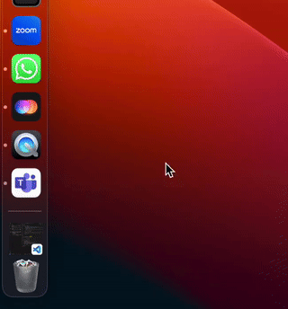
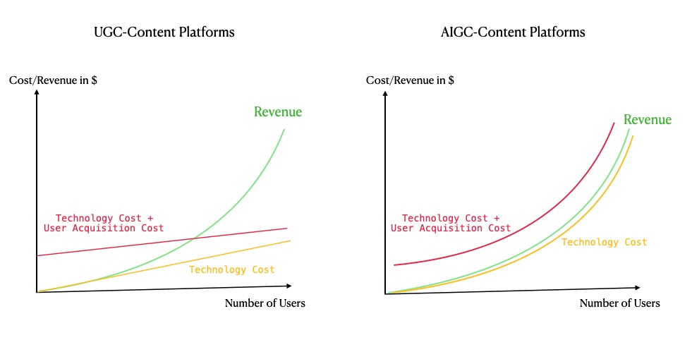
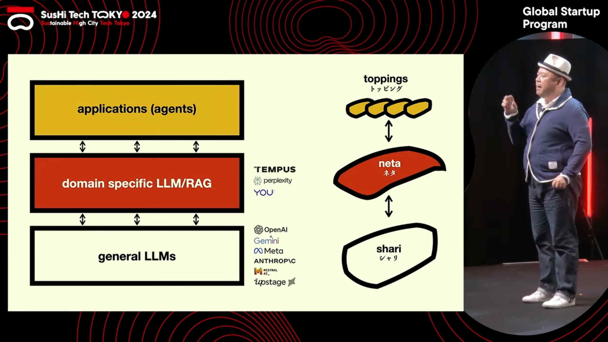

:::info

Before I joined Presence, I wasn’t very attuned to the concept of retention. At my previous companies, Tableau (B2B) mainly focused on customer acquisition and brand awareness like the Gartner Quadrant, while Airbnb prioritized booking rates—retention was just a number we occasionally glanced at.

Only after I tried to build a product from 0 to 1, I realized that "retention is a good way to measure product-market fit and by far the best lever for product growth in the early stage", same as what Sequoia said in their article - [Retention](https://articles.sequoiacap.com/retention)

However, in the era of AI, products may indeed need to break free from previous frameworks and rethink using First-Principles Thinking.

This article serves as a record of my recent thoughts on retention, and the target audience is PMs who want to build an AI-native product.
:::

## Scenarios Retention doesn't work

- **Type 1 Error - False Positive**

  In this case, it looks like we have gained retention but we didn't. Some product managers might come up with tricky ways to manipulate and fake the retention metrics:

  - **Engagement tactics**: Daily Check-ins, push notifications, and red dots

  - **Incentive tactics**: Give users some rewards to stay engaged. You are essentially buying retention.
    - Coupons, credits, and other rewards
  - **Force your product to be installed**: Microsoft Team, Baidu apps

    - I just installed Microsoft Team, and I can't uninstall it. The PM has definitely increased the retention metrics.
      

- **Type 2 Error - False Negative**

  In this case, it looks like we have lost retention or the general retention rate is low, but in fact, we are still doing well.

  - **Dating Apps**:
    - Tinder, Bumble, OkCupid, Match.com, etc.
    - The core value of dating apps is to find a partner, not to stay engaged. Staying engaged probably means you are not able to find a partner on the platform.
  - **Infrequent Usage Products**:
    - Tools: Tableau, Terraform, Datadog, Splunk, New Relic, AWS, GitHub, etc.
    - Travel Booking: Airbnb, Expedia, Ctrip, Fliggy, Booking.com, etc.
    - Seasonal Products:
      - 📑 Audit and tax-related tools: Intuit QuickBooks, TurboTax, H&R Block, etc.
      - 📱 Period Tracking Apps: Clue, Flo, etc.
      - 🎃 Holiday Shopping Platforms: Amazon, eBay, etc.
  - **Hyperlocal Network-Effect Products**:
    - 🚕 Taxi Services: Uber in the US, Didi in China, Ola in India, Careem in the Middle East, Grab in Southeast Asia, Lyft, etc.
    - 💳 Payment Systems:
      - Suica (only works in Japan).
      - Alipay (only works in China).
      - WeChat Pay (only works in China).
      - Google Pay (works globally but with varying levels of adoption).
    - 🛍️ Food Delivery Services: Uber Eats, Grubhub, DoorDash, etc.
    - 🚲 Bike-Sharing Services: Lime, Bird, etc.

- **Special Cases**
  - **Luxury Products**:
    - Luxury brands often deliberately limit retention, as frequent engagement can dilute exclusivity and make products more accessible.
    - 💍 The rarity of diamond rings, for instance, contributes to their allure.
    - 🍴 Michelin-starred restaurants owe their prestige to the scarcity of their ingredients, which are not readily available every day.
    - 💒 The ideal wedding dress is one that is worn only once, making it a unique and special occasion.
  - **Content Products**:
    - 🎮 Video Games, 🎬 Movies, etc.

## AI Products and Retention

### Different Costs

The cost structures of Large Language Model (LLM) based products and user-generated content platforms like TikTok differ significantly. LLM-based products require computationally intensive processing, resulting in higher marginal costs (MC). These costs are primarily driven by the need for significant computational resources and data storage.

In contrast, user-generated content (UGC) platforms have negligible marginal costs, primarily focusing on infrastructure maintenance and user acquisition. Their cost structure is largely driven by the need to maintain infrastructure and acquire new users.

When considering the cost structure of AIGC products, it becomes clear that pursuing high user retention rates can lead to **substantial cost increases without corresponding revenue growth**. This is because the cost of generating information through LLMs increases with the frequency of user engagement. As a result, promoting high-frequency user engagement might not be the most cost-efficient approach for AIGC products.

In the past, creating a successful platform was like building a public mall where people would gather. As more people came, businesses like cafes and restaurants would naturally appear, and the platform could earn money from them. However, AI products are different. They not only need to build the mall but also manage the cafes and restaurants themselves, which is expensive and makes it hard to grow sustainably.

### Rethinking User Engagement

For AI products, **Interaction Frequency** may not be the best indicator of success. Traditional retention metrics might fail to capture users’ actual dependence on or satisfaction with the tools.

I think that the success of an AI product should be measured by **Replacement Rate × number of tasks replaced**. In its ideal form, an AI product should fully replace human effort, leading to a scenario where the best AI products might have zero retention!

For instance, in specific scenarios, the ideal outcome for an AI tool might be to address a singular issue for the user, after which they may not require the tool for an extended period:

- Activities such as legal consultations, tax preparation, or email management are considered "tedious and unnecessary tasks" that AI should ideally handle. Retention metrics are not applicable to these types of solutions.
- By delegating these mundane tasks to AI, humans can allocate more time to recreational activities, such as engaging with TikTok or Xiaohongshu, which should prioritize retention.

For AI products to prioritize retention or optimize for retention feels contradictory and counterintuitive.

### Uncontrollable Variables and Retention

Retention is a key metric for product managers to understand user behavior and guide product development. However, for AI products, the influence of the underlying Large Language Model (LLM) on retention needs to be considered. It is important to determine how much of the retention is driven by the quality of the LLM, and how much is influenced by the product itself.

If the impact of the LLM on retention is significantly greater than that of product decisions, then the traditional approach of tracking retention may not be as relevant for AI products.

During last year's Tokyo Sushi Conference, a founder mentioned that AI applications are like making Sushi, its an art of minimalism, you need to keep it simple and clean. I can't agree more with this analogy, when building an AI application you should limit the amount of engineering efforts on the product side, choosing a better LLM is equvilent to choosing a fresher nigiri 🍣, hence can substantially improve the product experience.

In conclusion, AI products require a redefinition of previous metrics for product success. The traditional understanding of retention may not fully align with the fundamental value proposition of AI solutions. This is a exercise of First-Principles Thinking. **Retention Unlearnt!**
