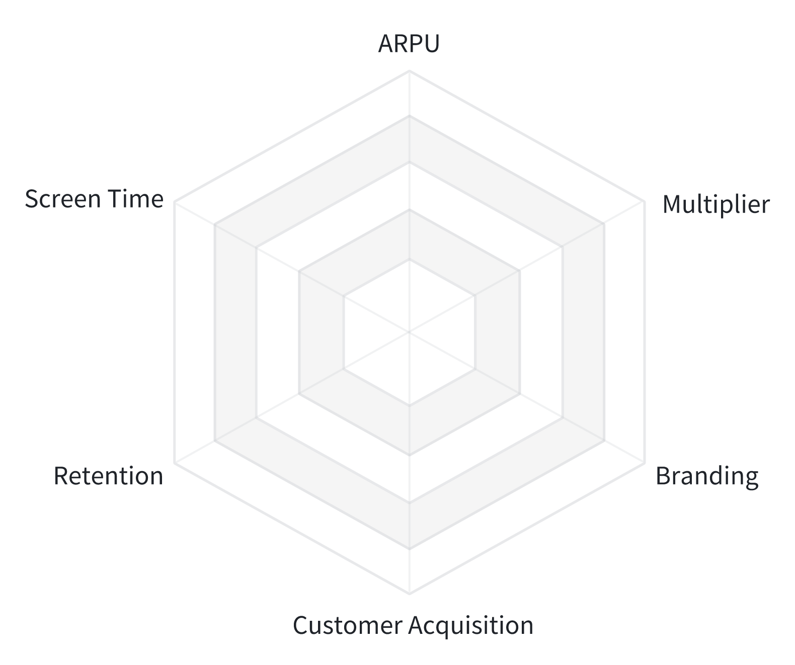

_This is an introduction blog to some knowledge (basic) and vocabs I have learnt building mobile products. _

# Mobile Product Skill Radar Chart 🧭

For any Internet startup, you need to know your advantages and disadvantages just so you don't get lured down a blind alley.

## Customer Acquisition

At the basic level, you need to know how and how much you spend to acquire a customer. Without knowing this, your product can't even reach the market.

- **Impressions**:

  - Number of times your ad is shown
  - A rough benchmark as of 2024

    | Platform       | Impressions per $1 spent | Notes                               |
    | -------------- | ------------------------ | ----------------------------------- |
    | Facebook       | 500-1,500                | Good for targeted demographic reach |
    | Google Display | 1,000-4,000              | Wide reach across websites          |
    | TikTok         | 2,000-5,000              | High engagement with Gen Z          |
    | Reddit         | 800-2,000                | Good for niche communities          |
    | Twitter        | 400-1,200                | Best for news/trending topics       |
    | LinkedIn       | 300-800                  | Higher costs but B2B focused        |

- **CTR (Click-Through Rate)**:

  - Measures the percentage of people who click on an ad after seeing it

    | Platform          | CTR Benchmark |
    | ----------------- | ------------- |
    | Facebook Ads      | 0.5-1.6%      |
    | Google Search Ads | 1.5-3%        |
    | Display Ads       | 0.1-0.3%      |

  - Factors affecting CTR:
    - Ad creative quality
    - Targeting accuracy
    - Ad placement

- **CVR (Conversion Rate)**:

  - Install rate after clicking the ad
  - Typical benchmarks:

    | Platform                 | Conversion Rate |
    | ------------------------ | --------------- |
    | App Store                | 30%             |
    | Google Play              | 25%             |
    | Facebook App Install Ads | 20-35%          |
    | TikTok App Install Ads   | 10-20%          |

  - Affected by:
    - App store optimization
    - Screenshots quality
    - Reviews and ratings

- **CPI (Cost Per Install)**:

  | Platform | Average CPI | Range          | Notes                                                                                                                         |
  | -------- | ----------- | -------------- | ----------------------------------------------------------------------------------------------------------------------------- |
  | iOS      | Higher      | $1.00 - $3.00+ | Generally higher due to perceived higher value of iOS users. Can be higher for competitive categories like gaming or finance. |
  | Android  | Lower       | $0.50 - $2.00  | Varies depending on app category and region.                                                                                  |

- **CAC (Customer Acquisition Cost)**:

  - Total marketing spend / Number of new customers
    - Includes all costs: ads, content, personnel
    - Should be significantly lower than LTV
  - Example benchmarks:
    - B2C Apps: $1-10
    - B2B SaaS: $100-200

- **Case Studies**:

  - Any web era startups: Google, Yahoo, Portal sites
  - Modern social apps:
    - TikTok: High impressions, strong CTR due to algorithm
    - Instagram: Strong CVR through visual appeal
    - LinkedIn: High CAC but justified by B2B focus

:::info
for more updated data for each of these metrics, refer to [Business of Apps](https://www.businessofapps.com/ads/cpi/research/cost-per-install/)
:::

## Mutliplier

The multiplier effect in startups refers to the rate at which a product or service spreads among users. It can be exponential or linear, impacting growth potential significantly.

- **Exponential Growth**:

  This occurs when each new user brings in more users, creating a viral loop. It's often driven by network effects, where the value of the product increases as more people use it.

  - **Example**: Social media platforms like Facebook and TikTok, where user engagement and sharing lead to rapid user base expansion.

- **Linear Growth**:

  This is a steady increase in users over time, often through consistent marketing efforts rather than viral spread.

- **Net Promoter Score**:

  - A metric that measures the likelihood that customers will recommend a product or service to others.
  - A score of 10 or above is considered excellent, while a score below 0 is considered poor.

- **Example**: Subscription services that rely on steady acquisition through advertising and word-of-mouth.

- **Case Studies**:

  - **Uber**: Utilized network effects by incentivizing both drivers and riders, leading to rapid adoption in new markets.

  - **UberEats**: Expanded quickly by leveraging Uber's existing infrastructure and user base, demonstrating a strong multiplier effect in food delivery.
  - Understanding and leveraging the multiplier effect is crucial for startups aiming for rapid growth and market dominance.

## Screen Time

The time users spend glued to your app. More time = more engagement!

- Amount of time the user uses your app on daily basis.

- **Basic Benchmarks**:

  - **TikTok**: 100 minutes of addictive scrolling.
  - **Facebook**: 45 minutes of social fun.
  - **Toutiao**: 75 minutes of AI-curated content.

- **Boosting Screen Time**:

  - **Personalize**: Show users what they love.
  - **Gamify**: Add fun challenges and rewards.
  - **Notify**: Send timely nudges to bring them back.
  - **Beautify**: Make your app a joy to navigate.

## Retention

- **Definition**: Retention measures how long users continue to use your app after their initial download. It's a critical metric for understanding user engagement and app longevity.

- **Retention Rates**:

  - **2nd/7th/30th Day Retention**: These metrics indicate the percentage of users who return to the app on the second day, after a week, and after a month, respectively.
    - **4-2-1**: Considered average (40% on the second day, 20% after a week, 10% after a month).
    - **6-4-3**: Exemplified by top apps like TikTok, Facebook, and Google.
    - **5-3-2**: Indicates strong retention, suggesting potential for an IPO.

- **DAU/MAU Ratio**:

  - This is another common web metric equivalent to retention rates, calculated as daily active users divided by monthly active users.
    - **20%**: Average retention.
    - **60%**: Comparable to TikTok's retention.
    - **66%**: Comparable to Facebook's retention.

- **Other Metrics**:

  - Because not all business model needs everyday usage, i.e. Airbnb, Booking.com
    - **Repeat Purchase Rate**: Measures the percentage of users who make a second purchase within a certain period.
    - **Churn Rate**: Measures the percentage of users who stop using your app within a certain period.
    - **Time between sessions**: Measures the average time between consecutive sessions.

- Examples:
  - **Consumer Apps**: TikTok, Facebook, Snapchat.
  - **B2B Apps**: Salesforce, Slack, Tableau, which often have mandatory retention due to their necessity in work environments.

## ARPU (Average Revenue Per User)

- **Definition**: ARPU is the average revenue generated per user per month. It's a key metric for understanding user value.

  $$
  \text{ARPU} = \frac{\text{Total Revenue}}{\text{Number of Users}}
  $$

- **ARPPU (Average Revenue Per Paying User)**: A metric that measures the average revenue generated from users who make a purchase, providing insights into monetization effectiveness.

- **LTV (Lifetime Value)**:

  - LTV estimates the total revenue a business can expect from a single customer account throughout its relationship with the company.
    $$
    \text{LTV} = \text{ARPU} \times \text{Average Customer Lifespan}
    $$
  - **Significance**: Understanding LTV helps businesses determine how much they can spend on acquiring new customers (CAC) while remaining profitable. Ideally, LTV should be significantly higher than CAC.

- **Examples**:
  - **Airbnb**: High ARPU due to premium pricing and low operational costs, despite low screen time.
  - **Netflix**: High ARPU driven by subscription-based model and a vast library of content, with moderate screen time.

## Branding

- **Top Internet Companies with Strong Branding**:

  - **Apple**: Design excellence, user-friendly products, loyal customer base

  - **Netflix**: High-quality content, personalized recommendations, global presence

  - **Airbnb**: Community-driven, trust-focused, storytelling-based marketing

  - **Google**: Data-driven innovation, seamless integration, user-centric services

  - **Tesla**: Cutting-edge technology, sustainability focus, disruptive innovation

- **Key Branding Strategies**:
  - Build consistent brand identity
  - Create emotional connections
  - Adapt to market changes
