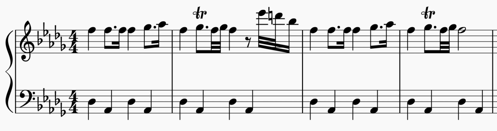

## Introduction

Music has been an integral part of Hollywood films ever since the 1930s. Musical figures can be used in many ways to enhance the movie narrative by bringing additional information to the on-screen picture, providing emotional qualities, and better shaping a character’s image and mental activities. Franz Waxman’s score to Sunset Boulevard, which won the Best Score at the 1951 Oscars, is a great example to explore how music components in a movie make up another layer of art on top of photography, writing and acting. This article mainly focuses on the scene where Joe Gillis first moved into Norma Desmond’s guest room above the garage, and explain how Waxman used musical components to present the symbolic motifs and underlying plot of the movie. This scene starts at Chapter 6 at 24:00 minutes and ends at 28:30, which is pretty early in the movie. There are three score excerpts associated with this particular scene and there are clear pauses in between the excerpts. I will go over each excerpts consecutively in the following paragraphs.

## First Excerpt

The first score excerpt is non-diegetic and it appears in the scene from 24:00 to 24:22, where Joe follows Max to get settled down in the guest room after Joe Gillis’ first encounter with Norma Desmond, who forced him to stay overnight to help her finish the scripts. While they are walking upstairs to the guest room, the double bass plays pizzicato over Joe’s leitmotif, which first appears in bebop style at 2:50 when the narrator takes the audience to where Joe used to live in — an apartment house above Franklin and Ivar. The transcribed score is below :

<!--truncate-->

Here, the pizzicato double bass only features the first two measures of Joe’s original theme in bebop and keeps on repeating it as the bass line while other instruments join in:

The reason of shortening Joe’s leitmotif could be that the original bebop version of Joe’s theme has a huge leap that goes all the way from middle E to high G, and arpeggiates all the way down to lower A. It is a common jazz practice yet not a good usage to reflect the pacing of the scene, as both Joe and Max are walking relatively slow, and the surrounding environment is quite obsolete and dead. Furthermore, the pizzicato technique itself in music has many associations with walking and when it is short and percussive, it has this “sneaky”, “sly” and “covert” feeling. Pizzicato appears a lot in scenes where a predator or a hunter approaches his prey (i.e, Hunter’s leitmotif in Prokofiev’s Peter and the Wolf), but we rarely hear pizzicato in a “victorious”, “righteous” and “glorious” hero scene. It serves as a musical counterpart here to Joe’s plan as he narrates that he actually felt kind of pleased with the way he’d handled the situation because “Norma snapped his hook” and he “saw plenty of money in it”. As they reach to the upper stairs, there are some wind instruments prolonging the middle E note to increase intensity in the texture, and string instruments playing chromatic motifs descending from higher A to create a thrilling and strange feeling. In terms of musico-dramatic form, if the double bass pizzicato statement at the beginning of the score has a more dependent role in order to depict Joe’s physical and mental activity, these later joined winds and strings provides music material that follows more of its own independent logic. In fact, as the music score adds more dissonance and intensity as Joe walks closer into that room, the composer Waxman hints the audience and indicates in his point of view, that Joe’s decision of moving into Norma’s house is wrong and it will eventually lead him into misfortune and danger. Another detail worth mentioning is that in the previous scene of Joe first meeting with Norma, string instruments seem to be associated specifically with Norma’s presence. Hence, this passage which starts from the bass playing Joe’s leitmotif and later topped by string instruments on the higher registers, also serves a musical metaphor of Joe’s character being gradually topped by Norma, and his greedy plan eventually leading to misadventure.

## Second Excerpt

The second soundtrack plays at 25:17 after Max says “good night” to Joe. This excerpt is also non-diegetic and mainly creates the atmosphere while Joe explores Norma’s garden at the window. The soundtrack starts with strings playing Joe’s theme in Ab minor with tremolo, with another group of strings coming to imitate Joe’s theme in a diminished harmony a major third above Ab which is C. Later on, there is solo piano and lower brass joining to echo the same theme on different keys. A transcribed score can be seen as follows:

This beginning of the soundtrack is in imitative counterpoint comprised of a musical theme in different registers, which is a typical fugal technique. The next soundtrack in this scene coincidently features Bach’s Toccata and Fugue in D minor. Also, even though different instruments play the same motif in different keys and registers, all of them land and sustain on Bb and Db. This works as a preparation for a short “Funeral March” in the later part that is based on a Phrygian mode with its root on F, which has the relative minor with root on Bb. As Joe moves near the window to see the view of Norma’s garden, there is a sequence of descending semitones echoing one after the other from instrument to instrument. Behind the narrative, there is a slow simple duple meter bass and a creepy, ghostly and unsettling sounding flute, playing Joe’s theme again in a very dullish and almost out of toned timbre. This flute variation of Joe’s theme is also tonally ambiguous, as it alters between A major and A minor:

This alternation between major and minor syncs up perfectly with on-screen pictures as Joe explores the garden from the window. Whenever he finds something interesting in the garden, he gets disappointed and disgusted due to the lack of maintenance and faded shape as he narrates “there was a tennis court, but rather a ghost of a tennis court” and “of course there was a pool… it was empty now”. When Joe wants to pull down the shades, he sees Norma and Max carrying out a coffin to the garden. The score here still has the duple meter bass from the previous part, but now adding brass instruments playing a traditional Funeral March melody on top of it, as the reduced transcription shows:

It is not hard to find similarities compare to Chopin’s Marche Funèbre:

In both pieces, the bass is alternating between the tonic and the dominant function, and the rhythm in the soprano is pretty much the same. Overall, this score excerpt focuses on Joe’s point of view and it does a lot of word paintings over on-screen pictures and the narration to enhance audience’s perception and provide immersive experience over the ominous nighttime environment at Norma’s garden. The unsettling and suspenseful music creates tension and catch audience’s attention of what to come.

## Third Excerpt

The third score excerpt starts at 26:55, after the screen turns into black after the chimp’s funeral ceremony scene, and Joe reappears lying on the bed while the narrator describes Joe’s weird dream of a monkey dancing with organ grinder for pennies. This excerpt transfers from non-diegetic to diegetic sound — at the beginning there is an organ playing imitative motifs from Bach’s Toccata and Fugue with some wind instruments as background. Later on, the sound is fully submerged in Max’s diegetic organ playing as Joe realizes when he “opened his eyes and the music was still there”. The reference of Bach’s Toccata and Fugue has an important role in the drama as it serves as a music polysemy. First, the piece hints at the audience to re-evaluate Max’s character, as this piece is not an easy piece to play. Yet Max plays it so fluently even whilst he speaks with Joe. This shows that Max is professionally trained in classical music and organ, and he is not just a butler; highly likely he had a career in some art industry before. Second, the piece has a spooky, horrifying, and unsettling sound itself, and this particular opening of the piece has been used in many horror movies such as “Phantom of the Opera” in 1925, and “The Black Cat” in 1934. Moreover, based on research, Bach Toccata and Fugue was a “popular classic for dramatic moments in silent films” (Brown, p. 60). Therefore, the piece and the organ also symbolizes figures like Norma and Max from the silent film era and Joe does not like this organ sound at all. This different preference in art foreshadows future conflicts between the older Hollywood generation from the silent film era and newer Hollywood generation who appreciates bebop jazz. Combining these three meanings, my interpretation of the score’s role in the drama is that this reference to Bach’s piece is a turning point from exposition to rising action of the plot. Up to this point, the audience has been given enough information about Joe and Norma, two characters on completely different ends of the spectrum, with different initial motivations and desires. It is now time to kick-off the conflict between them. Hence, this dark opening of Bach’s Toccata and Fugue serves as a prelude to the conflict and storm that is about to come into the drama.

## Conclusion

In conclusion, just from this single scene of Sunset Boulevard, we are able to extract such a great amount of details and information, it is hard to imagine how much craftsmanship and elaboration Franz Waxman has incorporated in his score writing to the whole film. Music in modern films is an art on it own. By doing close analysis over music components such as musical features, music-dramatic form, and interpretation over a score’s role in the drama, it will open whole new perspective for the audience to understand and appreciate films.

## Biliography

Brown, Royal S. Overtones and undertones: reading film music. Berkeley: University of California Press, 1994.
