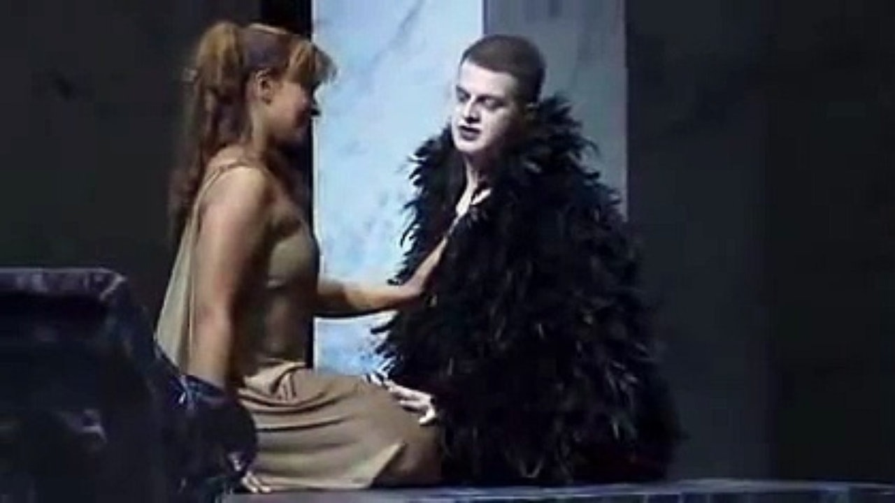

## Intro

&nbsp;&nbsp;&nbsp;&nbsp;	The castrato was a musical practice and social convention that shaped 17th-century opera in Venice. It was first influenced by the Catholic church, but the rise and fall of the castrato closely paralleled the popularity of opera seria. To answer the question why the castrati phenomenon was so widespread in 17th century operas, I believe there are three aspects worthy of exploration — physical advantage the castrato had, cultural context that encouraged the development of the castrato; and the unique artistic use of the castrato in opera.

<!--truncate-->

## Physical advantage of the Castrati

&nbsp;&nbsp;&nbsp;&nbsp;	The castrato had a physical advantage which was contributed by the unique biological development. By removing the testes, which results in a lack of male hormone, bone joints of a castrato are restricted from hardening in the normal way, resulting in long limbs, narrow shoulders, and round hips. Similar to a female, a castrato also has smooth pale skin, fine eye wrinkles and plentiful hairs. A castration before puberty also prevents a boy’s larynx from transforming into bigger dimensions. According to the only recorded post-mortem examination of a castrato, the size of larynx was strikingly small, and the vocal cords were similar in length to a female soprano (Jenkins, p. 1877). 
&nbsp;&nbsp;&nbsp;&nbsp;	However, a castrato would still have a male lung power over the females. Two researchers from Royal Brompton Hospital, M. Rosenthal and A. Bush, showed that “at the end of puberty, lung function formerly nearly equal between the sexes, will be ~ 25% greater in males than in females of identical height”, and it is truncal growth rather than limb growth that dominates during puberty as the lung lies within the thoracic cage which is not influenced by removing of the testes and lack of male hormone (Rosenthal and Bush, p.9). Caricature drawings of castrati with tall bodies, tiny heads, and huge barreled chests in the 18th century is another evidence to support the castrati had greater reserves of air.

In a contest in which Farinelli, who was a great Italian castrato, won against a German trumpeter, the 18th-century musicologist Charles Burney quoted — “not only swelled and shook the note, but ran the most rapid and difficult divisions, and was at last silenced only by the acclamations of the audience” (Weiss and Taruskin, p. 193). 
&nbsp;&nbsp;&nbsp;&nbsp;	Combining small larynx and vocal cords from a female with great lung power, breath capacity and large chests from a male, the castrati had the voices that were more powerful than a woman’s or a boy’s, meanwhile extremely flexible and agile; navigating in registers. Hence, both the physical appearances and voices of the castrati were unique and distinctive. Importantly, these features and abilities could not be learned or achieved by other voice types.

## Cultural context of the Castrati

&nbsp;&nbsp;&nbsp;&nbsp;	Cultural context is another factor that encouraged the development of the castrato. The castrato first emerged in the late 16th century when the Church of Rome had a Papal injunction that restricted women from singing in the public. As a result of it, when opera first came to the Italian musical scene in the early 17th century, the most professional singers were castrati in church choirs, who were intensively and professionally trained and had operatic and religious roles (Jenkins, p. 1878). During the opera season, the Church found most of its choirs stripped of castrati (Howard, p. 13). 
&nbsp;&nbsp;&nbsp;&nbsp;	Moreover, when women did take to the stage outside the Papal States, many people still preferred the better-trained voice of the castrato in female roles, and the increasing demand by theatre audiences for castrato soloists separated the paths of those singing in the choirs and the operas. The leading opera castrati were the stars. When Farinelli appeared onstage, people went crazy and fainted. Figures from Covent Garden for 1735-36 show that, before adding on supplements, Farinelli took home in one night the same pay that a theatre company of more than ninety staff and performers divided among themselves (Cordner and Holland, p. 123). For a poor family, the castration was seen as an investment: if the child should turn into an opera star it could bring untold wealth to the whole family, and even if the voice proved less exceptional, it offered a good
chance of secure employment in the church (Howard, p. 13). 
&nbsp;&nbsp;&nbsp;&nbsp;	The fall of the castrato closely followed the fall in audience popularity of opera seria (Jenkins, p. 1877). By the early 19th century, the new style of romantic opera, which featured more muscular ideas of masculine sex appeal, was already putting castrati out of business, and it was long before 1903 that the Vatican officially banned the castrato. In summary, even though the castrato had unrivaled virtuosities themselves, cultural context is a significant factor: The Church and the Papal injunction definitely helped the spread of the castrato at first; later on, the rise and fall of the castrato paralleled the popularity of opera seria — it was really the blooming opera seria industry and society recognition that encouraged and provided incentives for the castrato.

## Use cases of the Castrati in Operas

&nbsp;&nbsp;&nbsp;&nbsp;	Another point worth addressing is why the castrato was so commonly used in the operas is that the castrato had its unique artistic function that opera producers liked to use. The rise of the castrati with great technical skills enabled composers to write increasingly complex vocal music. Researcher John Potter theorized that castrati were responsible for the development and cultivation of the art of singing during 17th century and there were some vocal traditions, such as bel canto, that became extinct after the loss of the castrato voice and ‘irrecoverable’ technique after the banning of the castrato in 19th century (Potter, p. 1). 
&nbsp;&nbsp;&nbsp;&nbsp;	There was a shift in the use of the castrato in opera productions from simply substituting the subsidiary female singers at first to a position where the opera roles needed the castrati due to the fact that the castrati had unique physical appearance and professional technique. In early operas like Orfeo and Euridice, a castrato voice was mainly used for female leads, while the male leading roles were mostly taken by a tenor. Later on, opera productions started to feature both female soprano and the castrato, and the castrato retained their dominance as a soloist. For L’incoronazione di Poppea, Monteverdi took a castrato to be the male lead, also known as the primo unmo, and act as Nero, while a woman soprano was taken as the female lead, also known as the prima donna, to act as Poppea. Across the opera, there are many duets
between the primo unmo and the prima donna to compete in agility and capacity for vocal display and their ranges to gradually extend upwards to a’’, c’’’ or higher (Jackson, p. 457). For example, in Act.3 VIII of L’incoronazione di Poppea, Nero and Poppea with melodic lines that are similar but continually overlapping each other, filled with lyrical outpourings of love and contentment. The melodic lines extend upwards as a perfect embodiment of the eroticism of the opera. Also, since the registers for the castrato and female soprano are similar, the vocal lines of Nero and Poppea can become interchangeable and merge into each other at the cadential notes and unisons. In contrast, in the case of a tenor versus soprano duet, the octave interval difference will remain a gap. 
&nbsp;&nbsp;&nbsp;&nbsp;	Another reason to use the castrati in operas is that opera writers had the intention to feminize male characters onstage by using not only their feminized voice but also their unique seraphic physical look. In L’incoronazione di Poppea, both Nero and Otho have drown their native male characteristics such as being logical, rational and able to self-control in the feminizing influence as they fall in love with Poppea. In Act.1, III, the scene where Nero and Poppea bid farewell to each other, Monteverdi depicted a strong power in Poppea over Nero, who was supposed to and expected to be the more aggressive and masculine one as the Roman emperor. Moreover, the opera’s use of the castrato for Ottone was also very ironic and sarcastic. 

In Act.1, I, when Ottone realized that his wife had betrayed him, which made him the cuckold, he did not take any actions but only sang music to cold stone. A feminized action from a castrato shows the failure of Ottone to be a lover and creates an unmanly cuckold image of Ottone, which is opposite to his identity as a noble man. Overall, the techniques, voice, and physical image of the castrati expanded the domain and possibilities of opera ideas and creations, opera writers like Monteverdi were able to depict the scenes and characters he envisioned more efficiently.

## My Thoughts

&nbsp;&nbsp;&nbsp;&nbsp;	From the above aspects, it is not hard to say that the widespread phenomenon of the castrati in 17th century is not independently caused by a specific reason. It started from the
Catholic church, but its common use in operas around 17th century Europe is a combined result of biological developments which gifted the castrati with unique abilities, cultural and society context which paved the ground and provided opportunities for the castrati to develop their career, and the incentives and interests of opera producers to star the castrati in their art pieces. These three aspects from the castrati themselves, the audience, and the producers mutually interact with each and eventually created the upward spiral of frequency of presence of the castrati in the 17th century opera.

## Bibliography

1. Cordner, Michael, and Holland, Peter. Players, playwrights, playhouses: investigating performance, 1660-1800. Basingstoke: Palgrave Macmillan, 2007.
2. Howard, Patricia. The modern castrato: Gaetano Guadagni and the coming of a new operatic age. New York: Oxford University Press, 2014.
3. Jackson, R.J. Performance practice: a dictionary-guide for musicians. New York: Routledge, 2005.
4. Jenkins, JS. “The voice of the castrato.” In The Lancet Volume 351 (1998): p. 1877-1880. 
5. Potter, John. “The tenor–castrato connection.” In Early Music Volume 35 (2007): p. 97-112. 
6. Rosenthal, M, and Bush, A. “The growing lung: normal development, and the long-term
effects of pre- and post-natal insults.” Eur Respir Monogr (2002): p. 1-24.
7. Weiss, Piero, and Taruskin, Richard. Music in the Western World: a history in documents.
Australia: Thomson/Schirmer, 2008.